# Trade OS - End-to-End Sprint Completion Plan

**Version:** 1.0  
**Prepared:** 1 September 2026  
**Planning horizon:** 29 weeks to India-SMB GA, 31 weeks through universal-expansion proof, plus 4-7 weeks of approval and contingency time  
**Primary market:** Indian small and medium manufacturers and existing exporters  
**Initial segment:** Leather and materials exporters, with selected export destinations  
**Architecture goal:** India-first experience on a universal, configurable product core  
**Source review:** `Trade_OS_Indian_SMB_Market_Fit_and_Universal_Architecture.docx`, dated 30 August 2026

---

## 1. Executive decision

Trade OS should stop adding owner-visible features until its existing capabilities work as one understandable journey:

> Get Ready -> Find Buyers -> Connect -> Quote -> Fulfil -> Ship -> Get Paid -> Repeat

The product already has substantial prototype coverage. The completion programme is therefore a **productisation and integration programme**, not a feature-collection programme.

The work must achieve five outcomes in this order:

1. Make the owner experience simple and honest.
2. Connect the export lifecycle through a controlled backend journey engine.
3. Remove India-, leather-, Europe-, EUR-, and square-foot assumptions from the universal core.
4. make identity, tenant isolation, evidence, testing, and deployment production-safe.
5. prove willingness to pay with Indian exporters before broad sector or country expansion.

### 1.1 Current reviewed baseline

| Area | Review estimate | Planning interpretation |
|---|---:|---|
| Feature coverage | 75% | Most prototype capabilities exist; do not use this as a release-readiness score. |
| Indian owner usability | 35% | The product exposes modules, acronyms, statuses, and technical concepts instead of owner jobs. |
| Assisted paid-pilot readiness | 55% | A closely managed demonstration or concierge pilot is feasible after immediate truth and safety work. |
| End-to-end workflow integrity | 40% | Features exist but records and stage gates are not yet connected safely. |
| Universal-product architecture | 35% | Leather, EU/Germany, EUR, square-foot, and fixed Incoterm assumptions remain in core code and data. |
| Production SaaS readiness | 25-30% | Shared API-key access, default-tenant behaviour, test isolation, deployment, and security controls are incomplete. |

### 1.2 Repository evidence that drives this plan

The latest review and repository inspection identify these concrete blockers:

- `GlassSidebar.tsx` exposes twelve owner-visible technical modules.
- `MobileBottomNav.tsx` uses Pipeline, Signals, and Dossiers instead of the five approved owner jobs.
- `uiStore.ts` stores a Simple Mode flag, but the flag does not create a genuinely different owner information architecture.
- `DealsPipelineView.tsx` computes a frontend stage map and exposes a generic **Next Stage** action.
- `deal_repo.py` directly changes deal stages and contains business defaults, which violates the service/repository boundary.
- `po_received` and `in_production` can move to `closed_won`; shipment, payment, realization, and export closure are not independent.
- Core models and schemas contain `volume_sqft`, EUR-specific values, leather fields, Germany/Hamburg assumptions, and fixed Incoterms.
- `tenants.py` and `users.py` resolve a default tenant instead of a session-derived tenant and user.
- `deps.py` authenticates with a shared `X-TradeOS-Key` and a fallback development secret.
- Several tenant-owned models permit a null tenant, and repository queries are not consistently tenant-scoped.
- `start_local.py` starts the backend on port 8000 while `frontend/vite.config.ts` targets port 8005.
- No Alembic migration structure is present under `backend/`.
- The last reviewed backend test baseline was 22 passing and 17 failing. This must be re-established in an isolated test environment before implementation.

### 1.3 Completion definition

Trade OS is complete for the first market only when all of the following are true:

- an owner can explain the product in one sentence without a guided tour;
- the owner sees only Today, Sales, Orders, Money, and My Business as primary navigation;
- the owner always sees the current stage, blocker, owner, due date, and next required action;
- one export case can move from readiness to payment closure and repeat business without leaving the workflow;
- no stage changes without a real event, prerequisites, permission, reason, and immutable event record;
- demo, declared, estimated, checked, verified, stale, and official data are visibly distinct;
- every verified claim exposes its source and last-checked date;
- individual identity, role enforcement, and tenant isolation protect every tenant-owned record and file;
- automated unit, API, tenant, workflow, migration, frontend, and end-to-end tests pass;
- staging and production deployments are repeatable, monitored, backed up, and recoverable;
- at least three paid pilots are completed, with at least two renewal or recurring-plan commitments;
- the same core can configure a second Indian sector or destination market without a fork.

---

## 2. Product scope and release ladder

### 2.1 First ideal customer profile

The first customer should be:

- an Indian manufacturer or existing small exporter;
- already holding or actively maintaining an IEC;
- operating with a small owner-led sales and operations team;
- exporting or preparing to export leather/material products;
- managing buyers, quotations, documents, shipments, and payment follow-up through spreadsheets, email, WhatsApp, and portals;
- willing to use an assisted product and share workflow evidence during a paid pilot.

Do not begin with every trader, every sector, first-time micro-exporters, large enterprise procurement, or direct customs filing.

### 2.2 Product promise

> Trade OS helps Indian manufacturers find suitable export buyers, prepare profitable quotations, complete export work, ship orders, and get paid without managing the process across spreadsheets, WhatsApp, and multiple portals.

### 2.3 Release ladder

| Gate | Earliest point | What may be sold or claimed | Required evidence |
|---|---|---|---|
| D0 - Internal demo | End of Sprint 1 | Internal and adviser demonstrations only | Truth labels, safe demo data, no false live/verified claims, green frontend build |
| P1 - Assisted prototype | End of Sprint 3 | Closely supervised workflow demonstration | Owner navigation, controlled journey foundation, connected buyer-to-quote case |
| P2 - Paid single-tenant pilot | End of Sprint 7 | One assisted design-partner pilot | Full readiness-to-payment mock case, independent shipment/payment states, signed pilot scope |
| M1 - Secure multi-customer MVP | End of Sprint 8 | Up to 3-5 controlled paying customers | Identity, tenant isolation, isolated tests/data, CI/CD, restore, audit, critical security tests |
| R1 - Recurring SMB offer | End of Sprint 12 | Recurring Starter/Growth plan in initial segment | Pilot outcomes, support process, accounting/manual government workflows, connector fallbacks |
| G1 - India-SMB GA | End of Sprint 14 | Public marketing within the selected segment | External security review, legal/privacy pack, billing, operational SLOs, renewal evidence |
| U1 - Universal expansion proof | End of Sprint 15 | Second sector or destination pack | No core fork; pack-level configuration passes regression and migration tests |

No release gate is passed by feature presence alone. Each gate requires customer, technical, security, operational, and commercial evidence.

### 2.4 Explicit non-goals before GA

- No additional owner-visible dashboards, modules, or AI-agent screens.
- No promise that Trade OS replaces Tally, Zoho Books, an ERP, a CHA, a freight forwarder, a bank, DGFT, or ICEGATE.
- No direct government filing until the manual workflow is proven and formal access is obtained.
- No multilingual rollout before the plain-English journey passes usability tests.
- No second origin country before context-pack boundaries are proven in India.
- No unlicensed scraping or resale of buyer/contact/trade data.
- No claim of customs approval, legal compliance, guaranteed buyer conversion, live freight, or verified data without the required evidence state.

### 2.5 Feasibility and budget guardrails

**Technical feasibility:** High. The existing FastAPI, React, PostgreSQL, scoring, evidence, product, deal, shipment, and audit foundations can be retained. The high-risk work is controlled refactoring: journey authority, generic models, migrations, tenant enforcement, and environment isolation.

**Operational feasibility:** Medium. Indian export workflows involve government portals, banks, CHAs, freight forwarders, accountants, and evidence that Trade OS does not control. The product remains feasible if every external step has a portal/file/manual fallback and clear responsibility.

**Commercial feasibility:** Conditional. The problem is credible, but self-service product-market fit is not yet demonstrated. Paid pilots must prove that the product improves owner action, buyer conversion, execution time, and support-adjusted willingness to pay.

**Universal-product feasibility:** High only if context packs remain typed, versioned, and governed. A generic platform with uncontrolled configuration would become harder to maintain than the current vertical prototype.

Indicative cumulative planning ranges from the existing business-readiness work are:

| Delivery boundary | Team/horizon | Product delivery | External/data/cloud/legal | Total planning range |
|---|---|---:|---:|---:|
| Safe demo and first concierge pilot | 3-5 people, about 6 weeks | Rs 8-15 lakh | Rs 2-6 lakh | Rs 10-21 lakh |
| Secure multi-customer MVP | 5-7 people, through about 14-18 weeks | Rs 25-45 lakh | Rs 7-18 lakh | Rs 32-63 lakh |
| India-SMB GA | 6-8 people, about 7-9 months | Rs 70 lakh-Rs 1.25 crore | Rs 20-50 lakh | Rs 90 lakh-Rs 1.75 crore |

These are planning ranges, not vendor quotations. Re-estimate after Sprint 0 using actual staffing, cloud choice, data licence quotes, legal/privacy scope, external testing, integration fees, and founder contribution. Do not commit to the GA budget until the first paid pilot demonstrates repeatable value.

---

## 3. Target business journey

The owner experience is organised by business outcomes. Detailed backstage statuses can remain available in the Expert Workspace.

| Stage | Owner question | Required records/actions | Completion gate |
|---|---|---|---|
| 1. Get Ready | Can my business export this product? | Company, registrations, product, capacity, target market, readiness gaps, evidence | Mandatory gaps are resolved or assigned to an owner with a due date. |
| 2. Find Buyers | Who should I sell to? | Market choice, explainable buyer shortlist, source/freshness, analyst review | Owner approves a small set of buyers worth pursuing. |
| 3. Connect | How should I approach them? | Contact plan, channel, approved message, follow-up tasks, response outcome | Contact or non-response outcome is recorded. |
| 4. Sample and Quote | What should I send and what price should I offer? | Sample, cost basis, FX timestamp, freight assumption, margin, quote version, approval | Sample outcome and accepted/revised/declined quotation are recorded. |
| 5. Fulfil Order | What must we manufacture and by when? | PO, specifications, production, quality, packing, dependencies, due dates | Goods are quality-cleared and ready for dispatch. |
| 6. Ship | What documents and logistics are required? | Document checklist, booking, shipment, milestones, exceptions, delivery evidence | Delivery and required shipment-document completion are confirmed. |
| 7. Get Paid | Have I received and properly closed the export payment? | Invoice, receivable, bank realization, reconciliation, eBRC tasks/evidence | Payment is reconciled and closure evidence is obtained. |
| 8. Repeat | Was this profitable and what should I do next? | Realized margin, buyer health, delivery performance, lessons, reorder/expansion | Reorder, renewal, or next opportunity is created, or the buyer is closed with a reason. |

### 3.1 Owner navigation

| Owner navigation | Contains |
|---|---|
| Today | At most five tasks, warnings, approvals, due dates, blockers, and recommended next actions |
| Sales | Markets, buyers, contacts, outreach, samples, and quotations |
| Orders | Purchase orders, production, quality, documents, bookings, and shipments |
| Money | Invoices, receivables, realization, margins, incentives, and closure |
| My Business | Business profile, products, readiness, registrations, certificates, team, settings, and integrations |

### 3.2 Owner and Expert Workspace rule

**Owner Workspace** shows outcomes, actions, money, approvals, exceptions, and plain-language explanations. It uses progressive disclosure.

**Expert Workspace** exposes detailed sub-statuses, scoring drivers, rule versions, evidence, verification queues, source records, audit history, integration errors, and administration according to role.

The workspaces share the same records and authorization system. They are not separate products and must not duplicate business logic.

---

## 4. Target business and technical architecture

### 4.1 Architecture layers

```text
Owner Workspace / Expert Workspace
                |
        Journey Orchestrator
                |
 Universal Business Domains and Services
                |
 Context Packs and Versioned Rules
                |
 Identity, Tenant, Evidence, Audit, Connectors, Jobs, Notifications
                |
 PostgreSQL / Object Storage / Queue / Observability
```

| Layer | Responsibility | Mandatory boundary |
|---|---|---|
| Experience | Role- and stage-specific screens | No business transition logic in React. |
| Journey orchestrator | Stage definitions, prerequisites, tasks, approvals, blockers, transitions, SLA, history | Every transition occurs through the journey service. |
| Universal domains | Organisation, product, market, buyer, opportunity, quote, order, shipment, invoice, payment | No country/sector-specific field in a universal record without an extension mechanism. |
| Context packs | Origin-country, sector, destination-market, terminology/language, role | Packs are versioned, effective-dated, testable, and selected by context. |
| Platform foundation | Identity, tenant scope, evidence, audit, documents, jobs, feature flags, connectors, monitoring | Platform concerns cannot be bypassed by feature routes. |
| Data foundation | Bronze -> Silver -> Gold, object storage, append-only histories | No reverse medallion write; audit and score histories remain insert-only. |

### 4.2 Core architecture decisions

1. **Repository boundary:** all database access remains in repositories; no business logic moves into repositories.
2. **Service boundary:** journey, scoring, compliance, lane economics, and outreach decisions remain in their canonical services.
3. **Backend state authority:** the backend owns allowed transitions; the frontend asks for available actions and submits a chosen action with evidence/reason.
4. **Event history:** a stage/action event is append-only and records actor, tenant, previous state, new state, reason, evidence, timestamp, and correlation ID.
5. **Truth state:** all externally meaningful claims carry status, source, checked date, expiry/freshness, responsible actor, and evidence reference.
6. **Tenant context:** tenant and user come from the authenticated session/token; clients never select the tenant by arbitrary request field.
7. **Generic value objects:** quantity uses amount plus unit; money uses amount plus ISO currency and valuation/FX timestamp; locations use country/port identifiers; rules use applicability and effective dates.
8. **Pack resolution:** product, origin, destination, transaction type, date, and role determine active rules, fields, labels, documents, and stages.
9. **Connector adapters:** DGFT, ICEGATE, Tally, Zoho, messaging, freight, and data providers implement ports/adapters; their payloads do not leak into domain models.
10. **Phase 3 isolation:** search and agent features stay in their dedicated modules and remain hidden from owner navigation unless they directly serve a validated action.

### 4.3 Critical dependency sequence

```mermaid
flowchart LR
    S0["S0 Rebaseline"] --> S1["S1 Owner simplification"]
    S0 --> EXT["External access and partner track"]
    S1 --> S2["S2 Journey engine"]
    S2 --> S3["S3 Buyer-to-quote flow"]
    S3 --> S4["S4 Universal core"]
    S4 --> S5["S5 Context packs"]
    S5 --> S6["S6 Identity and tenancy"]
    S6 --> S7["S7 Fulfil-to-payment"]
    S7 --> S8["S8 Production engineering"]
    S8 --> S9["S9 India owner completion"]
    S9 --> S10["S10 Paid pilot launch"]
    EXT --> S11["S11 Accounting connector"]
    S10 --> S11
    S11 --> S12["S12 Government/partner adapters"]
    S12 --> S13["S13 Pilot evidence and hardening"]
    S13 --> S14["S14 India-SMB GA"]
    S14 --> S15["S15 Universal expansion proof"]
```



Identity and production controls may begin earlier in parallel, but the secure multi-customer release is not allowed until Sprint 8 gates pass.

---

## 5. Programme operating model

### 5.1 Capacity assumption

The 29-week India-SMB GA schedule, followed by the two-week universal proof sprint, assumes this minimum active capacity:

| Role | Suggested allocation | Accountable work |
|---|---:|---|
| Founder/product lead | 1.0 | ICP, scope, customer discovery, pricing, claims, release gates |
| Senior backend/platform engineer | 1.0 | journey, tenancy, services/repositories, integrations |
| Full-stack/backend engineer | 1.0 | domains, APIs, documents, connectors, jobs |
| Frontend/product engineer | 1.0 | owner/expert workspaces, mobile, exports, accessibility |
| Product designer/researcher | 0.5-1.0 | owner language, flows, prototypes, usability testing |
| QA/automation engineer | 0.5 initially; 1.0 by Sprint 6 | regression, E2E, tenant, mobile, release gates |
| DevOps/security engineer | 0.3-0.5 | IaC, CI/CD, monitoring, threat modelling, recovery |
| Data/verification analyst | 1.0 | source quality, buyer verification, corrections, pilot operations |
| India export-domain adviser | 0.3-0.5 | customs, documents, banking, tax, operational validation |
| Legal/privacy/CA/CHA advisers | Fractional | contracts, DPDP, data rights, integration authorization |

A three-person team should expect roughly twice the schedule. Do not remove tenancy, testing, security, or evidence work to preserve dates.

### 5.2 Sprint cadence

- Sprint length: two weeks, except Sprint 0, which is one week.
- Planning: first morning, with measurable outcome and capacity limit.
- Daily: blocker, dependency, test, and customer-risk review.
- Mid-sprint: product/design/domain review before UI or rule work is finalised.
- End-sprint: live demonstration using a deterministic scenario, test evidence, telemetry, and decision log.
- Retrospective: defects escaped, support burden, rework, and unfinished dependencies.
- Release: feature-flagged deployment after acceptance and rollback evidence.

### 5.3 Story readiness rule

A story may enter a sprint only if it has:

- one user or operational outcome;
- owner and reviewer;
- acceptance criteria;
- data/tenant classification;
- API/schema and migration impact;
- truth/source impact;
- error, empty, loading, offline/slow-network, and permission states where applicable;
- test plan and telemetry event;
- documentation/support impact;
- external dependency and fallback, if any.

### 5.4 Definition of done for every story

- implementation follows repository/service/schema boundaries;
- Pydantic request and response schemas are present for APIs;
- all non-health routes have the correct authentication/authorization dependency;
- tenant-owned operations are scoped and covered by negative tenant tests;
- audit/evidence events are emitted where required;
- migrations support upgrade, data validation, and safe rollback/forward-fix strategy;
- unit, API, frontend, and relevant E2E tests pass;
- loading, empty, error, permission, and stale-data states are implemented;
- desktop and 390-pixel mobile behaviour are checked for owner-critical work;
- telemetry and operational logs avoid sensitive data;
- help text, support notes, and runbook impact are updated;
- CODEMAP entity registration is complete and `python update.py` succeeds;
- no critical/high security issue remains open.

---

## 6. Sprint schedule overview

| Sprint | Duration | Primary outcome | Release effect |
|---|---:|---|---|
| S0 | 1 week | Reproducible baseline, approved scope, architecture decisions | No customer release |
| S1 | 2 weeks | Owner understands the shell, language, and truth states | Internal demo gate D0 |
| S2 | 2 weeks | Backend-controlled journey and next-action engine | Internal workflow alpha |
| S3 | 2 weeks | Connected Get Ready -> Find Buyers -> Connect -> Quote path | Assisted prototype gate P1 |
| S4 | 2 weeks | Generic quantity, money, product, market, and route model | Migration-only controlled release |
| S5 | 2 weeks | Versioned India/leather/destination/role context packs | Pack-enabled prototype |
| S6 | 2 weeks | Individual identity, tenant isolation, and role enforcement | Security staging gate |
| S7 | 2 weeks | Fulfil -> Ship -> Get Paid -> Repeat, with separate lifecycles | Paid single-tenant pilot gate P2 |
| S8 | 2 weeks | Isolated tests/data, CI/CD, observability, backup and recovery | Secure multi-customer gate M1 |
| S9 | 2 weeks | Complete India-owner mobile workflow and practical exports | Pilot usability gate |
| S10 | 2 weeks | First paid pilot live with controlled operations | Pilot launch |
| S11 | 2 weeks | Pilot corrections plus Zoho/Tally accounting workflow | Accounting-enabled pilot |
| S12 | 2 weeks | Government/partner adapter groundwork and manual fallbacks | Recurring offer gate R1 |
| S13 | 2 weeks | Pilot evidence, reliability, security, privacy, support hardening | GA candidate |
| S14 | 2 weeks | Billing, legal/commercial pack, penetration-test remediation, GA decision | India-SMB GA gate G1 |
| S15 | 2 weeks | Second-sector or destination-pack proof without core fork | Universal proof gate U1 |

Allow 4-7 additional calendar weeks for customer availability, government/provider approval, external security testing, legal review, and defect contingency. External lead time must not be hidden inside story estimates.

---

## 7. Detailed sprint backlog

### Sprint S0 - Rebaseline, freeze, and decide

**Duration:** 1 week  
**Objective:** Establish a safe, reproducible baseline and prevent work from continuing against misleading completion claims.

#### Product and business

- Approve the first ICP, one-sentence promise, five owner jobs, and eight journey stages.
- Freeze new owner-visible modules, advanced analytics, and agent features.
- Create an allowed-claims and prohibited-claims register.
- Select 5-10 target pilot exporters and at least two advisers: one export operations/CHA adviser and one finance/banking/CA adviser.
- Define pilot scope, expected customer work, support boundaries, success measures, and indicative pricing.

#### Engineering

- Capture current backend test results without touching demo or production-like data.
- Create an isolated test database and deterministic seed before rerunning the full suite.
- Fix the local port contract: one configuration source for backend, Vite proxy, Docker, and documentation.
- Define environment matrix: local, test, demo, staging, and production.
- Decide OIDC identity provider, cloud/India region, object storage, queue, email provider, monitoring, and secrets manager.
- Create Alembic baseline and migration policy; stop using seed scripts as the production migration mechanism.
- Produce architecture decision records for journey state, context packs, identity, tenant scope, truth model, documents, and connectors.
- Inventory every tenant-owned repository query and every route still using the shared API key/default tenant.

#### Data, legal, and external track

- Inventory buyer/contact/trade data sources and rights: collection, display, export, retention, and derivative use.
- Mark all demo/synthetic records visibly and remove any unsupported verified/live/certified claim.
- Prepare external-access prerequisite pack: company registration, PAN, GSTIN, domain emails, authorized signatory, privacy notice, DPA, security contact, static egress IP plan, consent form, and provider register.

#### Acceptance evidence

- One command starts the intended local stack with matching ports.
- Fresh test environment can be created and reset without demo data.
- Baseline report records pass/fail counts, known failures, owners, and priority.
- Product, architecture, and claims decisions are signed by the founder/product owner.
- All work after S0 maps to this plan; no duplicate entity is planned against CODEMAP.

---

### Sprint S1 - Owner shell, plain language, and truth safety

**Objective:** An Indian business owner can understand where to start and is never misled by demo, estimated, or unverified data.

#### Frontend

- Replace twelve owner-visible destinations with Today, Sales, Orders, Money, and My Business.
- Retain detailed destinations only in role-controlled Expert Workspace routes.
- Replace cosmetic Simple Mode with actual owner/expert route, content-density, metric, action, and help policies.
- Rewrite owner labels using the approved terminology map; remove Cockpit, Dossier, DPP, EUDR, SVHC, DDP, entity resolution, and insert-only from primary actions.
- Redesign Today to show no more than five items, each with impact, blocker, owner, due date, and next action.
- Add expandable **What does this mean?** explanations and a glossary reachable from context.
- Apply explicit truth badges: demo, declared, estimated, checked, verified, stale, and needs professional confirmation.

#### Backend/data

- Return truth status, source reference, checked date, and freshness/expiry in owner-relevant response schemas.
- Remove hardcoded compliance/customs approval language from customer-facing payloads.
- Add a controlled demo-data marker and reject mixed demo/live records in production configuration.

#### Research

- Test the new navigation and Today view with five Indian owners/export operators.
- Test five tasks: identify priority, add a product, select a buyer, prepare a quote, explain a blocker.

#### Acceptance evidence

- At least 4 of 5 participants identify the correct next action without a guided tour.
- No primary owner action depends on understanding an acronym.
- The owner sees no more than five main navigation items and five Today items.
- Every verified label has a visible source and checked date.
- Demo values cannot be mistaken for live verified values.
- Frontend build, component tests, keyboard navigation, and 390-pixel smoke checks pass.

**Gate:** D0 - internal demo.

---

### Sprint S2 - Journey engine and controlled transitions

**Objective:** Replace frontend status progression with a backend journey orchestrator.

#### Domain and backend

- Define journey template, journey instance, macro-stage, backstage sub-stage, prerequisite, action, blocker, task, approval, and stage-event schemas.
- Implement repository functions for persistence only.
- Implement `journey_service.py` as the only authority for available actions and transitions.
- Require actor, tenant, reason code, prerequisite result, evidence references, and idempotency key for a transition.
- Store immutable stage/action events; never update historical events.
- Generate Today tasks from blockers, due dates, SLA, and journey state instead of hardcoded task content.
- Return `available_actions`, `blocked_reasons`, and `required_evidence` in API responses.
- Enforce transition permissions by role, even before final OIDC is introduced.

#### Frontend

- Remove the frontend `stageFlow` and generic Next Stage button.
- Display backend-provided actions using owner language.
- Show why an action is unavailable and what must be completed first.
- Add approval, reason, and evidence prompts only when required.

#### Tests

- Golden transition tests for all allowed and disallowed stage paths.
- Duplicate/idempotency tests.
- Permission and evidence requirement tests.
- Immutable event-history tests.
- Today-task generation tests.

#### Acceptance evidence

- No route or frontend component can directly select an arbitrary next stage.
- An invalid transition returns an owner-readable reason and does not alter data.
- Every successful transition has an immutable event with tenant, actor, time, reason, and evidence.
- Replaying the event history reconstructs the journey state.

---

### Sprint S3 - Connected sales path: Get Ready to Quote

**Objective:** Complete one connected owner scenario from readiness through an approved quotation.

#### Get Ready

- Connect exporter onboarding, registrations, product capability, readiness gaps, owners, and due dates to a journey instance.
- Reduce initial onboarding to essential fields; defer non-blocking details.
- Add save/resume, progress, evidence status, and missing-information explanations.

#### Find Buyers

- Present a small explainable shortlist rather than a large match portal.
- Require score, score version, at least one driver, source/freshness, and truth state.
- Record owner accept/reject/defer decisions and reason.

#### Connect

- Create contact plan, message draft, approval, channel, scheduled follow-up, and response/non-response outcome.
- Keep all outreach generation in `outreach_service.py`.
- Use copy/download/`mailto`/native WhatsApp share before automated messaging.

#### Sample and Quote

- Add sample request, dispatch, receipt, feedback, and approved/rejected/revision outcome.
- Version quotations and record unit, quantity, currency, FX source/time, freight assumption, Incoterm, margin, validity, approval, and customer response.
- Keep lane values in `lane_service.py`; never hardcode freight in UI/routes.
- Provide professional PDF/Excel output with an assumptions section.

#### Acceptance evidence

- A new exporter profile reaches a buyer shortlist and approved quote without database intervention.
- The owner can explain why a buyer was recommended.
- Quote totals can be reproduced from stored assumptions and versions.
- Sample and quotation states are independent and audited.
- At least 80% of test users complete the five pilot tasks without assistance.

**Gate:** P1 - assisted working prototype.

---

### Sprint S4 - Universal core data model and migration

**Objective:** Remove India/leather/EU assumptions from universal business records without losing current data.

#### Universal models

- Replace `volume_sqft` with quantity amount plus unit of measure.
- Replace EUR/INR-specific value columns with money amount, ISO currency, valuation type, FX rate/source, and timestamp.
- Replace leather-specific product columns with generic product identity plus versioned attribute definitions and values.
- Model origin, destination, markets, ports, Incoterm, and route explicitly; remove Germany/Hamburg defaults.
- Separate opportunity, quotation, purchase order, fulfilment, shipment, invoice, payment, and closure records.
- Add effective-dated requirements and rules keyed by product, origin, destination, transaction, and date.

#### Migration

- Create forward Alembic migrations, backfill rules, validation queries, and a forward-fix/rollback plan.
- Dual-read or compatibility-map old fields during controlled migration; stop new writes to old fields.
- Migrate current leather/square-foot/EUR data to explicit units, currencies, and sector attributes.
- Record migration evidence and reject ambiguous conversions for manual review.

#### Tests

- Unit conversion and money/FX precision tests.
- Old-to-new data reconciliation tests.
- Clean-install and production-like upgrade tests.
- API backward-compatibility tests for any temporary compatibility window.

#### Acceptance evidence

- A textile/metre/USD example can be represented without adding a core column.
- Existing leather/square-foot/EUR examples reconcile to their previous business totals.
- No new universal-domain code defaults to leather, Germany, Hamburg, EUR, or square feet.

---

### Sprint S5 - Context packs and versioned rule resolution

**Objective:** Load local behaviour through packs rather than hardcoded core logic.

#### Pack framework

- Define pack manifest, type, version, effective dates, status, dependencies, validation, and activation.
- Support origin-country, sector, destination-market, role/terminology, workflow, document, calculator, and integration configuration.
- Implement deterministic pack resolution from tenant, product, origin, destination, transaction date, and role.
- Store the exact resolved pack/rule versions on decisions and compliance results.
- Add feature-flagged pack rollout and rollback.

#### First packs

- India origin pack: IEC, GSTIN/Udyam/RCMC fields where applicable, owner wording, INR/lakh/crore display, operational checklists, portal handoffs.
- Leather/materials sector pack: product attributes, certificate/test types, sector terminology, readiness questions.
- EU/Germany destination pack: applicable document and rule definitions validated by a domain adviser; no unsupported compliance approval.
- Owner role pack and Expert role packs for sales, operations, finance, compliance/analyst, and admin.

#### Governance

- Create rule-change review process, owner, source, effective date, expiry/review date, test case, and customer notification rule.
- Make legal/customs/tax/banking content adviser-reviewed and versioned.

#### Acceptance evidence

- India + leather + Germany selects the expected fields, labels, stages, documents, and rules.
- India + textile + UAE configuration hides irrelevant leather/EU content without a core fork.
- Historical outcomes continue to reference the rule/pack version used at the time.

---

### Sprint S6 - Identity, tenant isolation, and role enforcement

**Objective:** Replace shared API-key/default-tenant access with production-grade individual identity and tenant context.

#### Identity

- Integrate an OIDC provider using authorization code flow with PKCE for the frontend.
- Add verified email, invitation, passwordless/MFA options as supported, session expiry, logout, revocation, and account disable.
- Preserve `X-TradeOS-Key` only for explicitly scoped service-to-service or local development use; never expose it in the browser.

#### Tenant and permissions

- Derive current user, tenant, membership, and permissions from the validated session/token.
- Remove `get_default_tenant` from customer routes.
- Make tenant ID non-null for tenant-owned production records.
- Add tenant foreign keys and repository-level tenant filters to exporters, products, buyers, evidence, matches, opportunities, quotes, tasks, documents, shipments, invoices, payments, search, jobs, and audit queries.
- Enforce roles: owner, sales, operations, finance, compliance/analyst, partner, auditor/read-only, support/admin.
- Add explicit support-access grant, reason, expiry, and audit event.

#### Security tests

- Cross-tenant read/write/search/document tests.
- IDOR and privilege-escalation tests.
- Revoked/expired session tests.
- Partner role least-privilege tests.
- Admin/support impersonation/access-audit tests.

#### Acceptance evidence

- Two tenants using identical record names cannot see, update, search, export, or infer each other's data.
- Every tenant-owned repository operation requires tenant context.
- Browser network traffic contains no shared platform secret.
- Permission-denied actions are owner-readable and audited.

---

### Sprint S7 - Fulfil, ship, get paid, and repeat

**Objective:** Complete the second half of the business journey while keeping order, shipment, payment, and closure independent.

#### Fulfil Order

- Convert accepted quotation/PO into order lines, specifications, production tasks, quality checks, packing, dependencies, and dates.
- Support partial fulfilment, revisions, exceptions, and approval history.

#### Ship

- Create booking, shipment, package/container, route, milestone, document requirement, exception, and delivery evidence models.
- Generate document checklists from resolved packs and transaction context.
- Store estimated versus confirmed dates and provider/source freshness.

#### Get Paid

- Create invoice, receivable, receipt, bank realization, reconciliation, eBRC task/evidence, incentive/refund task, and closure state.
- Never let shipment delivery automatically mark payment realized or eBRC complete.
- Allow partial payments, deductions, FX differences, disputes, and overdue escalation.

#### Repeat

- Calculate realized margin from actual costs/receipts, not quotation estimates.
- Show buyer health, delivery performance, payment behaviour, lessons, reorder timing, and next opportunity.

#### Acceptance evidence

- One mock or consented case reaches readiness, buyer, quote, order, shipment, delivery, payment, eBRC task, closure, and repeat.
- Delivery can be complete while payment is overdue.
- Payment can be received while eBRC evidence is pending.
- Partial shipment and partial payment scenarios remain accurate.
- Each state change is permissioned, evidenced, and audited.

**Gate:** P2 - paid single-tenant pilot may begin after security review and signed scope.

---

### Sprint S8 - Test isolation, deployment, observability, and recovery

**Objective:** Make the product repeatably deployable and safe for multiple controlled customers.

#### Test and environment isolation

- Separate local, test, demo, staging, and production databases, storage, keys, queues, and provider credentials.
- Use an ephemeral database per CI run and deterministic synthetic fixtures.
- Add demo reset that cannot target staging/production.
- Add environment safety guards and destructive-operation allowlists.

#### CI/CD and infrastructure

- Build immutable backend/frontend images and database migration jobs.
- Add lint, type check, unit, API, repository, migration, frontend, E2E, dependency, secret, container, and IaC checks.
- Deploy through staging approval, smoke tests, health/readiness checks, and rollback/forward-fix procedure.
- Add feature flags and per-tenant rollout.

#### Observability and recovery

- Structured logs with request/correlation ID, tenant-safe identifiers, and no sensitive payloads.
- Metrics for latency, errors, job backlog, connector failures, stale data, login failures, document operations, and journey blockers.
- Alerts, dashboards, status communication, and on-call ownership.
- Automated encrypted backups, retention, restore runbook, and timed restore test.
- Incident response and provider-outage tabletop.

#### Acceptance evidence

- Full test suite is green in isolated CI.
- Clean install and production-like migration pass.
- Staging deployment is reproducible from version control.
- Backup restoration meets the agreed RPO/RTO in a timed exercise.
- A failed connector or job is retried, quarantined, reconciled, and visible to support.

**Gate:** M1 - secure multi-customer MVP.

---

### Sprint S9 - India-owner completion, mobile, documents, and exports

**Objective:** Make daily use practical for an Indian SMB owner and their authorised helpers.

#### India UX

- INR default with lakh/crore formatting and explicit conversion date/source.
- Mobile-first forms at 360/390/412 widths, low-bandwidth mode, resumable uploads, and compressed previews.
- Clear empty/error/offline/stale states and retry behaviour.
- Owner plain English; introduce Hindi or other language only as a tested pack later.
- Calendar/date/time behaviour in Indian locale without corrupting universal stored values.

#### Documents and assisted entry

- Camera/file upload, type/size validation, malware scanning, hash, version, classification, expiry, and access log.
- OCR/field extraction only as a draft; user reviews and confirms before it becomes declared data.
- Generate professional quote, buyer brief, order pack, document checklist, shipment summary, receivable summary, and audit export in PDF/Excel.
- Add partner access for a CHA, forwarder, accountant, or consultant with limited records/actions and expiry.

#### Manual connector foundation

- Tally/Zoho-compatible CSV/Excel exchange with mapping preview, duplicate detection, and reconciliation.
- Government portal handoff links/checklists for ICEGATE, DGFT eBRC, eCoO, and relevant registration workflows.
- Native user-initiated WhatsApp share and email handoff with outcome confirmation.

#### Acceptance evidence

- Five owner tasks achieve at least 80% unassisted completion.
- Time to first useful result is 10 minutes or less.
- Essential onboarding is 15 minutes or less.
- Critical flow works on a mid-range Android-size viewport and a slow-network profile.
- Exported documents are customer-ready and carry assumptions/truth labels.

---

### Sprint S10 - First paid pilot launch

**Objective:** Operate Trade OS with real, consented customer work and measure value, support burden, and truth quality.

#### Pilot preparation

- Execute pilot SOW, DPA/consent, user list, roles, data import, success scorecard, support channel, escalation, and exit/export terms.
- Train owner, sales/operations user, and one authorised helper.
- Verify the exporter profile, three products, ten buyers, and one live opportunity.
- Establish baseline for current time, errors, tools used, and buyer-to-quote process.

#### Pilot operation

- Daily first-week check, then weekly outcome review.
- Record every analyst correction, customer question, blocked action, manual workaround, and support minute.
- Do not silently fix customer data; use correction/evidence history.
- Run weekly source-quality and stale-data review.
- Observe tasks instead of relying only on feature opinions.

#### Metrics

- activation and time to first value;
- weekly active owner/team users;
- accepted buyer recommendations;
- contact/reply/sample/quote/order outcomes;
- time saved and avoided spreadsheet/portal handoffs;
- correction rate and stale-source rate;
- support/analyst hours per tenant;
- willingness to pay and renewal intent.

#### Acceptance evidence

- Customer completes at least one buyer-to-quote path and one shipment/payment planning path.
- No unsupported compliance/live/verified claim is reported.
- All severe defects have owner, workaround, and target sprint.
- Pilot sponsor signs the fortnight outcome review.

---

### Sprint S11 - Pilot corrections and accounting integration

**Objective:** Remove the highest-friction pilot issues and reconcile Trade OS with the customer's accounting workflow.

#### Product corrections

- Fix only issues proven by task observation, support burden, data errors, or conversion blockers.
- Simplify fields and steps with high abandonment or repeated explanation.
- Improve Today ranking based on real blocker urgency and business impact.
- Calibrate buyer recommendations against owner accept/reject and outcomes; keep scoring in `scoring_service.py`.

#### Zoho Books

- Register a server-based OAuth client using the customer's correct data centre.
- Request minimum read scopes first for organisations, contacts, invoices, and payments.
- Store refresh tokens in secrets management; support rotation, revocation, tenant isolation, retries, cursoring, and reconciliation.
- Add write actions only after preview and explicit customer approval.

#### TallyPrime

- Support reviewed CSV/Excel and, where customer version permits, JSON/XML exchange.
- If demand is proven, prototype a signed local bridge that makes outbound authenticated connections.
- Never expose the customer's local Tally HTTP port to the public internet.
- Add company selection, mapping preview, idempotency, duplicate detection, and reconciliation.

#### Acceptance evidence

- One accounting method imports/reconciles invoices and receipts without duplicates.
- Connector revoke and provider-outage fallbacks pass.
- Pilot support time per completed workflow decreases from the Sprint 10 baseline.

---

### Sprint S12 - Government and partner adapter groundwork

**Objective:** Add authorised, failure-safe India execution capability without making external approvals a blocker for the product.

#### DGFT eBRC

- Maintain manual tracker/import as the guaranteed fallback.
- With a consenting IEC holder, onboard the API consumer, obtain module access, register static public IP, download credentials, and use the official sandbox.
- Store credentials in secrets management; implement annual rotation reminders and emergency regeneration.
- Add request status, reconciliation, seven-day sandbox data handling, error queue, and audit evidence.
- Do not label eBRC complete until official response/evidence is received.

#### ICEGATE

- Complete exporter/CHA registration and AD-code evidence checklist as a portal-assisted workflow.
- Obtain the current BE/SB Open API contract and confirm eligibility, customer authority, security, test, and production requirements.
- Build an adapter proof only if a pilot needs status/filing and formal access is available.
- Keep portal handoff and file/status reconciliation as fallback.
- Never store a DSC private key, OTP, or reusable portal password outside an authorised design.

#### Partner and messaging

- Pilot role-limited CHA/forwarder workspace.
- Add WhatsApp Business Platform only if automated messaging has proven value, opt-in is captured, templates are approved, and webhook/reconciliation controls are ready.
- Evaluate GSP/IRP/e-invoice/e-waybill partner only when a signed pilot requirement exists.
- Add connector health, credential expiry, revoke, retry, manual fallback, and reconciliation dashboard.

#### Acceptance evidence

- Every connector is classified as public, customer-authorised, partner, portal-assisted, file exchange, or licensed-data access.
- No connector uses browser automation, CAPTCHA bypass, shared customer credentials, or undocumented data rights.
- At least one DGFT/ICEGATE-related workflow completes through API or documented manual fallback with evidence.
- Connector failure never blocks the underlying business journey from being tracked manually.

**Gate:** R1 - recurring SMB offer, subject to pilot outcome and unit economics.

---

### Sprint S13 - Pilot evidence and operational hardening

**Objective:** Convert pilot learning into a stable GA candidate and prove the business can support it.

#### Product and quality

- Close all critical/high defects and the highest-volume support causes.
- Complete accessibility review for keyboard, screen reader, focus, contrast, errors, labels, and 200% zoom.
- Run performance, concurrency, queue backlog, large document, and slow provider tests.
- Run tenant escape, IDOR, injection, upload, secret, session, and privilege tests.
- Complete privacy export, correction, deletion/retention, consent/revocation, and support-access workflows.

#### Operations

- Finalise support tiers, severity matrix, response targets, on-call ownership, maintenance notice, incident templates, and root-cause process.
- Document stale data, bad evidence, duplicate entity, failed job, connector expiry, document upload, payment/eBRC, and suspected breach runbooks.
- Run incident, provider outage, and restore exercises.
- Complete data-provider and subprocessor register with rights and contract status.

#### Commercial evidence

- Recalculate pricing using cloud, data, AI, analyst, onboarding, support, and payment costs.
- Compare pilot outcomes with baseline and record case-study claims that are supportable.
- Secure at least three paid/committed pilots and two renewal/recurring commitments, or trigger a narrow/pivot decision.

#### Acceptance evidence

- GA candidate passes regression, security, privacy, resilience, mobile, and accessibility suites.
- Support and analyst capacity supports the intended customer count at target gross margin.
- Sales claims match measured evidence.

---

### Sprint S14 - Billing, assurance, and India-SMB GA

**Objective:** Make the selected-segment product legally, commercially, and operationally sellable.

#### SaaS operation

- Add plans, entitlements, feature flags, metering, invoices, payment status, suspension/grace, cancellation, and tenant export/closure.
- Start with GST-compliant business invoicing through the company's accounting system; automate only after finance validation.
- Add internal admin for tenant status, entitlements, support access, connector health, jobs, and audit - without bypassing authorization.

#### Legal and assurance

- Finalise terms, privacy notice, DPA, subprocessor list, retention schedule, acceptable use, support policy, pilot/production SOW, disclaimers, and data-processing records.
- Complete DPDP programme review and applicable GDPR/contact-data review.
- Commission an external penetration test, remediate critical/high findings, and record accepted residual risk.
- Complete backup/restore evidence, vulnerability process, dependency inventory, and security questionnaire pack appropriate to SMB sales.

#### Go-to-market

- Finalise Starter, Growth, and Partner packaging.
- Create website, sales deck, demo script, onboarding guide, ROI calculator, proposal/SOW, and case study using approved claims.
- Train sales/support on what Trade OS does not verify, file, guarantee, or replace.

#### GA gate

- 3-5 paying pilots completed.
- At least two recurring-plan or renewal commitments.
- External security test critical/high issues closed.
- Tenant isolation, restore, privacy, accessibility, mobile, and E2E gates pass.
- Data rights and connector authorizations are documented.
- Gross-margin and support capacity are acceptable.
- Founder, product, engineering, QA/security, data, domain, legal, and customer-success owners sign the release decision.

**Gate:** G1 - India-SMB GA for the selected segment only.

---

### Sprint S15 - Universal expansion proof

**Objective:** Prove future scope without weakening the India-first product.

#### Expansion experiment

- Choose one: a second Indian sector using the India origin pack, or a second destination pack for the proven sector.
- Add only pack definitions, attribute schemas, rules, labels, checklists, test cases, and source references.
- Do not add a core column, fork a service, copy a screen, or create a separate workflow engine.
- Run the original India/leather/destination regression suite unchanged.
- Compare onboarding, workflow, rule resolution, documents, quote units/currency, and terminology across both configurations.

#### Acceptance evidence

- The new configuration is installed/activated as packs.
- Core APIs and universal models remain unchanged except generic extension capability approved through architecture review.
- Historical rule versions and customer journeys remain reproducible.
- The owner sees only fields and actions relevant to the selected business context.
- Support, data, and rule-maintenance cost is estimated before commercial expansion.

**Gate:** U1 - universal architecture proven for controlled expansion.

---

## 8. External access and authorised integration plan

External approval work runs in parallel from Sprint 0. A delayed API must not block the manual owner journey.

### 8.1 Integration priority and difficulty

| Capability | First release approach | Authorised route | Difficulty | Typical lead-time assumption | Start | Build decision |
|---|---|---|---|---|---|---|
| IEC/GSTIN/Udyam/RCMC | Upload, checklist, reviewed evidence | Customer-supplied records and official portal checks | Low | Days | S0 | Required for pilot |
| ICEGATE registration/AD code | Guided checklist and evidence | Exporter/CHA's registered ICEGATE process | Medium | 1-4 weeks per exporter | S0 | Required manually |
| ICEGATE BE/SB API | Portal/file fallback; adapter later | Current Open API contract and authorised exporter/CHA | High | 6-12+ weeks | S0 discovery | Only if pilot demand and access |
| DGFT eBRC | Manual tracker/import first | IEC user grants module API access; static IP and credentials | Medium-high | 3-8 weeks | S0 paperwork | S12 pilot |
| Zoho Books | OAuth read/reconcile first | Customer administrator OAuth consent | Low-medium | 2-5 weeks | S8 preparation | S11 |
| TallyPrime | CSV/Excel/JSON/XML exchange | Customer-controlled Tally instance; local bridge later | Medium | 3-8 weeks | S9 | S11 if demanded |
| WhatsApp | Native share first | User action; Cloud API later with Meta business setup/opt-in/templates | Low then medium-high | 1 day / 3-8 weeks | S1 | Automate only after pilot evidence |
| Email/calendar | Copy/download/`mailto` first | Google/Microsoft OAuth consent later | Low then medium | Days / 3-8 weeks | S1 | Later if activity capture is valuable |
| E-invoice/e-waybill/GST | Import/reference first | Authorised IRP/GSP/ASP or taxpayer integration | Medium-high | 4-12 weeks | S10 discovery | Conditional |
| Freight | Structured forwarder quote upload | Contracted forwarder/carrier/rate provider | Low manual; high live | Days / 1-4 months | S3 | API only after volume |
| Buyer/trade data | Licensed/manual controlled import | Contracted provider with display/export/retention rights | High commercial dependency | 1-3+ months | S0 | Required rights before GA |
| Bank data | File/accounting/eBRC reconciliation | Customer-authorised corporate API later | High | Bank-specific | After GA | Not initial scope |

Lead times are planning assumptions, not promises. Reconfirm official/provider terms when each application starts.

### 8.2 Prerequisites to obtain access

Complete these during S0-S6:

- Indian legal entity, PAN, GSTIN, corporate bank account, and authorised signatory;
- verified company domain and role emails such as security, privacy, support, and API operations;
- terms, privacy notice, DPA, subprocessor list, retention schedule, and customer authorisation forms;
- architecture diagram, India-region decision, static egress IP, encryption, secrets management, audit, vulnerability, backup, and incident evidence;
- sandbox/staging with synthetic data;
- IEC-linked pilot exporter and authorised primary user;
- CHA/CA/domain adviser willing to validate workflow and access route;
- API credential register, owner, expiry/rotation, revoke process, support contact, and incident procedure;
- data-provider contracts covering ingestion, display, export, retention, correction, and derived scores;
- professional-indemnity/cyber-insurance review as data and customer commitments grow.

### 8.3 DGFT eBRC acquisition checklist

1. Select a consenting pilot exporter and ensure the API consumer user is onboarded on the DGFT portal and attached to the IEC.
2. Have the IEC user grant eBRC-module API access.
3. Register the static public IP used by the Trade OS integration environment.
4. Download the credential file and place secrets in the secrets manager, never source control.
5. Implement token/crypto handling from the current DGFT specification.
6. Use the official sandbox and account for its short data-retention window.
7. Add credential expiry/annual rotation, revoke, regeneration, monitoring, reconciliation, and manual fallback.
8. Move to production only after exporter approval, security review, signed operational responsibility, and sandbox acceptance.

### 8.4 ICEGATE acquisition checklist

1. Confirm whether the user is an exporter, CHA/customs broker, or other authorised entity and complete the appropriate ICEGATE registration.
2. Confirm IEC, GSTIN/PAN, authorised signatory, email/mobile, DSC/eSign, bank/AD-code, port/location, and required supporting evidence with the current portal guidance.
3. Start with a guided portal checklist, document/status evidence, and handoff.
4. Obtain the current BE/SB Open API advisory/contract directly from ICEGATE.
5. Obtain written confirmation of eligibility, permitted operations, test process, credential model, encryption, IP/network requirements, and production approval.
6. Build the adapter against contract fixtures, sandbox/test environment, idempotency, status reconciliation, audit, and failure queue.
7. Use customer-specific authorisation and never reuse credentials across tenants.
8. Retain portal/file fallback until the API has completed successful production reconciliation.

### 8.5 Connector completion standard

No connector is complete without:

- documented authority and minimum scopes;
- tenant-specific consent and revocation;
- secrets storage and rotation;
- schema/version compatibility;
- idempotency, retries, rate-limit handling, timeout, and circuit breaking;
- webhook signature or response authenticity validation;
- reconciliation and duplicate handling;
- customer-visible last-sync/status/error;
- audit events and support runbook;
- manual/file fallback;
- provider outage and revoked-token tests;
- data retention/deletion behaviour;
- commercial terms and redistribution rights where relevant.

---

## 9. Test and release assurance matrix

| Test class | Mandatory coverage |
|---|---|
| Unit | journey transitions, applicability, scoring, money/FX, quantity conversion, freshness, permissions |
| Repository | tenant filters, append-only constraints, pagination, transactions, concurrency, no business logic |
| API | schemas, identity, RBAC, idempotency, validation, rate limits, errors, versioning |
| Frontend | forms, role/mode visibility, available actions, error/empty/loading/stale states |
| End-to-end | onboarding -> buyer -> connect -> sample -> quote -> order -> ship -> payment -> repeat |
| Data quality | duplicate/merge, source expiry, unsupported claims, quarantine, corrections |
| Security | tenant escape, IDOR, privilege escalation, injection, upload, secret exposure, session abuse |
| Privacy | consent/revoke, export, correction, deletion/retention, support access |
| Migration | clean install, upgrade, reconciliation, rollback/forward fix, old-version compatibility |
| Performance | top APIs, search, exports, uploads, concurrent users, job backlog |
| Resilience | provider timeout, webhook duplicate, queue replay, backup restore, partial failure |
| Accessibility | keyboard, screen reader, focus, contrast, labels, errors, 200% zoom |
| Mobile | 360/390/412 widths, mid-range Android, slow network, camera upload |
| Connector | sandbox contract, auth rotation, revoke, rate limit, retry, reconciliation, fallback |
| AI | citations/evidence, unsupported claims, personal data, prompt injection, schema, cost, approval |

### 9.1 Golden end-to-end scenarios

Maintain deterministic scenarios for:

1. happy path from readiness to repeat;
2. readiness blocked by missing evidence;
3. buyer rejected and recommendation corrected;
4. sample revision before quote;
5. quote expiry and FX change;
6. partial fulfilment and split shipment;
7. delivery complete but payment overdue;
8. partial payment and deduction dispute;
9. payment received but eBRC evidence pending;
10. stale compliance/source rule requiring review;
11. partner access to only one assigned shipment/document set;
12. attempted cross-tenant access;
13. provider timeout with manual fallback;
14. pack/rule version change while an existing journey remains reproducible;
15. second sector/destination configuration without a core fork.

### 9.2 Release-blocking severity

- **Blocker:** tenant/data exposure, financial corruption, false compliance/official claim, unrecoverable data loss, broken migration, auth bypass.
- **Critical:** owner cannot complete a core journey, incorrect money/quantity, audit/history violation, document access error, repeated connector duplication.
- **High:** common workflow lacks fallback, major mobile/accessibility failure, stale/estimated data presented without warning.
- **Medium/low:** may ship only with owner, target date, workaround, and no release-gate conflict.

No blocker or critical issue may be waived for a customer release.

---

## 10. Product-market and commercial workstream

### 10.1 Pilot cohort

Recruit 5-10 exporters across:

- experienced exporters validating speed and workflow completeness;
- export-ready manufacturers validating onboarding and confidence;
- service partners validating delegated work and evidence handoff.

Use the first three paying pilots for the GA decision. Do not expand sector positioning based only on interviews or demo enthusiasm.

### 10.2 Packaging hypothesis

| Package | Outcome | Initial boundary |
|---|---|---|
| Starter | Readiness, products, buyer shortlist, simple follow-up, Today guidance | Owner-led team, limited users/records, assisted onboarding |
| Growth | Samples, quotations, orders, documents, shipments, receivables, roles | Small export team, operational workflow, accounting exchange |
| Partner | Multiple companies, expert workflows, verification, audit, integrations | Consultant/CHA/enterprise-style controls, only after tenancy/support proof |

Final prices must be based on pilot willingness to pay and the real cost of data, analyst review, support, cloud, messaging, AI, and connector operations.

### 10.3 North-star and supporting metrics

**North-star metric:** number of active exporters completing a verified next action that advances a real export case each week.

Supporting metrics:

- activation rate and time to first useful result;
- essential onboarding completion time;
- five-task unassisted completion rate;
- weekly/monthly active exporter teams;
- accepted buyer recommendations and correction rate;
- contact, reply, sample, quote, order, shipment, and payment conversion;
- median days and blocked time between stages;
- realized versus quoted margin variance;
- overdue receivables and reconciliation time;
- data freshness, evidence coverage, and stale-source rate;
- support/analyst hours per tenant;
- connector success/reconciliation rate;
- retention, renewal, expansion, and gross margin.

### 10.4 Stop, narrow, or continue rules

After three properly delivered paid pilots:

- **Continue** if owners complete the journey, support burden declines, measurable outcomes improve, and pricing covers variable cost.
- **Narrow** if one workflow or customer subtype produces value but the broad promise does not.
- **Stop/pivot** if customers will not pay, verified buyers do not improve outcomes, data rights/cost are uneconomic, founder intervention remains necessary for every action, or evidence quality cannot be maintained.

---

## 11. Security, privacy, legal, and operational checklist

### Before any real customer data

- remove browser/shared production API key and rotate all defaults;
- individual identity and minimum role enforcement;
- approved pilot SOW, privacy notice, DPA/consent, and support access terms;
- separate pilot tenant, database/storage boundaries as designed, and tested backup;
- encryption in transit and at rest; secrets manager; upload controls;
- source/data-rights register and prohibited-claim controls;
- incident contact and breach/escalation procedure;
- verified data export and customer offboarding path.

### Before multi-customer MVP

- repository-level tenant filters and negative isolation tests;
- tenant-scoped storage, search, cache, jobs, logs, exports, and connectors;
- audit, consent, support-access, correction, and retention controls;
- CI/CD, staging, migration, rollback/forward-fix, monitoring, alerts, restore proof;
- vulnerability/dependency/secret/container scanning;
- rate limiting and abuse protection;
- operational runbooks and named on-call owner.

### Before GA

- external penetration test and remediation;
- DPDP/privacy/legal approval and customer documents;
- data provider contracts and subprocessor register;
- billing/entitlement, cancellation, data export/closure, and support process;
- performance, resilience, accessibility, mobile, and disaster-recovery gates;
- approved sales claims and case study;
- unit economics and capacity signed off.

---

## 12. Risk register

| Risk | Likelihood | Impact | Early warning | Mitigation/decision |
|---|---:|---:|---|---|
| Owner experience remains module-led | High | High | Users ask where to start or require tours | Five-job IA, task testing each sprint, freeze new owner modules |
| Journey engine is bypassed | Medium | Critical | Direct stage writes appear in routes/repos/UI | Service authority, code search gate, repository tests, append-only events |
| Tenant leakage | Medium | Critical | Optional tenant IDs, unscoped queries | Non-null tenant, session context, repository filters, cross-tenant tests |
| Universal refactor corrupts existing data | Medium | High | Reconciliation differences | Alembic, dual-read window, golden migration data, manual exception queue |
| Context packs become arbitrary configuration | Medium | High | Pack code paths fork or conflict | Typed manifest, resolver contract, versions, schema validation, test matrix |
| Rules overstate legal/compliance certainty | High | Critical | Approved/compliant labels lack evidence | Adviser review, applicability, truth states, disclaimers, version/source |
| Government API approval is delayed | High | Medium | No sandbox/access response | Portal/file/manual fallback; begin paperwork S0; do not block core journey |
| Buyer data rights/cost are unsuitable | Medium-high | High | Provider limits redistribution/derived use | Contract diligence, source alternatives, narrow ICP, stop rule |
| Pilot becomes custom consulting | High | High | Repeated one-off work and founder intervention | Track support minutes, productise repeated work, scope/SOW boundaries |
| AI creates unsupported claims | Medium | High | Draft lacks evidence or approval | Hide from owner core, citations, structured output, evaluation, human approval |
| Accounting connector creates duplicates | Medium | High | Reconciliation mismatches | Read-first, preview, idempotency, cursors, duplicate rules, revoke/fallback |
| Small team compresses security/testing | High | Critical | Sprint spillover at S6-S8 | Extend schedule; never remove release gates |
| Expansion starts before retention evidence | Medium | High | New sector work before renewals | U1 gate only after G1/paid evidence; product-owner approval |

---

## 13. Immediate first ten working days

### Days 1-2

- appoint product, engineering, QA/security, data, domain, and pilot owners;
- approve ICP, promise, five jobs, eight stages, and freeze list;
- capture repository/test/deployment baseline in isolated conditions;
- open claims, data-rights, risks, and architecture decision registers.

### Days 3-4

- fix port/environment contract and create deterministic test/demo separation;
- select OIDC, cloud, object storage, queue, monitoring, and secrets direction;
- map every route/repository/model to tenant and authorization requirements;
- approve journey and universal-model target schemas.

### Day 5

- review the owner shell prototype with two exporters;
- finalise owner terminology and truth labels;
- sign Sprint 1 acceptance criteria and pilot recruitment script.

### Days 6-8

- implement five-item owner navigation and role-based expert access;
- implement Today item contract and truth metadata;
- remove false live/verified/certified/compliance claims;
- add 390-pixel and keyboard test harnesses.

### Days 9-10

- test the five owner tasks with at least three users;
- fix comprehension blockers;
- demo deterministic owner flow;
- review D0 evidence and plan Sprint 2 using observed failures.

---

## 14. Master completion checklist

### Product and UX

- [ ] Five owner jobs replace module-led navigation.
- [ ] Owner and Expert Workspaces differ by role, density, terminology, and actions.
- [ ] Today shows at most five relevant items.
- [ ] Eight owner stages are clear and backed by real records.
- [ ] Plain-English help and glossary exist.
- [ ] Truth/source/freshness is visible.
- [ ] Mobile, slow-network, accessibility, and assisted-entry flows pass.
- [ ] PDF/Excel/customer-sharing outputs are professional and accurate.

### Journey and domains

- [ ] Backend journey engine owns transitions and available actions.
- [ ] Prerequisites, permissions, reasons, evidence, blockers, tasks, and events are implemented.
- [ ] Buyer, contact, sample, quote, PO, fulfilment, shipment, invoice, payment, and repeat records are connected.
- [ ] Shipment, payment, eBRC, and closure remain independent.
- [ ] Quantity/unit, money/currency/FX, product attributes, country/market/port, and Incoterm are generic.
- [ ] Pack resolver and versioned rule governance work.

### Security and SaaS

- [ ] Individual OIDC identity replaces browser/shared API-key access.
- [ ] Session-derived tenant/user and role enforcement are universal.
- [ ] Tenant-owned records are non-null and repository-scoped.
- [ ] Cross-tenant, IDOR, and privilege tests pass.
- [ ] Documents, search, jobs, cache, logs, exports, and connectors are tenant-safe.
- [ ] Secrets, rate limits, audit, consent, retention, support access, and feature flags are complete.

### Engineering and operations

- [ ] Alembic migrations, clean install, upgrade, and reconciliation pass.
- [ ] Test/demo/staging/production are isolated.
- [ ] CI/CD and security scans gate releases.
- [ ] Monitoring, alerting, job/connector health, incident, and support runbooks exist.
- [ ] Backup and timed restore pass.
- [ ] No blocker/critical defects; all automated tests green.

### India workflows and integrations

- [ ] India origin and leather/destination packs are adviser-reviewed and versioned.
- [ ] IEC/GSTIN/Udyam/RCMC/AD-code/eCoO/eBRC workflows are conditional and evidence-based.
- [ ] Tally/Zoho exchange has preview, idempotency, and reconciliation.
- [ ] DGFT/ICEGATE work uses customer-authorised access or documented portal/file fallback.
- [ ] WhatsApp/email follow consent, approval, delivery status, and audit rules.
- [ ] No customer password, OTP, Aadhaar biometric, or DSC private key is stored.

### Market and company readiness

- [ ] Pilot SOW, DPA, terms, privacy, retention, support, and disclaimers are approved.
- [ ] Data-provider rights and subprocessor register are complete.
- [ ] Three to five paid pilots finish; two renew/convert.
- [ ] Pricing covers analyst, data, cloud, AI, connector, support, and onboarding costs.
- [ ] Approved claims and case study match evidence.
- [ ] External security test and GA release sign-off pass.
- [ ] A second configuration proves universal expansion without a core fork.

---

## 15. Source and authority references

### Local product sources

- `../Trade_OS_Indian_SMB_Market_Fit_and_Universal_Architecture.docx`
- `../Trade_OS_India_SMB_End_to_End_Completion_Master_Plan.md`
- `../ai_context/RULES.md`
- `../ai_context/INDEX.md`
- `../CODEMAP.json`

### Official integration references to recheck at implementation time

- [ICEGATE Advisory - Contract Document for BE/SB Open API Filing](https://www.icegate.gov.in/sites/default/files/2026-03/Advisory%20Contract%20Document%20for%20BE%20and%20SB%20Open%20API%20Filing%20%281%29_0.pdf)
- [ICEGATE portal and registration resources](https://www.icegate.gov.in/)
- [DGFT eBRC IEC Integration System Technical Specification](https://content.dgft.gov.in/Website/eBRC%20Technical%20Specs%20Bulk%20Generation.pdf)
- [DGFT API Management for Exporters](https://content.dgft.gov.in/Website/DGFT%20Exporter%20Guide%20for%20API%20Management%20Functions.pdf)
- [Zoho Books OAuth documentation](https://www.zoho.com/books/api/v4/oauth/)
- [Zoho Books API introduction and data-centre guidance](https://www.zoho.com/books/api/v3/introduction/)
- [TallyPrime integration guidance](https://help.tallysolutions.com/getting-started-with-tally-integrations/)
- [TallyPrime JSON integration](https://help.tallysolutions.com/tally-prime-integration-using-json-1/)
- [WhatsApp Cloud API documentation](https://developers.facebook.com/docs/whatsapp/cloud-api/get-started)

Official requirements, provider pricing, eligibility, and lead times may change. The integration owner must record the version/date checked, approval evidence, credentials owner, and fallback before implementation begins.

---

## 16. Final programme rule

The programme is not complete when all planned screens exist. It is complete when an Indian owner can safely move a real export case from readiness to repeat business, understands what is true and what is pending, can use the critical flow on a phone, and is willing to pay for the outcome - while the same core can support another sector or destination through configuration rather than a fork.
