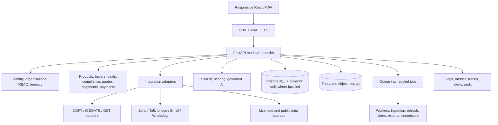
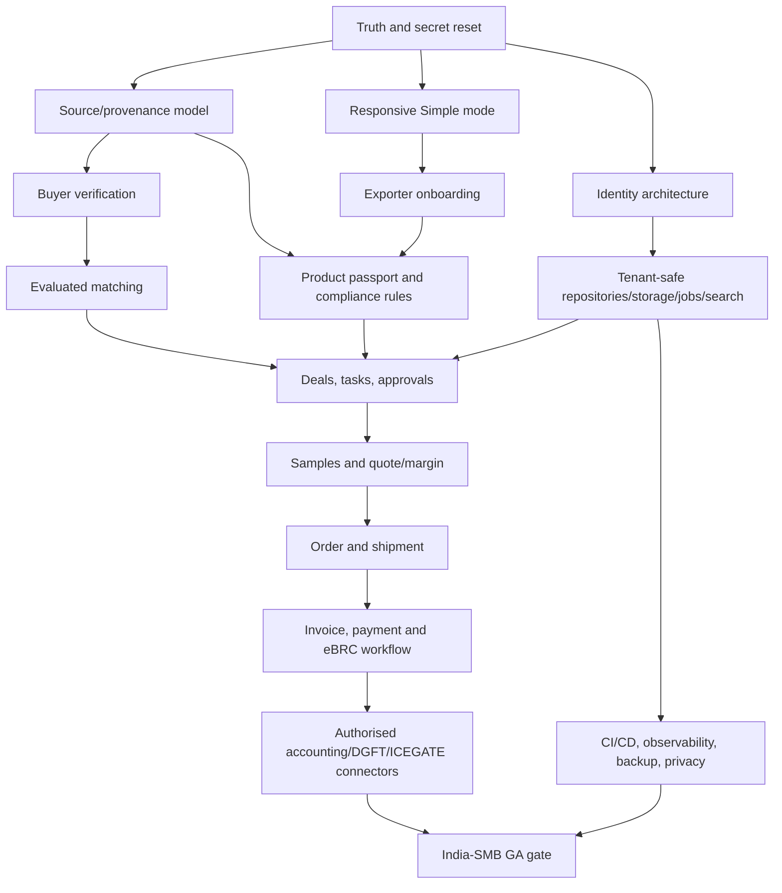

# Trade OS — India-SMB End-to-End Completion Master Plan

**Document status:** Implementation baseline  
**Assessment date:** 29 August 2026  
**Primary market:** Indian leather and leather-goods exporters, beginning with owner-led SMBs  
**Primary corridor:** India to Germany/EU, while keeping the product corridor-agnostic  
**Planning horizon:** 9 months to India-SMB general availability; 12+ months for enterprise readiness  
**Evidence base:** Current Trade OS repository, UI review, test/build results, the business and technical readiness assessments, and official government/provider documentation checked in August 2026

> This is a product, engineering, data, compliance, operations, deployment, and go-to-market plan. It is not legal, tax, customs, GST, or regulatory advice. Government filing workflows must be validated by a qualified customs broker, chartered accountant/GST practitioner, bank, and export-domain adviser before production use.

---

## 1. Executive decision

Trade OS should continue, but its product promise must change from an apparently autonomous AI intelligence platform to a **trustworthy export opportunity and execution operating system for Indian SMB exporters**.

The fastest credible route is:
1. correct unsupported claims and make the current demo honest;
2. sell a managed, analyst-assisted pilot to three to five exporters;
3. build the secure multi-customer foundation while those pilots run;
4. prove that verified opportunities create replies, samples, quotations, purchase orders, margin, or time savings;
5. integrate accounting, messaging, DGFT/eBRC, and ICEGATE only through authorised paths;
6. expand to a self-service India-SMB product after data quality, mobile usability, security, support, and unit economics pass explicit gates.

### 1.1 Readiness baseline

| Commercial state | Current readiness | Meaning |
|---|---:|---|
| Desktop demonstration | 72% | Visually convincing and sufficient for controlled founder-led demos after truth corrections |
| Managed paid pilot | 45% | Can become sellable quickly with verified data, onboarding, task/deal tracking, mobile fixes, and operating SOPs |
| Self-service India-SMB SaaS | 28% | Missing identity, tenancy, reliable integrations, support/admin, security operations, and complete workflows |
| Enterprise/procurement-ready | 15% | Missing SSO, formal controls, DPA/SLA, penetration testing, DR evidence, data contracts, and customer references |

These percentages are directional release-readiness estimates, not code-completion percentages. The internal registry records 153 entities and 11 modules as complete, but registration of a component does not prove that it is production-grade, connected to a licensed source, secure, usable on mobile, or commercially validated.

### 1.2 What is already valuable

- A coherent vertical concept: exporter capability, buyer matching, explainable drivers, signals, compliance, freight, outreach, and account planning.
- A working FastAPI/React/PostgreSQL foundation.
- A clear repository/service/layer architecture that can be retained as a modular monolith.
- A polished desktop demonstration across five product views.
- Passing backend tests and a successful frontend production build at the time of assessment.
- Explainability concepts—score, version, drivers, evidence—which are strategically more useful than generic AI chat.
- A medallion-style data model that can become a real provenance pipeline after the seeded-data shortcuts are removed.

### 1.3 The four non-negotiable corrections

1. **Truth before scale.** Every buyer, contact, signal, rate, certificate, score, and claim needs a source, status, owner, checked date, permitted use, and expiry/refresh rule.
2. **Workflow before dashboards.** A customer must be able to move from exporter readiness to buyer contact, sample, quote, order, shipment, payment, and eBRC—not merely view attractive cards.
3. **Security before a second customer.** Authentication, organisation boundaries, tenant isolation, role controls, secret management, backups, monitoring, and audit trails are prerequisites for multiple customers.
4. **Authorisation before automation.** Do not scrape or automate government portals. Use documented APIs, customer-granted access, empanelled partners, or portal-assisted/manual workflows.

### 1.4 Feasibility conclusion

| Dimension | Feasibility | Condition |
|---|---|---|
| Managed pilot | High | Use human verification, transparent demo labels, and narrow deliverables |
| Secure India-SMB product | Medium-high | A focused 5–7 person team, 6–9 months, disciplined scope, and customer design partners |
| Government workflow automation | Medium | Several APIs are customer-specific or partner-gated; portal workflows must remain available |
| Buyer-level trade intelligence | Medium-low until licensed | Official Indian data is principally aggregate; buyer identities require lawful sources and contracts |
| Enterprise deployment | Medium, later | Requires controls, audit evidence, SSO, SLAs, DR exercises, legal readiness, and references |
| EUDR-led differentiation | Low as the primary moat | The EU's July 2026 scope proposal removes cattle hides, skins, and leather, subject to EU scrutiny |

---

## 2. Product scope and positioning

### 2.1 Ideal customer profile for the first year

The first customer should be an Indian exporter that:

- exports leather, leather goods, footwear components, saddlery, or adjacent products;
- has approximately ₹5 crore to ₹250 crore annual turnover;
- has 10–250 employees and a small export team;
- already has, or is actively obtaining, IEC, GSTIN, an AD-code relationship, and required sector registrations;
- has a usable product catalogue, capacity information, and willingness to share documents;
- wants EU/UK buyer growth but lacks a structured intelligence and follow-through process;
- will name one decision-maker and one operational champion;
- agrees to a weekly review and outcome measurement;
- accepts that the first version is analyst-assisted rather than autonomous.

Avoid initially:

- pre-export businesses with no product specifications or compliance ownership;
- firms seeking a guaranteed buyer or guaranteed customs approval;
- businesses unwilling to provide evidence or allow data correction;
- large enterprises requiring SSO, dedicated VPC, procurement audits, or complex ERP integrations on day one;
- broad multi-sector coverage before the leather workflow has repeatable outcomes.

### 2.2 Core jobs to be done

The owner should be able to answer:

1. Are we ready to export this product to this market?
2. Which buyers are genuinely worth our time?
3. Why does each buyer fit, and how strong is the evidence?
4. Which documents, tests, commercial terms, and price assumptions are missing?
5. Who should act today, and what should they do?
6. What happened after contact—reply, sample, quote, order, loss, or no response?
7. Where is the shipment, payment, incentive, or eBRC process blocked?
8. Are we earning an acceptable contribution margin and recovering cash on time?

### 2.3 Product promise

> Trade OS helps Indian exporters turn verified market evidence into buyer action, compliant commercial preparation, shipment follow-through, and cash realisation.

### 2.4 Claims allowed during each stage

| Stage | Safe claim | Prohibited claim |
|---|---|---|
| Demo | “Sample records demonstrate the workflow.” | “Live”, “verified”, “real-time”, or “100% certified” without evidence |
| Managed pilot | “Analyst-reviewed opportunities with dated sources.” | “Autonomous AI finds and contacts buyers” |
| Secure MVP | “A secure workspace for multiple exporter teams.” | “Enterprise-grade” without independent evidence |
| Live integration | “Connected to the named system with customer authorisation.” | “Connected to ICEGATE/GST/DGFT” when only a link or upload exists |
| Enterprise | Claims supported by contracts, tests, SLAs, audit evidence, and references | Absolute compliance, outcome, or customs-clearance guarantees |

### 2.5 Initial commercial offer

Sell a **30-day Managed Export Opportunity Pilot**, not a software licence.

Suggested planning range: **₹50,000–₹1,25,000 plus applicable tax**, validated through at least five customer interviews. Price depends on the number of products, markets, verified buyers, manual research hours, and domain support.

Minimum deliverables:
- one verified exporter readiness profile;
- product and compliance passport for up to three products;
- ten verified target buyer accounts;
- three to five verified role/contact routes or transparent company-level alternatives;
- five opportunity briefs with evidence and gaps;
- two sample/quotation playbooks with landed-margin assumptions;
- a document-readiness checklist;
- a weekly “what changed / what to do” brief;
- an outcome review covering replies, meetings, samples, quotes, orders, losses, corrections, and time saved.

The contract must state that Trade OS provides workflow and intelligence support—not brokerage, legal advice, tax advice, customs representation, buyer guarantees, credit guarantees, or regulatory certification.

---

## 3. India-first business architecture

### 3.1 End-to-end operating model

```mermaid
flowchart LR
    A[Exporter readiness] --> B[Product passport]
    B --> C[Market and buyer discovery]
    C --> D[Buyer and evidence verification]
    D --> E[Opportunity qualification]
    E --> F[Compliance and commercial preparation]
    F --> G[Outreach, sample, and quotation]
    G --> H[Order and production readiness]
    H --> I[Shipment and customs follow-through]
    I --> J[Payment, incentives, and eBRC]
    J --> K[Outcome learning and rescoring]
    K --> C
```

### 3.2 Stage-by-stage workflow

| Stage | User outcome | System work | Human/partner work | Exit evidence |
|---|---|---|---|---|
| 0. Business onboarding | A trusted company workspace exists | Create organisation, roles, consent, profile, registrations, bank and logistics references | Owner approves profile; analyst checks documents | Profile owner, source documents, status, expiry dates |
| 1. Exporter readiness | Gaps are visible and prioritised | Capability, readiness and document checklist | Export-domain reviewer validates applicability | Approved readiness profile and remediation tasks |
| 2. Product passport | Each product has commercial and compliance data | Store HS/ITC(HS), materials, specs, capacity, MOQ, lead time, price basis, tests, certificates | Product/quality owner approves | Versioned product passport with missing-data flags |
| 3. Market discovery | Priority countries and segments are chosen | Aggregate trade trends, tariff/context, demand signals, saved market theses | Analyst interprets; owner chooses market | Approved market thesis and search criteria |
| 4. Buyer verification | Shortlist contains credible accounts | Entity resolution, source capture, recency, confidence, contact route | Analyst verifies identity, relevance, and data rights | Verified/inferred status, sources, checked date, owner |
| 5. Qualification | Team knows why to pursue or reject | Explainable score, drivers, blockers, next action | Sales/owner accepts, defers, or rejects | Decision, reason, next task, due date |
| 6. Commercial/compliance preparation | Offer is ready for buyer review | Document pack, requirement matrix, quote model, INR/FX margin, Incoterms assumptions | Compliance/finance/CHA validates | Approved pack, assumptions, approver, validity |
| 7. Outreach/sample/quote | Controlled engagement begins | Draft sequence, approval, activity timeline, sample/quote records | User sends; responses recorded | Consent/channel basis, sent proof, outcome state |
| 8. Order/shipment | Order moves through milestones | PO, production, QC, packing, documentation, booking, shipping-bill references, exceptions | Operations, CHA, forwarder, bank update milestones | Milestone evidence and exception ownership |
| 9. Payment/incentives/eBRC | Cash and export closure are tracked | Invoice, receipt, IRM/eBRC status, ageing, RoDTEP/drawback checklist | Finance/bank/CA validates | Payment reconciliation and closed export record |
| 10. Learning | Future recommendations improve | Outcome attribution, correction history, source quality, score performance | Team reviews win/loss and data corrections | Approved outcome and model/data feedback |

### 3.3 Roles and permissions

| Role | Primary view | Core permissions |
|---|---|---|
| Owner/director | Today, pipeline, margin, cash, risk | Approve markets, users, sensitive integrations, quotes, final outreach |
| Export sales | Buyers, deals, tasks, activity | Qualify, draft outreach, manage samples and quotes |
| Compliance/quality | Products, certificates, requirement matrix | Upload, verify, approve applicability, manage expiry |
| Finance | Quotes, invoices, payments, eBRC, incentives | Manage FX assumptions, receipts, reconciliation, finance exports |
| Operations | Orders, production, shipment milestones | Update fulfilment, documents, booking, exceptions |
| Analyst | Sources, verification queue, evidence | Research, verify, correct, recommend; cannot approve customer filings |
| Partner/CHA | Limited shipment/document workspace | Access only assigned shipments and documents; no buyer/contact export |
| Trade OS support | Tenant support/admin with audited elevation | No default access to customer content; time-bound support access |

### 3.4 Business capability map

| Capability group | Must exist for managed pilot | Must exist for India-SMB GA |
|---|---|---|
| Customer management | Exporter profile, products, users, support owner | Organisations, RBAC, plans, billing, support/admin, audit export |
| Opportunity intelligence | Verified accounts, evidence, score, recommendation | Licensed sources, refresh policies, corrections, outcome learning |
| Commercial execution | Tasks, outreach approval, samples, quote/margin | Deal stages, approvals, versioned quotes, accounting sync |
| Compliance | Document checklist and human sign-off | Versioned requirement rules, expiry alerts, jurisdiction/product applicability |
| Logistics | Quote upload and milestone checklist | Partner/carrier/ICEGATE status integrations where authorised |
| Finance | Invoice/payment/eBRC task tracking | Accounting integration, authorised eBRC workflow, receivable ageing |
| Governance | Demo labels, source register, consent records | DPDP controls, DPA, retention, incident response, vendor governance |
| Platform | Single-customer secure pilot | Tenant isolation, backups, monitoring, CI/CD, SLOs, DR |

---

## 4. Target user experience

### 4.1 Information architecture

Replace technology-led navigation with action-led navigation:

1. **Today** — tasks, approvals, expiring documents, changed evidence, shipment/payment exceptions.
2. **Buyers** — saved markets, verified accounts, qualification and evidence.
3. **Deals** — opportunity, contact, sample, quote, order and loss stages.
4. **Products** — product passports, capacity, price basis, tests and certificates.
5. **Documents & Compliance** — requirements, files, validity, gaps and approvals.
6. **Shipments & Payments** — orders, booking, customs references, invoices, receipts, incentives and eBRC.
7. **Insights** — conversion, margin, source quality, market changes and team performance.
8. **Settings** — company, users, roles, integrations, consent, billing and audit.

“Search”, “agents”, “EUDR”, “scoring”, “ingestion”, “pgvector”, and model names are implementation details or analyst tools—not primary SMB navigation.

### 4.2 Simple mode and Analyst mode

**Simple mode** is the default for owners and SMB teams. It uses:

- High / Medium / Low instead of raw model terminology;
- “Why this buyer” instead of “match drivers”;
- “Documents ready / missing / not applicable / needs expert review” instead of absolute compliance scores;
- “Best route and expected margin” instead of “multi-corridor freight matrix”;
- “AI export assistant” only when an AI output genuinely exists;
- one primary action per card;
- visible owner and due date;
- source and checked date behind a plain-language “Why?” link.

**Analyst mode** exposes raw evidence, source rights, confidence, score version, drivers, rule versions, ingestion runs, entity-resolution decisions, and audit history.

### 4.3 Screen backlog and acceptance criteria

| Screen | Must show | Primary actions | Acceptance criteria |
|---|---|---|---|
| Sign-in/onboarding | Company, role, consent, language, profile progress | Create company, invite team, save draft | MFA option; progress resumes; no cross-tenant data |
| Today | Five most important actions, alerts, approvals and changed evidence | Complete, assign, approve, snooze | Owner understands next action in under 30 seconds |
| Exporter profile | Registrations, capacity, markets, finance/logistics setup | Verify, upload, assign gap | Every claim has status, evidence and owner |
| Product passport | HS code, materials, variants, capacity, MOQ, lead time, price basis, certificates | Edit version, upload evidence, approve | Version history and applicability are preserved |
| Buyer list | Fit, why, evidence quality, source age, current stage | Qualify, reject, assign, export allowed fields | No duplicated ranks/scores; filters work on mobile |
| Buyer 360 | Legal entity, site, segment, contacts, products, evidence, activity, risks | Add to deal, verify, correct, draft outreach | Contact confidence and lawful source are visible |
| Deal workspace | Stage, value, probability, tasks, contacts, samples, quotes, blockers | Move stage, create task, record outcome | Every stage change has actor, time and reason |
| Quote and margin | Currency, FX source/date, Incoterm, FOB/CIF costs, freight, duties, commission, contribution | Compare scenarios, approve, export PDF | All assumptions dated; invalid/expired quotes flagged |
| Documents/compliance | Requirement matrix, file status, issuer, validity, applicability | Upload, request, review, mark N/A with reason | No “compliant” result without rule version and approval |
| Shipment | PO, production/QC, booking, packing, invoice, shipping bill, milestones, exceptions | Update, attach proof, assign exception | Manual and integrated events are distinguishable |
| Payment/eBRC | Invoice, due date, receipt, IRM, deductions, eBRC, incentive tasks | Reconcile, authorise connector, export | No filing without explicit user approval and audit trail |
| Integrations | Provider, scope, consent, health, last sync, credential expiry | Connect, test, rotate, revoke | Per-tenant credentials; least privilege; revocation works |
| Admin/support | Users, roles, support access, retention, export/delete request, audit | Invite, suspend, export, close account | Customer controls access and receives confirmation |

### 4.4 Mobile requirements

The current fixed desktop sidebar and horizontal overflow must be removed. A 390×844 pixel viewport is the minimum acceptance target.

Required behaviours:

- bottom navigation for the five most common areas;
- responsive drawer for secondary areas;
- cards collapse to one column;
- tables become labelled stacked rows or horizontally isolated data grids—not whole-page overflow;
- sticky primary action at thumb reach;
- 44×44 pixel minimum touch targets;
- camera upload for documents;
- phone-native share to WhatsApp/email;
- offline-tolerant draft forms for weak connectivity;
- no interaction that depends only on hover;
- forms save draft automatically;
- performance target: usable first content on a mid-range Android device over 4G.

### 4.5 India localisation

- English first, with translation-ready message keys from the beginning.
- Validate Hindi and Tamil demand during pilots; add only after terminology is reviewed by exporters.
- INR by default; show ₹, lakh/crore grouping, foreign currency, FX source, FX time and validity.
- Indian financial year, GSTIN, PAN, IEC, Udyam, RCMC, AD code, port/location, LUT, ITC(HS), HSN/SAC, eBRC and bank/CHA fields.
- Dates use `DD MMM YYYY`; store UTC and user time zone internally.
- Phone numbers use E.164 format while displaying Indian grouping where appropriate.
- Templates support Indian company letterhead, authorised signatory, GST/export invoice fields, Incoterms, bank details and declaration blocks.
- Accessibility target: WCAG 2.2 AA for keyboard, contrast, focus, names, errors and screen-reader labels.

---

## 5. Target technical architecture

### 5.1 Architecture decision

Keep a **modular monolith** through India-SMB general availability. Do not introduce microservices or Kubernetes. Separate modules and background jobs are sufficient; complexity should be spent on trust, workflow and operations.

### 5.2 Mandatory boundaries

- API routes validate request/response schemas, authorisation and orchestration only.
- Services contain business rules.
- Repositories contain database access only.
- Scoring remains in the scoring service.
- Compliance applicability and readiness remain in the compliance service.
- Lane economics remain in the lane service and use dated provider/source records.
- Outreach generation remains in the outreach service and requires human approval.
- Connector-specific logic sits behind adapters; domain services do not depend on provider payloads.
- Background jobs are idempotent, resumable, observable and tenant-scoped.
- Bronze → Silver → Gold remains one direction; corrections create new records/events, not silent rewrites.
- Append-only histories are enforced in database permissions/triggers, not only developer convention.

### 5.3 Deployment shape

Recommended first production shape in an India cloud region:

- static frontend through CDN/object hosting;
- one containerised API service with at least two instances for production;
- one worker service;
- managed PostgreSQL in a private network;
- encrypted object storage for documents;
- managed queue for jobs;
- secrets manager and KMS-backed encryption;
- WAF/rate limiting, TLS, DNS and security headers;
- central logs, metrics, error tracking and synthetic health checks;
- automated backups and tested restore;
- separate development, staging and production accounts/environments.

AWS Mumbai (`ap-south-1`) is the default recommendation because it has three Availability Zones and supports a conventional managed stack. Hyderabad is a possible DR/expansion region. Equivalent Azure or Google Cloud India regions are acceptable if the team already operates them. Keep primary customer data and the mandatory security log copy in India as a conservative operational choice; confirm the final cross-border data design with counsel.

### 5.4 Environments

| Environment | Data | Access | Purpose |
|---|---|---|---|
| Local | Synthetic only | Developers | Feature work and unit tests |
| CI | Ephemeral synthetic fixtures | CI service identity | Automated validation |
| Staging | Synthetic or specifically consented masked pilot data | Team + nominated customer testers | Integration/UAT/rehearsal |
| Production | Customer data | Least-privilege production identities | Live service |
| DR restore environment | Encrypted backup restored during exercises | Restricted incident team | Recovery verification only |

No production database should be cloned into local or CI. Seed data must be unmistakably fictional and idempotent.

## 6. Domain and data design

### 6.1 Core domain entities

| Domain | Required entities | Important controls |
|---|---|---|
| Identity/tenancy | organisation, user, membership, role, permission, session, API client, support-access grant | `tenant_id` enforcement, MFA, session revocation, audited elevation |
| Exporter | exporter profile, registration, facility, bank/AD reference, partner, market preference | evidence, verification status, expiry, owner |
| Product | product family, SKU/variant, material, specification, capacity, price basis, HS/ITC code, product passport version | versioning, approval, applicability, source |
| Buyer | legal entity, site, brand, segment, product interest, relationship, contact, contact channel | entity-resolution history, lawful source, confidence, correction |
| Intelligence | source, source licence, raw document, extract, evidence assertion, signal, market thesis | usage rights, checked time, checksum, parser/rule version |
| Matching | match profile, candidate, score, score version, driver, decision | no candidate without score/version/driver; immutable score history |
| Work management | task, approval, comment, attachment, notification | assignee, due date, status, audit event |
| Commercial | opportunity, stage history, sample, quotation, quote scenario, pricing assumption, order, loss reason | approval and version history; currency/FX timestamp |
| Compliance | jurisdiction, requirement, rule version, applicability decision, certificate/test, document, review | human approver, effective dates, expiry, legal-review flag |
| Logistics | shipment, booking, package, milestone, shipping bill reference, exception, freight quote | provider/source, quote validity, manual/integrated event type |
| Finance | invoice, receipt, allocation, IRM reference, eBRC reference, incentive claim task, receivable | reconciliation, deductions, maker-checker approval |
| Integration | connection, consent grant, credential reference, sync cursor, webhook, job, reconciliation item | no plaintext secret, health, rotation, revocation, tenant scope |
| Governance | audit event, consent record, privacy request, retention hold, incident, correction/dispute | append-only events, timestamps, actor, decision reason |

### 6.2 Universal truth model

Every commercially material assertion must carry:

- `claim_type` — legal name, buyer interest, certification, freight quote, market signal, contact role, etc.;
- `value` and structured units/currency where relevant;
- `truth_status` — `verified`, `inferred`, `customer_supplied`, `provider_supplied`, `demo`, `stale`, `disputed`, `unavailable`;
- `source_id` and resolvable evidence reference;
- `source_published_at` and `checked_at`;
- `valid_from`, `valid_until`, or refresh interval;
- `verification_method` and reviewer;
- `confidence` with a defined rubric—not an unexplained number;
- `licence/usage_basis` and permitted customer-facing use;
- `tenant_id` and visibility classification;
- correction/dispute history.

The UI must never collapse “inferred” and “verified” into the same badge.

### 6.3 Data quality gates

| Gate | Requirement |
|---|---|
| Ingestion | Source is registered; terms/licence reviewed; run is idempotent; raw record checksum stored |
| Extraction | Parser/model version stored; schema validation passed; failed records quarantined |
| Entity resolution | Candidate links have evidence and confidence; ambiguous merges require review |
| Silver acceptance | Required identifiers and source references present; duplicates resolved or explicitly linked |
| Gold publication | User-facing assertion has truth status, checked date, and permitted display basis |
| Match scoring | Score, score version and at least one evidence-linked driver exist |
| Signal publication | Non-empty evidence; effective/expiry date; jurisdiction/product applicability |
| Contact publication | Confidence, role/source, contact basis, and correction path |
| Freight publication | Origin/destination, mode, inclusions, currency, effective date, validity and provider |
| Expiry | Stale records are visibly downgraded and removed from claims/automation where necessary |

### 6.4 Data source tiers

1. **Tier A — authoritative:** government portals/APIs, recognised registries, certificate issuers, customer documents, provider-signed events.
2. **Tier B — licensed commercial:** buyer/trade databases, logistics feeds, business registries, contact providers with contractually permitted use.
3. **Tier C — public web:** buyer websites, public reports, trade-fair directories, public professional pages, with captured URL/date and terms review.
4. **Tier D — inferred:** model or analyst inference. Never presented as verified fact.
5. **Tier E — demo:** fictional/synthetic data used only in demonstration tenants.

Ranking must prefer source quality and recency over raw record count.

### 6.5 Retention and classification

Define at minimum:

- Public, Internal, Confidential Customer, Restricted Personal, Restricted Credential;
- customer-controlled document retention;
- shorter retention for rejected contact data and temporary integration payloads;
- 180-day security-log baseline in India to support CERT-In operational requirements;
- legal hold and deletion-exception procedure;
- encrypted backup retention separate from live deletion, with documented expiry;
- export/delete/correction workflows for personal data;
- source-licence expiry that can disable redistribution without deleting audit history.

---

## 7. Complete product and engineering workstreams

The following workstreams resolve the specific gaps found in the current platform.

### 7.1 Truth reset and demo safety

**Problems to resolve**

- seeded contacts and buyers appear verified;
- “live”, “real-time”, “100%”, “multi-tenant active”, and pipeline-value claims are not supported;
- only ten visible match results are shown while the UI suggests 50+;
- ranks beyond five reuse clamped scores/evidence;
- sample customs records and repeated evidence are presented as operational intelligence;
- EUDR language is strategically outdated.

**Actions**

1. Create separate `demo` and `production` tenants/databases.
2. Watermark every demo page and generated export with “Sample data — not for commercial decision”.
3. Add the truth-status model and evidence drawer to every material card.
4. Replace all unsupported aggregate claims with measured metrics or “not available”.
5. Remove fake scale badges and hard-coded pipeline valuation.
6. Correct ranking: unique ordered candidates, calibrated score distribution, tie rules, and no duplicated rank evidence.
7. Replace the EUDR score with a versioned “market requirement readiness” framework. EUDR becomes one conditional rule, not the product identity.
8. Maintain a do-not-claim register reviewed before sales demos and releases.

**Acceptance gate**

- zero unlabelled sample records;
- 100% of user-facing material claims have status/source/date or explicitly say unavailable;
- sales deck, demo, website and product use the same approved claims;
- no duplicate rank or evidence in the first 50 test candidates.

### 7.2 Identity, organisations, tenancy and RBAC

**Actions**

- replace the shared `X-TradeOS-Key` user model with OIDC/OAuth-based user authentication;
- retain service API keys only for machine-to-machine clients, hashed and scoped;
- introduce organisation, membership, role and permission tables;
- enforce tenant filtering at repository/query level and preferably PostgreSQL row-level security as defence in depth;
- add owner, sales, compliance, finance, operations, analyst, partner and support roles;
- implement invitation, suspension, removal, password reset/session revocation and optional MFA;
- build time-bound audited support access with customer visibility;
- protect OpenAPI/docs and all routes except a minimal liveness endpoint;
- version APIs and WebSocket/event payloads;
- add CSRF protections where cookies are used, secure cookie flags, CORS allowlist and rate limits.

**Acceptance gate**

- automated tests prove user A in tenant A cannot read, search, export, infer or receive events from tenant B;
- suspended users and revoked sessions lose access promptly;
- support access requires reason, expiry, actor and audit event;
- no frontend bundle contains production secrets.

### 7.3 Exporter onboarding and readiness

**Actions**

- create a save-and-resume onboarding wizard;
- collect legal name, entity type, PAN, GSTIN(s), IEC, Udyam/MSME where applicable, facilities and authorised signatory;
- collect ICEGATE status, AD code/bank/branch, ports/locations, LUT status/expiry, RCMC/CLE, EPC details, CHA/forwarder and bank contacts;
- capture product categories, capacity, MOQ, lead time, markets, price basis, Incoterms and commercial constraints;
- capture quality/compliance certificates, scope, issuer, validity and files;
- capture consent, privacy notice acknowledgement, processing purpose and integration authorisations;
- generate a readiness gap plan with owners, due dates, evidence and “needs expert review” status;
- support bulk import from spreadsheet for product/SKU masters.

**Acceptance gate**

- a new exporter completes a basic profile in under 30 minutes;
- no registration is marked verified solely because the user typed a number;
- the system identifies missing items without claiming that every item is legally mandatory;
- a reviewer can approve or return each section with comments.

### 7.4 Product passport and compliance workspace

**Actions**

- version product families, SKUs/variants, bill of materials, leather type/source where relevant, finishes, thickness, dimensions, capacity and MOQ;
- store ITC(HS)/HS classifications with user/expert approval and effective versions;
- create market/product requirement rules with jurisdiction, legal basis/source, effective dates and applicability expression;
- support certificates/tests such as LWG, ISO, REACH-related lab results and customer-specific RSLs without treating a badge as universal compliance;
- add issuer, accredited lab, scope, file hash, issue/expiry, verified date and reviewer;
- create document packs by buyer/market/order;
- add expiry alerts and replacement tasks;
- require a human approval before a readiness statement is shared externally;
- record “not applicable” with reason and approver.

**Acceptance gate**

- readiness is reproducible from a specific product-passport version and rule version;
- expired or superseded evidence cannot silently support a green result;
- every external document pack records its contents, version, recipient and creator.

### 7.5 Buyer discovery, verification and Account 360

**Actions**

- create a source/licence register before ingesting any dataset;
- ingest authoritative and licensed sources into immutable raw records;
- implement entity resolution with legal-name aliases, domain, address, VAT/LEI/company identifiers and review queue;
- distinguish legal entity, brand, location and buyer account;
- implement contact confidence and role/channel verification;
- record source, checked date, lawful/contractual use basis and correction status;
- add account activity, evidence, product interest, risks, relationship owner and last meaningful change;
- create a duplicate/merge review with reversible link history;
- remove fabricated contacts; where only a company channel is known, say so.

**Acceptance gate**

- each of the first ten pilot accounts has legal/company proof, relevant evidence, checked date and analyst sign-off;
- contacts are either verified with evidence or clearly described as inferred/unavailable;
- customers can report a correction, and the correction is processed under an SOP.

### 7.6 Matching and qualification

**Actions**

- redesign score features around observed exporter/buyer data rather than fixed rank constants;
- maintain product fit, requirement readiness, commercial fit, lane feasibility, intent/evidence and accessibility as explainable components;
- version formulas and feature definitions;
- show missing-data penalties separately from negative fit;
- calibrate grades using pilot outcomes, not aesthetics;
- add customer acceptance/rejection and reason as feedback;
- measure precision at top 5/10, reply/sample/quote conversion and analyst override rate;
- never use the model score as the only reason to contact or reject a buyer.

**Acceptance gate**

- replaying the same versioned inputs produces the same score;
- every driver links to evidence or an explicit customer input;
- offline evaluation compares the score with human qualification and observed outcomes;
- no more than an agreed percentage of top-ten recommendations are obvious false positives in pilot review.

### 7.7 Search

**Actions**

- first make PostgreSQL full-text/trigram search complete, tenant-safe and measurable;
- add filters for country, segment, product, status, evidence age, owner and deal stage;
- implement result explanations and permission-aware highlighting;
- add embeddings/pgvector only after defining semantic queries that lexical search fails;
- if added, store embedding model/version, text snapshot, tenant scope and re-embedding job;
- create real vector columns and HNSW indexes only with measured recall/latency benefit;
- test prompt/query injection and data leakage for any semantic layer.

**Acceptance gate**

- common owner/sales queries return correct authorised results in under the agreed latency target;
- no cross-tenant search leakage;
- vector search is not claimed until an actual index, embeddings and evaluation exist.

### 7.8 Governed AI and “agents”

**Actions**

- rename deterministic template workflows honestly until a real model is used;
- choose only outcome-linked use cases: research summarisation, requirement-gap draft, match explanation, approved outreach draft, and account-plan draft;
- use retrieval only from authorised tenant/source content;
- store model/provider, version, prompt template, input references, output, cost, latency and reviewer decision;
- redact secrets and unnecessary personal data before model calls;
- support provider opt-out and regional/data-processing review;
- implement human approval before messages, filings, score changes, record merges or document assertions;
- add factuality checks, citation requirements, output schemas, prompt-injection defences and evaluation datasets;
- LangGraph is optional orchestration, not a product requirement; adopt only when stateful branching/retry/approval is proven necessary.

**Acceptance gate**

- no AI output is presented as verified fact without supporting evidence;
- no AI sends external communication or performs a government action autonomously;
- evaluation passes defined citation, unsupported-claim, privacy and usefulness thresholds;
- model cost per active customer stays within the commercial margin plan.

### 7.9 Deals, tasks, samples, quotations and orders

**Actions**

- implement opportunity stages: identified, reviewing, qualified, contact-ready, contacted, engaged, sample, quotation, negotiation, won, lost, dormant;
- require stage-entry/exit conditions and record reasons;
- add tasks, assignment, due dates, comments, reminders and approvals;
- add outreach draft → approval → user send → outcome timeline;
- track samples, courier/reference, buyer feedback and next action;
- build versioned quote scenarios with currency, FX source/time, Incoterm, product cost, packing, inland logistics, freight, insurance, duties/fees assumption, commission and contribution margin;
- record quote validity, approver and exported PDF;
- add purchase order, production/QC and handoff to shipment;
- support loss reasons and post-deal learning.

**Acceptance gate**

- a pilot user can complete the full buyer-to-quote journey without a spreadsheet other than optional import/export;
- all monetary outputs show assumptions and timestamp;
- a manager can identify stalled deals and overdue actions.

### 7.10 Shipment, payment, incentives and eBRC

**Actions**

- implement shipment milestones without claiming live tracking;
- store commercial invoice, packing list, certificate references, booking, container/AWB/BL, shipping-bill number/date/port and exceptions;
- add maker-checker approval for sensitive customs/finance actions;
- integrate only customer-authorised ICEGATE/DGFT paths;
- track invoices, due dates, receipts, deductions, short payments, bank/IRM references and allocations;
- add eBRC task status: not started, IRM awaited, mapping ready, submitted, processing, issued, exception;
- add RoDTEP/drawback and other incentive task checklists as configurable workflows—not automated entitlement advice;
- reconcile application/system status and surface exceptions.

**Acceptance gate**

- one real pilot shipment can be followed from accepted order to payment/eBRC closure with evidence;
- manual and API events are separately labelled;
- no filing or declaration occurs without an authorised user action and immutable audit record.

### 7.11 Notifications, documents and exports

**Actions**

- create in-app notification preferences and digest emails;
- add user-initiated WhatsApp share before platform messaging;
- create PDF/Excel exports with tenant, generated time, data status and disclaimer;
- virus-scan uploads; restrict types and size; use signed, expiring download URLs;
- maintain document versions, checksums, access events and retention class;
- support customer-controlled data export and account closure.

### 7.12 Admin, support and billing

**Actions**

- build internal tenant/user/connector/job health views without exposing customer content by default;
- create support tickets, severity, SLA target and status communication;
- implement plan/entitlement flags before automated billing;
- use GST-compliant invoicing/accounting through the company’s accounting system initially;
- add metering for users, records, analyst hours, AI spend, exports and connector usage;
- create feature flags and safe per-tenant rollout.

## 8. Authorised integrations and how to obtain them

### 8.1 Integration policy

Every connector must be classified as one of:

1. **Public official data/API** — documented and permitted without customer credentials.
2. **Customer-authorised API** — the exporter grants Trade OS access for its IEC/GSTIN/account.
3. **Empanelled/partner API** — Trade OS contracts with an authorised GSP, IRP, logistics, identity, or data provider.
4. **Portal-assisted workflow** — Trade OS prepares data/checklists, but the user completes the action on the official portal.
5. **File exchange** — CSV/Excel/PDF/JSON import/export with reconciliation.
6. **Licensed commercial data** — contract defines permitted ingestion, display, export, retention and derivative use.

Do not automate browser logins, bypass CAPTCHAs, reuse one customer’s credentials for another, or imply official partnership without a signed agreement.

### 8.2 Integration priority and difficulty matrix

Difficulty assumes a legally registered Indian company, capable engineering team, security baseline, and a cooperative pilot exporter.

| System/capability | Recommended first implementation | Authorised route | Difficulty | Planning lead time | Build stage |
|---|---|---|---|---|---|
| IEC/GSTIN/Udyam/RCMC profile | Customer upload + portal verification checklist | Customer-supplied records and official portal checks | Low | Days | P1 |
| ICEGATE registration/AD code | Guided checklist, status and evidence | Exporter’s ICEGATE registration; customer performs/approves changes | Medium | 1–4 weeks per exporter | P1/P2 |
| ICEGATE shipping-bill filing/status | Portal handoff first; API adapter later | Customer ICEGATE identity and current BE/SB Open API terms | High | 6–12+ weeks including test/approval | P3 |
| DGFT eBRC | Tracker/import first; customer-authorised API later | IEC primary user grants API-consumer access; static IP and credentials | Medium-high | 3–8 weeks | P3 |
| GST returns/refund data | CSV/Zoho/Tally export first | Partner with empanelled GSP/ASP; own GSP status is unnecessary | Medium through partner; very high to become GSP | 4–12 weeks through partner | P3/P4 |
| E-invoice | Import IRN/JSON first | Taxpayer-authorised IRP solution provider or direct taxpayer integration | Medium | 3–8 weeks | P3 if customers need it |
| E-way bill | Reference/import first | GSP or approved taxpayer/transporter API onboarding and IP whitelisting | Medium-high | 4–10 weeks | Later/conditional |
| Certificate of Origin | Checklist, document pack and portal handoff | DGFT eCoO/Trade Connect portal with IEC and DSC/eSign | Low manually; high/unknown for API | 1–2 weeks manual | P2 |
| CLE/e-RCMC | Expiry reminder and evidence vault | DGFT e-RCMC portal; CLE validation | Low manually; no public API identified | 1–3 weeks | P1 |
| TallyPrime | CSV first; optional local bridge | Customer-controlled XML/HTTP or ODBC endpoint | Medium | 3–8 weeks | P3 |
| Zoho Books | OAuth connector | Customer OAuth consent to Zoho Books India DC | Low-medium | 2–5 weeks | P3 |
| WhatsApp | Native share link first; Cloud API later | Meta Business/WhatsApp Business Platform, opt-in and templates | Low for share; medium-high for platform | 1 day / 3–8 weeks | P1/P3 |
| Email/calendar | `mailto`/download first; OAuth later | Customer Google/Microsoft OAuth consent | Low / medium | Days / 3–8 weeks | P1/P3 |
| Freight rates | Forwarder quote upload and validity | Contracted forwarder/carrier/rate-platform API | Low manual; high live | Days / 1–4 months | P1/P4 |
| CHA/customs collaboration | Limited partner workspace | Customer contract and role-scoped invite | Medium | 2–6 weeks | P2 |
| Indian aggregate trade data | Manual licensed import | DGCI&S paid Data Dissemination Portal | Low-medium | Days to weeks | P1/P2 |
| Buyer-level customs intelligence | Contracted provider only | Commercial provider licence; official DGCI&S does not provide identities privately | High | 1–3+ months | P2/P3 |
| EU VAT/entity verification | Manual/API verification | EU VIES, GLEIF and applicable registries; obey terms | Low-medium | 1–4 weeks | P2 |
| Aadhaar authentication | Avoid for initial product | AUA/KUA/Sub-AUA route through UIDAI/ASA only if essential | Very high | Months | Not planned |

Lead times are planning assumptions, not commitments by the agencies or providers.

### 8.3 ICEGATE: registration, AD code and Open API

#### What ICEGATE is—and is not

ICEGATE is the Indian Customs electronic gateway for customs users and filings. It can support an exporter’s own customs workflows. It is **not** a general buyer-discovery or named global shipment-data feed.

#### Exporter registration prerequisites

The exporter should:

1. have an active IEC and matching PAN/GST details;
2. register the organisation and authorised parent user on ICEGATE 2.0 under the Importer/Exporter role;
3. verify official email/mobile and organisation details;
4. create limited child users where required rather than sharing the parent credential;
5. register the relevant customs locations/ports;
6. maintain bank accounts and AD code references;
7. upload supporting documents through the official route when required;
8. maintain DSC/eSign capability where the workflow requires it.

ICEGATE’s registration FAQ lists Importer/Exporter among eligible roles and explains parent/child-user registration. Use the [ICEGATE registration guidance](https://www.icegate.gov.in/themes/contrib/bfd/pdf.js/web/viewer.html?file=%2Fsites%2Fdefault%2Ffiles%2F2023-12%2FRegistration-FAQ%2520%25281%2529.pdf).

#### AD code/bank setup

The exporter adds the foreign-remittance account/AD code, bank/branch/account, customs location and supporting-document reference in ICEGATE. The official advisory describes the current workflow: [ICEGATE AD Code Bank Account Registration Advisory](https://www.icegate.gov.in/guidelines/ad-code-bank-account-registration-advisory).

Trade OS should initially:

- store the bank/AD-code/location reference and verification evidence;
- show missing locations and expiry/revalidation tasks;
- link to the portal;
- never display a bank account or AD code as verified until a reviewer confirms official evidence;
- mask bank details based on role.

#### Open API route

ICEGATE now publishes BE/SB JSON Open API material, schemas and contract documents in its [API integration advisories](https://www.icegate.gov.in/advisories/integrate-with-icegate-on-api%27s). Current documents describe authentication, encryption, required headers, file submission and status exchange.

**Acquisition/action plan**

1. Obtain a written pilot mandate from one exporter and its customs broker.
2. Confirm that the desired message/status is covered by the latest published Open API contract; do not build against an archived format.
3. Complete ICEGATE registration for the exporter and designated users.
4. Assign a customs-domain owner and obtain legal/security review of credential handling.
5. Download the latest API contract, shipping-bill JSON schema and error codes from ICEGATE.
6. Create a connector-specific test environment and a mapping from the Trade OS shipment/document model to the ICEGATE schema.
7. Implement the specified hybrid encryption/authentication exactly; keep tenant credentials/keys in a secrets manager.
8. Validate with the exporter/CHA in a non-production or controlled filing process.
9. Add reconciliation: request ID, acknowledgement, processing status, errors, human correction and replay protection.
10. Require maker-checker approval before any filing or amendment.
11. Obtain written production sign-off from the exporter/CHA and retain evidence of the API terms/version used.

**Difficulty: High.** Customs schema correctness, changing specifications, credential sensitivity, legal responsibility, amendments, error handling and customer-by-customer authority make this unsuitable for the first prototype. Ship document preparation and status recording first.

### 8.4 DGFT eBRC API

DGFT’s current eBRC technical specification explicitly allows an IEC holder or an authorised API consumer/technical partner to consume the API.

**How to obtain access**

1. Trade OS registers/onboards on the DGFT portal with the relevant email and IEC relationship.
2. The IEC primary user grants eBRC module access to the Trade OS API-consumer email.
3. The IEC holder signs the authorisation using DSC or Aadhaar eSign and can later revoke it.
4. Trade OS registers the public static IP from which calls will originate.
5. Generate/download the credential file containing the client/API/key material.
6. Store the credential in a secrets manager, not the database or source code.
7. Implement annual key rotation; the current specification states a one-year validity.
8. Implement IP-change procedures; the specification notes that a production IP addition may take 24 hours to enable.
9. Test in the DGFT sandbox; current documentation notes that sandbox records are deleted after seven days.
10. Implement token generation, payload encryption, digital signatures, status polling, idempotency and reconciliation.
11. Require exporter confirmation for invoice/IRM mapping and declarations.

The official specification includes prerequisites, IP whitelisting, credentials, sandbox and message security: [DGFT eBRC IEC Integration Technical Specification v1.3](https://content.dgft.gov.in/Website/eBRC%20Technical%20Specs%20Bulk%20Generation.pdf).

**Difficulty: Medium-high but feasible.** The permission model is clearer than many government integrations, but it is per IEC, security-heavy, asynchronous and financially sensitive. Build it after the payment/invoice data model and manual eBRC tracker are stable.

**Fallback:** import/export the required reconciliation data and guide the exporter through the DGFT portal. Do not block the product on API access.

### 8.5 GST, GST returns and refunds

#### Recommended route

Do not attempt to become a GST Suvidha Provider initially. GSTN empanels GSPs through financial and technical evaluation followed by legal agreements. Empanelled GSPs receive direct access to GST, e-way bill and e-invoice systems. GSTN publishes the [GSP ecosystem and empanelled providers](https://www.gstn.org.in/gsp-ecosystem) and the [current empanelled GSP list](https://www.gstn.org.in/empanelled-gsps).

Trade OS should operate as an application/service provider and contract with one empanelled GSP only when a validated use case requires return/refund data.

**Partner acquisition steps**

1. Define exact use cases and scopes: LUT reminder, export invoice reconciliation, GSTR-1 status, refund-task evidence—not full accounting.
2. Shortlist two to three empanelled GSPs with sandbox, API documentation, Indian support and appropriate data terms.
3. Request commercial proposal, uptime/support commitments, security documentation, subprocessor list, data retention/deletion, incident terms and API limits.
4. Complete security/legal review and sign DPA/service agreement.
5. Implement customer authorisation and revocation; do not use Trade OS’s credentials to access a GSTIN without taxpayer authority.
6. Build sandbox tests, error/reconciliation queues and manual fallback.
7. Commission a CA/GST practitioner to validate every workflow and disclaimer.

**Difficulty: Medium through a GSP; very high to become a GSP.** Own empanelment would distract from the core product and requires demonstrated financial/technical capability.

### 8.6 E-invoice and e-way bill

The e-invoice IRP ecosystem permits taxpayer-authorised solution providers. The IRIS IRP documentation also describes direct API integration for taxpayers with internal IT teams and large volumes: [e-invoice API integration](https://einvoice6.gst.gov.in/content/api-integration/).

**Recommended sequence**

1. Store/import IRN, signed QR/JSON and e-way bill references.
2. Integrate Zoho/Tally first so invoice truth comes from the accounting system.
3. If pilots require generation, use an authorised IRP/GSP and per-taxpayer consent.
4. Validate cancellation windows, duplicate prevention, schema versions, signed response verification and reconciliation with a GST practitioner.

E-way bill API onboarding requires shortlisted GSP/taxpayer/transporter status, sandbox credentials, testing, test-summary submission and IP whitelisting according to the [official onboarding process](https://docs.ewaybillgst.gov.in/apidocs/on-boarding-process.html).

**Difficulty: Medium for e-invoice through a partner; medium-high for e-way bill.** Do not implement unless the target exporters’ volume and workflows justify it.

### 8.7 Certificate of Origin (eCoO) and e-RCMC/CLE

The DGFT common digital platform/eCoO 2.0 is the official route for preferential and non-preferential Certificates of Origin. Exporter registration relies on updated IEC contact details and DSC/eSign. See the [official Certificate of Origin platform](https://www.coo.dgft.gov.in/) and [exporter manual](https://www.coo.dgft.gov.in/manuals/Exporter-Manual.pdf).

No public third-party filing API was identified during this review. Therefore:

- build requirement selection, invoice/product data preparation, attachment checklist, maker-checker review, portal handoff, application number/status capture and certificate vault;
- do not use robotic portal automation;
- ask DGFT in writing about partner/API access only after a paid need is demonstrated;
- keep the user/authorised signatory in control of DSC/eSign.

For leather exporters, CLE indicates that RCMC applications/renewals use the DGFT e-RCMC portal and are verified by CLE. See [CLE’s e-RCMC guidance](https://leatherindia.org/renewal-of-cle-membership-for-the-year-2022-23/). Build expiry reminders, document preparation and evidence storage; do not claim live CLE integration without a written interface agreement.

**Difficulty: Low for an assisted portal workflow; high/unknown for API automation.**

### 8.8 DGCI&S and market/trade data

DGCI&S is the official source for India’s aggregate merchandise trade statistics. Its policy permits paid country/commodity/port data, but its FAQ states that private users do not receive transaction-level importer/exporter identity details. The current annual bulk-data policy lists a substantial commercial subscription, while query-level access is charged per output record. Review [DGCI&S](https://www.dgciskol.gov.in/), its [FAQ](https://www.dgciskol.gov.in/faq.aspx), and [data dissemination policy](https://dgciskol.gov.in/Writereaddata/Downloads/Data_dissemination_policy1.pdf).

**Acquisition steps**

1. Define the exact ITC(HS), country, port, period and aggregation required.
2. Register/use the official Data Dissemination Portal or send a formal requirement.
3. Obtain the current quote/licence and confirm commercial redistribution/derivative rights in writing.
4. Start with a narrow paid extract; do not buy annual bulk data before pilot use is proven.
5. Preserve source/version/release date and do not treat aggregate trends as named buyer evidence.

**Buyer-level customs data:** obtain from a commercial provider only after legal and source-rights diligence. The contract must explicitly permit SaaS ingestion, customer display, derived scores, retention, exports and audit. Test sample accuracy against known shipments. Avoid vendors that cannot explain the lawful source and permitted use of named companies/contacts.

**Difficulty: Low-medium for aggregate data; high and potentially expensive for buyer-level intelligence.**

### 8.9 Trade Connect, tariff and public market resources

The Government of India’s [Trade Connect platform](https://www.trade.gov.in/) provides product/country guides, tariff/trade-agreement exploration, learning and expert access aimed at exporters/MSMEs. Treat it as an official reference and portal handoff unless a documented reuse/API agreement is obtained.

Use public or licensed sources for:

- tariff/FTA research and country guidance;
- EU VIES VAT validation where applicable;
- GLEIF LEI/entity data;
- ECHA chemical restrictions/candidate-list changes;
- official buyer/company registries subject to each registry’s terms;
- trade-fair exhibitor data only where reuse is permitted.

Never convert a public-directory listing into a “verified decision-maker” without corroboration.

### 8.10 TallyPrime and Zoho Books

#### TallyPrime

TallyPrime supports XML over HTTP and ODBC when Tally is running and a company is loaded. Official guidance describes the local HTTP endpoint and integration configuration: [TallyPrime XML integration](https://help.tallysolutions.com/xml-integration/).

Because Tally commonly runs on an office computer:

1. start with reviewed CSV/Excel import/export templates;
2. build a small signed local connector only after pilots show demand;
3. make the connector initiate outbound TLS connections—never expose port 9000 to the public internet;
4. pair the connector to one tenant/device using short-lived credentials;
5. implement company selection, mapping preview, idempotency, duplicate detection and reconciliation;
6. request explicit approval before writing vouchers;
7. sign updates and support automatic revocation.

**Difficulty: Medium.** Network/firewall variation, local uptime, Tally customisation and mapping differences create support cost.

#### Zoho Books

Zoho Books offers OAuth 2.0 APIs and an India data-centre endpoint. See the [Zoho Books API introduction](https://www.zoho.com/books/api/v3/introduction/) and [OAuth guidance](https://www.zoho.com/books/api/v4/oauth/).

1. Register a Zoho OAuth client with the correct India-domain redirect URI.
2. Request minimum scopes for organisations, contacts, invoices and payments.
3. Obtain customer admin consent.
4. Store refresh tokens in the secrets manager and support revocation.
5. Map organisation/currency/tax/invoice IDs; do not duplicate the accounting ledger.
6. Add sync cursors, webhooks/polling, retries and reconciliation.

**Difficulty: Low-medium.** This should be the first full accounting connector.

### 8.11 WhatsApp, email and calendar

#### WhatsApp

Stage 1 uses the phone’s native share sheet or a user-initiated `wa.me` handoff. Trade OS does not send the message and records the outcome only when the user confirms it.

Stage 2 uses the official WhatsApp Business Platform/Cloud API:

1. create/verify the Trade OS Meta business portfolio;
2. create an app and WhatsApp Business Account or use a Business Solution Provider;
3. register and verify a dedicated phone number;
4. complete business verification where required;
5. create approved message templates;
6. collect and prove recipient opt-in; support opt-out;
7. configure signed webhooks, status reconciliation and template/version controls;
8. obtain each exporter’s authority and agree whether messages use a customer-owned or Trade OS-managed WABA;
9. enforce quiet hours, frequency rules and human approval.

Use Meta’s current [WhatsApp Cloud API documentation](https://developers.facebook.com/docs/whatsapp/cloud-api/get-started) when implementation begins, because requirements and pricing change.

**Difficulty: Low for user-initiated share; medium-high for a multi-customer embedded messaging product.**

#### Email/calendar

Start with copy/download/`mailto` and user confirmation. Add Google Workspace/Microsoft 365 OAuth only when activity capture materially improves conversion. Use minimum scopes, separate send/calendar consent, provider app verification where required, webhook security, token revocation and customer-controlled retention.

### 8.12 Freight, CHA, carrier and port integrations

There is no single authoritative “live freight rate” API. Rates depend on origin/destination, container/type, weight/volume, inclusions, surcharges, free days, validity, contract and customer credit.

Sequence:

1. structured forwarder quote upload;
2. compare scenarios and validity with visible assumptions;
3. invite the customer’s CHA/forwarder into a limited workspace;
4. contract with one forwarder/rate provider for an API pilot;
5. add carrier/port/community integrations only for proven volumes.

Provider diligence must cover rate inclusions, update frequency, coverage, redistribution rights, quote binding status, SLA, historical use, and liability. Never label an indicative benchmark as a bookable rate.

### 8.13 Bank and payment connectivity

For the initial product, do not integrate directly with exporter bank accounts. Use accounting records, bank-upload files, and DGFT eBRC/IRM data with exporter authorisation.

Later options:

- bank corporate APIs negotiated by each exporter;
- statement import formats and reconciliation;
- Account Aggregator only if the permitted use and customer segment support it;
- payment reminders—not payment initiation—until regulatory/legal scope is reviewed.

Do not store internet-banking passwords or OTPs.

### 8.14 Aadhaar and DSC/eSign

Trade OS does not need Aadhaar authentication for the initial product. UIDAI onboarding as an AUA/KUA/Sub-AUA involves eligibility, agreements, security infrastructure and audits; biometric/OTP data has strict handling requirements. Use an authorised eSign provider or let the customer complete eSign on the government portal.

Never collect or store a user’s DSC private key, Aadhaar biometric, or OTP. The authorised signatory must perform the signature action. UIDAI describes the requesting-entity model in its [AUA/KUA guidance](https://www.uidai.gov.in/en/ecosystem/authentication-ecosystem/authentication-requesting-agency.html).

### 8.15 External prerequisites checklist for integrations

Before applying to providers, Trade OS should have:

- an Indian legal entity, PAN, GSTIN, corporate bank account and authorised signatory;
- a verified company domain and role-based email addresses (`security@`, `privacy@`, `support@`);
- terms of service, privacy notice, DPA, subprocessor list and retention schedule;
- an information-security policy, incident-response plan and named security contact;
- production architecture diagram, India-region hosting decision and static egress IPs;
- secrets management, encryption, audit logging, vulnerability management and backup evidence;
- customer authorisation/consent templates for IEC, GSTIN, accounting, messaging and partner access;
- sandbox/staging environment and non-production test data;
- API support owner, credential rotation calendar and provider contact register;
- contracts that state source/redistribution/derivative rights for every commercial dataset;
- professional indemnity/cyber-insurance review as customer value and data volume increase.

## 9. Security, privacy, legal and regulatory readiness

### 9.1 Immediate security remediation

Complete before any real customer data enters the platform:

1. remove the frontend hard-coded API key and rotate every shared/default secret;
2. eliminate predictable fallback credentials and fail startup when required production secrets are absent;
3. remove public database exposure; place PostgreSQL in a private subnet/network;
4. protect API documentation, root endpoints, admin routes and WebSockets appropriately;
5. restrict CORS to exact production/staging origins;
6. add TLS, HSTS, CSP, frame, content-type, referrer and permissions headers;
7. add rate limits, request-size limits, timeouts and abuse controls;
8. scan dependencies, images and repositories for vulnerabilities/secrets;
9. encrypt storage, backups and transit; use managed keys and rotation;
10. centralise audit/security logs and alert on auth, privilege, connector and export anomalies;
11. create vulnerability disclosure and patch SLAs;
12. commission an external security review before the second production customer and penetration test before GA.

### 9.2 DPDP programme

India’s Digital Personal Data Protection Rules, 2025 have phased commencement. Design for the full operating model now rather than waiting for each obligation to become effective. The rules and enforcement timeline are published by [MeitY](https://www.meity.gov.in/documents/act-and-policies/digital-personal-data-protection-rules-2025-gDOxUjMtQWa?hl=en-US).

Required work:

- map personal data, purposes, sources, systems, processors, locations and retention;
- determine Trade OS’s role for exporter users, buyer contacts and customer-uploaded records;
- issue clear, itemised notices and record consent where consent is the basis;
- document other lawful/contractual bases with counsel where applicable;
- provide correction, access/export, erasure/closure and grievance workflows;
- publish privacy and grievance contacts;
- create processor contracts and a subprocessor register;
- implement reasonable security safeguards and breach-response notifications;
- minimise personal contact data and avoid sensitive identity data unless necessary;
- implement deletion/retention jobs and proof;
- conduct DPIA-style review for buyer/contact intelligence, AI processing and cross-border providers;
- obtain Indian privacy counsel sign-off before GA.

### 9.3 CERT-In operating controls

CERT-In directions require covered entities to report specified cyber incidents within six hours of noticing/being informed and require ICT logs to be enabled and securely maintained for a rolling 180 days in India. Use the official [CERT-In directions](https://cert-in.org.in/PDF/CERT-In_Directions_70B_28.04.2022.pdf) and current FAQs when establishing the runbook.

Implement:

- designated CERT-In point of contact;
- India-resident security-log archive for at least 180 days;
- time synchronisation;
- incident classification and six-hour decision/escalation workflow;
- evidence preservation and communication templates;
- annual tabletop exercise and post-incident review.

### 9.4 EU buyer/contact data and compliance

Because Trade OS researches EU buyers and contacts:

- obtain GDPR counsel on controller/processor roles and legitimate-interest/consent approaches;
- collect only relevant professional data;
- store provenance and give a correction/objection route;
- do not export or market personal contacts beyond source/licence permissions;
- implement suppression lists and channel opt-out;
- document cross-border transfer/provider terms;
- avoid sensitive personal data and private-contact enrichment;
- make customer responsibility and Trade OS responsibility explicit.

### 9.5 Regulatory knowledge system

Regulatory content must be versioned data, not code or marketing copy.

Each rule requires jurisdiction, products/materials, legal/official source, effective/proposed date, status, applicability logic, evidence requirements, reviewer, reviewed date and supersession link.

Important current strategy note: on 13 July 2026 the European Commission adopted a measure to update EUDR product scope by removing cattle hides, skins and leather, subject to European Parliament/Council scrutiny. Track the final legal outcome and do not keep leather EUDR as the platform’s primary moat. See the [European Commission update](https://environment.ec.europa.eu/news/commission-updates-product-scope-and-tools-support-eudr-2026-07-13_en).

For leather products, prioritise a configurable buyer/market requirement workspace covering, as applicable:

- REACH restrictions and candidate-list change tracking;
- chromium VI, azo colourants and buyer restricted-substance lists;
- product safety, traceability, lab evidence and technical files;
- packaging, labelling and extended-producer requirements where applicable;
- origin and trade-agreement documentation;
- customer codes of conduct, LWG/ISO/lab evidence and social/environmental requirements;
- professional review for product-specific applicability.

Never claim “EU compliant” from a generic questionnaire score.

### 9.6 Required company/legal documents

Before paid pilots:

- customer pilot agreement and statement of work;
- confidentiality agreement;
- acceptable-use and no-guarantee wording;
- privacy notice and customer DPA;
- data-source and contact-use policy;
- analyst verification SOP;
- information-security summary;
- incident contact and support policy;
- customer authorisation template for portal/API/accounting access;
- subcontractor/partner NDA and DPA.

Before GA:

- SaaS terms, subscription/order form and SLA;
- subprocessor list and cross-border data disclosure;
- deletion/export and account-closure policy;
- business continuity and incident response plans;
- vulnerability disclosure policy;
- IP assignment from every contributor; trademark/domain review;
- cyber/professional liability insurance decision;
- data-provider licences and redistribution terms;
- legal review of marketing claims and regulatory disclaimers.

---

## 10. Deployment, DevSecOps and operations

### 10.1 Production topology

Recommended AWS reference stack in Mumbai:

- Route 53 or equivalent DNS;
- CloudFront + WAF for frontend/API edge protection;
- S3 for versioned static frontend and private document storage;
- ECS Fargate/App Runner for API and worker containers;
- application load balancer with TLS;
- RDS PostgreSQL in private subnets, initially single-AZ for a tightly controlled pilot only, Multi-AZ before GA;
- SQS/EventBridge for jobs/schedules;
- Secrets Manager + KMS;
- CloudWatch plus an error-tracking/APM product;
- SES or an approved email provider for system notifications;
- GuardDuty/Security Hub or equivalent once production begins;
- infrastructure as code with Terraform/OpenTofu or AWS CDK;
- separate AWS accounts for production and non-production when practical.

AWS documents Mumbai and Hyderabad as three-AZ India regions in its [region list](https://docs.aws.amazon.com/global-infrastructure/latest/regions/aws-regions.html). RDS supports encryption, automated point-in-time backup and Multi-AZ availability as described in the [RDS PostgreSQL overview](https://aws.amazon.com/rds/postgresql/).

### 10.2 Container and startup corrections

- production compose/IaC must deploy frontend, API, worker and database dependencies—not only PostgreSQL;
- use multi-stage images, non-root users, pinned dependencies and health/readiness probes;
- run Alembic migrations as an explicit release step with rollback/forward-fix plan;
- never run schema `create_all` as a production migration strategy;
- use liveness for process health and readiness for database/queue/dependency readiness;
- run seed scripts only in demo/test environments;
- make seed scripts idempotent and clearly synthetic;
- publish image SBOM and vulnerability scan results.

### 10.3 CI/CD pipeline

Every pull request:

1. formatting/lint/type checks;
2. backend unit/integration tests against ephemeral PostgreSQL;
3. frontend component/unit tests;
4. production frontend build;
5. migration upgrade/downgrade or forward-compatibility test;
6. tenant-isolation and authorisation tests;
7. secret scan, dependency scan, SAST and container scan;
8. API schema compatibility check;
9. preview/staging deployment for relevant changes;
10. required review and protected main branch.

Production release:

- tagged immutable artifact;
- approved change record;
- database backup/checkpoint;
- migration with observability;
- canary or blue/green rollout where feasible;
- smoke test and synthetic workflow;
- automatic rollback for application failures; forward-fix process for schema migrations;
- release notes and customer-facing incident/status communication if needed.

### 10.4 Observability and SLOs

Instrument:

- request count, latency, errors and saturation;
- database connections/query latency/deadlocks;
- job lag, retries, poison messages and run duration;
- connector success, token expiry, rate limits and reconciliation failures;
- source freshness and records quarantined;
- audit/export/auth/privilege events;
- frontend errors and web vitals;
- customer workflow metrics, separated from technical telemetry;
- cost by environment, tenant, connector and AI provider.

Initial GA service targets:

- monthly availability target: 99.5%;
- P1 acknowledgement: 30 minutes during support hours, with documented out-of-hours process;
- daily automated backups with point-in-time recovery where supported;
- pilot RPO ≤ 24 hours / RTO ≤ 8 hours;
- GA RPO ≤ 1 hour / RTO ≤ 4 hours;
- restore exercise at least quarterly;
- critical vulnerability remediation target defined and enforced;
- connector-specific freshness/status displayed to users.

These targets must be adjusted to actual customer contracts and architecture.

### 10.5 Backup and disaster recovery

- automated PostgreSQL backups, point-in-time recovery and encrypted snapshots;
- versioned object storage with recovery protection;
- infrastructure and configuration reproducible from code;
- secrets recovery/rotation procedure;
- monthly automated restore validation and quarterly human DR exercise;
- separate failure-domain backup copy in India;
- documented data-reconciliation procedure after restore;
- customer/status communication tree;
- measure actual RPO/RTO and retain evidence.

### 10.6 Support operations

Create:

- status page;
- support email/ticket system;
- severity definitions and escalation matrix;
- runbooks for sign-in, failed jobs, stale data, connector expiry, bad evidence, duplicate entities, document upload, payment/eBRC exceptions and suspected breach;
- customer-facing maintenance and incident templates;
- on-call rota proportionate to paid commitments;
- root-cause review for material incidents and repeat failures.

---

## 11. Testing and release assurance

### 11.1 Test portfolio

| Test class | Required coverage |
|---|---|
| Unit | scoring, applicability, margin/FX, state transitions, source freshness, permissions |
| Repository | tenant filters, append-only constraints, pagination, concurrency, transaction boundaries |
| API | schemas, auth, RBAC, idempotency, validation, rate limits, error shapes, versioning |
| Integration | OAuth/token rotation, webhooks, sandbox payloads, retries, reconciliation, provider outage |
| Frontend | forms, state, error/empty/loading states, approval flows, responsive behaviour |
| End-to-end | onboarding → buyer → deal → quote → shipment → payment closure |
| Data quality | duplicate/merge, source expiry, unsupported claim prevention, quarantine |
| Security | tenant escape, IDOR, privilege escalation, injection, upload malware, secret exposure, OWASP |
| Privacy | consent/revocation, export, correction, deletion, retention, support access |
| Migration | clean install, upgrade from production-like version, rollback/forward fix, data checks |
| Performance | top queries, search, bulk import, document operations, concurrent users, job backlog |
| Resilience | provider timeouts, duplicate webhooks, queue replay, database failover, backup restore |
| Accessibility | keyboard, screen reader, focus, contrast, errors, labels, 200% zoom |
| Mobile | 360/390/412 widths, mid-range Android, 4G/slow network, camera upload |
| AI evaluation | citations, unsupported claims, personal data, prompt injection, schema, cost, usefulness |

### 11.2 Test-data strategy

- ephemeral database per CI run;
- synthetic exporter/buyer/contact data with obvious fictional markers;
- provider contract fixtures with sensitive fields removed;
- versioned golden cases for scores, compliance rules and quotes;
- no persistent shared developer test database;
- production bugs reproduced with minimised synthetic cases;
- database constraints tested directly, including append-only histories and evidence requirements.

### 11.3 Working-prototype acceptance test

A “working prototype” is complete only when one pilot exporter can:

1. sign in securely and invite at least two role-limited users;
2. complete an exporter profile and three product passports;
3. see ten analyst-verified buyer accounts with sources/dates/status;
4. qualify/reject buyers and assign tasks;
5. draft, approve and record an outreach action;
6. record one sample and build a versioned quotation with INR/FX margin assumptions;
7. assemble a document/compliance pack with gaps and human approval;
8. track a mock or real order/shipment through milestones;
9. record invoice, receipt and eBRC tasks;
10. export a customer-ready PDF/Excel report;
11. complete all of the above on desktop and a 390-pixel mobile viewport;
12. pass tenant-isolation, backup-restore, monitoring and critical security checks;
13. show no unsupported “live/verified/compliant” claims.

### 11.4 India-SMB GA release gate

- three to five paying design partners completed pilots;
- at least two customers renewed or converted to a recurring plan;
- measurable opportunity outcomes exist, not just usage;
- tenant isolation and external penetration test pass;
- DPDP/privacy/legal package approved;
- production backups restored successfully in a timed exercise;
- support/admin and incident process demonstrated;
- data provider rights are signed and documented;
- mobile/accessibility critical paths pass;
- connector failures have fallbacks and reconciliation;
- gross-margin model includes analyst, data, support, cloud and AI cost;
- approved sales claims match product evidence.

---

## 12. Phased delivery roadmap

### 12.1 Stage overview

| Stage | Calendar | Outcome | Release decision |
|---|---|---|---|
| P0 — Truth and safety reset | Weeks 1–2 | Honest, secureable demo | May demonstrate under supervision |
| P1 — Concierge pilot product | Weeks 3–6 | Founder/analyst can deliver a paid pilot | May sell up to 3 design-partner pilots |
| P2 — Secure multi-customer MVP | Weeks 7–14 | Separate exporter teams can safely operate | May onboard 3–5 paying customers |
| P3 — India execution and connectors | Weeks 15–26 | Deals, accounting, shipment/payment/eBRC workflow | May offer recurring SMB plan |
| P4 — India-SMB GA | Weeks 27–36 | Reliable, supportable, measurable product | Publicly market within selected segment |
| P5 — Enterprise readiness | Months 10–12+ | Procurement/security scale | Sell to enterprise only after gate |

### 12.2 P0 — Truth and safety reset (Weeks 1–2)

**Product/UI**

- demo watermark and truth-status badges;
- remove false scale/live/certified/multi-tenant claims;
- correct ranking, repeated evidence and pipeline calculations;
- mobile emergency fixes for current five screens;
- rename technical navigation and simplify language;
- update EUDR positioning.

**Engineering/security**

- remove/rotate hard-coded/default secrets;
- environment validation and protected docs/routes;
- CORS/rate-limit/header baseline;
- separate demo configuration/data;
- add minimum provenance fields and source registry;
- make health checks dependency-aware;
- create migration baseline and production deployment plan.

**Business/legal/data**

- approve do/do-not claim register;
- define pilot SOW, disclaimer and data verification SOP;
- choose three design-partner interview candidates;
- create source-rights inventory and stop unapproved ingestion.

**Exit gate**

- safe demo, zero exposed secrets, zero unlabelled demo records, official-positioning review complete.

### 12.3 P1 — Concierge pilot product (Weeks 3–6)

**Build**

- save-and-resume exporter onboarding;
- product passport and document checklist;
- buyer verification queue and evidence model;
- tasks/owners/due dates;
- basic deal stages and outcome recording;
- simple quote/margin calculator with dated FX assumption;
- user-initiated email/WhatsApp share;
- report exports;
- responsive Simple mode for critical paths;
- internal analyst/admin queue;
- manual shipment/payment/eBRC trackers.

**Operate**

- onboard first design partner;
- manually verify ten accounts;
- deliver weekly brief;
- record analyst time and corrections;
- hold weekly owner review;
- conduct five willingness-to-pay interviews.

**Exit gate**

- first paid or formally committed pilot; customer approves profile, ten accounts and opportunity priorities; no critical security issue.

### 12.4 P2 — Secure multi-customer MVP (Weeks 7–14)

**Build**

- OIDC authentication, organisation/membership/RBAC;
- tenant-scoped repositories and isolation tests;
- secure document storage and upload scanning;
- audit, consent and support-access controls;
- complete deals/samples/quotes/approvals;
- versioned product/compliance rules;
- production CI/CD, IaC, logs, metrics, alerts and backup;
- job queue and idempotent ingestion/refresh;
- full responsive navigation and accessibility pass;
- tenant-aware search;
- customer export/closure foundations.

**Operate**

- onboard customers two and three;
- start privacy/legal review and provider shortlist;
- run restore and incident tabletop;
- measure buyer qualification and reply/sample/quote outcomes.

**Exit gate**

- isolation, restore and critical workflow tests pass; three customers can operate independently; support and correction SOPs work.

### 12.5 P3 — India execution and authorised connectors (Weeks 15–26)

**Build**

- Zoho Books OAuth connector;
- Tally CSV templates and optional local-bridge proof of concept;
- invoice/receipt/reconciliation;
- shipment and exception workspace;
- DGFT eBRC sandbox connector for one authorised IEC;
- ICEGATE status/API discovery proof with one exporter/CHA—filing only if formally validated;
- GSP/IRP partner sandbox if customer need is proven;
- Meta WhatsApp platform pilot only with opt-in/template controls;
- licensed data ingestion for the chosen buyer source;
- source-refresh SLAs and connector dashboard;
- calibrated scoring and outcome evaluation;
- narrowly governed AI drafts with citations and approval.

**Exit gate**

- one order-to-payment/eBRC workflow completed; at least one accounting connector reconciles; every connector supports revoke/failure/manual fallback.

### 12.6 P4 — India-SMB general availability (Weeks 27–36)

**Build/strengthen**

- billing/entitlements and support admin;
- Multi-AZ database and production resilience;
- external penetration test remediation;
- performance/load improvements;
- privacy requests, retention automation and audit export;
- onboarding analytics, product tours and help centre;
- partner/CHA limited workspace;
- source quality dashboards and customer-visible freshness;
- DR exercise and final operational documentation;
- GA pricing, website, sales deck and case study using approved claims.

**Exit gate**

- all GA criteria in section 11.4 pass; founder signs the release decision with product, engineering, security, data, legal and customer-success owners.

### 12.7 P5 — Enterprise readiness (Months 10–12+)

Only after SMB product-market evidence:

- SSO/SAML/SCIM;
- enterprise role/policy controls;
- customer-managed retention/export features;
- formal SLA and 24×7 support decision;
- annual penetration test and security questionnaire pack;
- SOC 2/ISO 27001 readiness decision based on pipeline;
- advanced audit export and SIEM integration;
- dedicated environment/data-residency options where commercially justified;
- multi-region/advanced DR only if RTO/RPO and contracts require it;
- enterprise ERP/data connectors driven by signed opportunities.

### 12.8 Stop/go rules

Stop or narrow the project if, after three properly delivered pilots:

- customers will not pay enough to cover analyst/data/support cost;
- verified opportunities do not improve replies, samples, quotes or time saved;
- data rights/cost make the core buyer proposition uneconomic;
- users continue to depend on founder intervention for every action;
- the product cannot maintain evidence quality and corrections;
- the target segment does not treat this workflow as a recurring need.

## 13. Prioritised epic backlog and estimates

Estimates are person-weeks for planning. They include implementation and normal tests, but not long external approval waits. Re-estimate after design and provider discovery.

| Epic | Outcome | Priority | Estimate | Dependencies |
|---|---|---:|---:|---|
| E01 Truth/provenance reset | Honest demo and claim controls | P0 | 2–3 | None |
| E02 Secret/auth surface remediation | No shared/exposed production credential | P0 | 1–2 | None |
| E03 Responsive shell/Simple mode | Owner-usable mobile product | P0 | 3–5 | UX language decisions |
| E04 Exporter onboarding | Verified readiness profile | P0 | 4–6 | Domain fields/SOP |
| E05 Product passport | Versioned product evidence | P0 | 4–6 | Compliance data design |
| E06 Source/evidence/quality model | Auditable intelligence | P0 | 5–7 | Migration plan |
| E07 Buyer verification/entity resolution | Trustworthy accounts | P0 | 5–8 | Source contracts |
| E08 Tasks/deals/outcomes | Workflow and ROI tracking | P0 | 5–7 | Identity/roles |
| E09 Quote/margin | Commercial decision support | P0 | 4–6 | Lane/FX model |
| E10 Identity/org/RBAC/tenancy | Safe multi-customer service | P0 | 6–9 | OIDC decision |
| E11 Documents/object storage | Secure evidence/document packs | P0 | 4–6 | Cloud/security |
| E12 Compliance rule engine v2 | Versioned applicability/readiness | P1 | 5–8 | Expert review |
| E13 Shipment/payment/eBRC workflow | Order-to-cash visibility | P1 | 7–10 | Deals/docs/finance |
| E14 Search completion/evaluation | Fast tenant-safe discovery | P1 | 3–5 | Quality data |
| E15 Ingestion/job platform | Reliable refresh/reconciliation | P1 | 5–7 | Queue/observability |
| E16 Production IaC/CI/CD/observability | Deployable and operable product | P0 | 6–9 | Cloud account |
| E17 Privacy/retention/audit | DPDP operating controls | P0/P1 | 5–8 | Legal decisions |
| E18 Zoho Books | First accounting sync | P1 | 3–5 | OAuth/provider account |
| E19 Tally exchange/bridge | SMB accounting compatibility | P1 | 3 CSV; 6–10 bridge | Pilot demand |
| E20 DGFT eBRC | Authorised reconciliation | P1 | 6–10 | IEC authorisation/static IP |
| E21 ICEGATE adapter discovery | Safe customs integration decision | P2 | 6–12+ | Exporter + CHA + latest spec |
| E22 GSP/e-invoice/e-waybill partner | Conditional tax workflow | P2 | 6–12 | Partner contract/customer demand |
| E23 WhatsApp Platform | Opt-in auditable messaging | P2 | 5–8 | Meta/business setup |
| E24 Licensed buyer/trade source | Sustainable intelligence | P0/P1 | 4–8 plus contracting | Rights/budget |
| E25 Governed AI | Evidence-backed drafts | P2 | 4–7 per use case | Trust model/evaluation |
| E26 Billing/admin/support | Repeatable SaaS operation | P1 | 5–8 | Plans/process |
| E27 Security/privacy external assurance | GA evidence | P0/P1 | 3–6 plus vendor wait | Stable release |

### 13.1 Backlog rules

- No epic is “done” without acceptance criteria, tests, telemetry, support notes and documentation.
- External approval/contract work begins early but cannot be used to conceal unfinished internal work.
- Feature flags protect incomplete work from customer visibility.
- Every epic has one accountable owner and one customer outcome metric.
- Any new code entity must be checked against the module registry and assigned the required Trade OS entity code.

---

## 14. First 90 days: weekly action plan

### Week 1 — Truth, security and scope

- approve the new product promise and first ICP;
- freeze new AI/dashboard features;
- remove/rotate exposed/default secrets;
- create demo truth statuses and watermark;
- inventory every claim, source and dataset right;
- interview two exporters and one CHA about the proposed workflow;
- appoint owners for product, engineering, data and export-domain validation;
- draft pilot SOW and do-not-claim register.

**Deliverable:** safe demo and signed scope.

### Week 2 — Architecture and mobile foundation

- choose OIDC provider, cloud and India region;
- define tenant/role model and security threat model;
- define target navigation, Simple mode and 390-pixel responsive shell;
- create Alembic migration baseline and production environment design;
- define provenance/evidence schema and data-source intake form;
- shortlist legal/privacy adviser and two data providers.

**Deliverable:** approved architecture/UX/data decisions and P1 backlog.

### Week 3 — Exporter onboarding

- build organisation draft/profile and pilot-safe access;
- build exporter registration/capability sections;
- add evidence, status, checked date, owner and expiry;
- create document upload/storage proof with malware/type controls;
- validate onboarding fields with a leather-export domain expert.

**Deliverable:** first exporter profile completed with real, consented evidence.

### Week 4 — Products and verified buyers

- build versioned product passport;
- implement buyer source/evidence model and verification queue;
- clean/remove fabricated contacts from production-facing data;
- manually verify first ten accounts;
- implement correction/dispute record.

**Deliverable:** three approved products and ten reviewable accounts.

### Week 5 — Deals and commercial preparation

- build qualification decisions, tasks and owners;
- add opportunity stages and stage history;
- build sample record and quote/margin v1;
- add outreach draft/approval/user-send workflow;
- add weekly brief/report export.

**Deliverable:** end-to-end buyer-to-quote pilot path.

### Week 6 — First pilot launch

- complete responsive acceptance on critical screens;
- run security smoke test and backup/restore rehearsal;
- onboard first paid/design partner;
- train users and hold baseline outcome interview;
- begin weekly pilot review and analyst-time tracking.

**Deliverable:** live managed pilot under a signed SOW.

### Weeks 7–8 — Identity and tenant isolation

- implement OIDC, organisations, memberships and roles;
- tenant-scope all repositories, jobs, storage and search;
- add isolation/security tests;
- add audit/consent/support access;
- create production IaC and CI security checks.

**Deliverable:** multi-tenant security gate passed in staging.

### Weeks 9–10 — Documents, rules and workflow depth

- complete secure object storage/versioning;
- implement compliance requirement/rule versions and review;
- add document packs/expiry alerts;
- improve deals, approvals and lost reasons;
- onboard second pilot.

**Deliverable:** repeatable onboarding/compliance/deal workflow.

### Weeks 11–12 — Shipment/payment and operations

- add order, shipment milestone, invoice, receipt and eBRC task models;
- build exception and reconciliation queue;
- add support/admin/job monitoring;
- perform privacy/data-retention design review;
- start Zoho and DGFT sandbox/account applications.

**Deliverable:** manual order-to-cash workflow in staging.

### Week 13 — Evidence and commercial review

- measure pilot outcomes and corrections;
- evaluate top-ten recommendation precision;
- update price/packaging and analyst capacity assumptions;
- decide licensed data vendor based on sample accuracy and rights;
- run incident tabletop and customer feedback session.

**Deliverable:** evidence-based go/narrow decision.

### Week 14 — Secure MVP gate

- regression, responsive, accessibility and isolation tests;
- restore exercise and monitoring proof;
- close critical security/privacy gaps;
- onboard third customer only after gate approval;
- approve P3 connector sequence from actual demand.

**Deliverable:** signed secure-MVP release decision.

---

## 15. Team, ownership and governance

### 15.1 Minimum delivery team

| Role | Minimum allocation | Responsibilities |
|---|---:|---|
| Founder/product lead | 1.0 | ICP, scope, customers, pricing, release decisions, partnerships |
| Senior backend/platform engineer | 1.0 | domain/services/repos, tenancy, jobs, integrations |
| Full-stack or second backend engineer | 1.0 | workflows, APIs, connector/reconciliation support |
| Frontend/product engineer | 1.0 | responsive UX, forms, accessibility, exports |
| Product designer/researcher | 0.5–1.0 | Simple mode, testing, design system, onboarding |
| Data/research analyst | 1.0 | buyer verification, source quality, data operations |
| Export-domain SME | 0.5 | customs/compliance workflow validation, partner training |
| DevOps/security engineer | 0.3–0.5 initially | IaC, CI/CD, monitoring, threat/vulnerability work |
| QA automation | 0.5 initially, 1.0 by GA | end-to-end, mobile, integration, release assurance |
| Privacy/legal/CA/CHA advisers | Fractional | contracts, DPDP/GDPR, GST/customs workflow sign-off |
| Customer success/ops | Founder initially; 1.0 by 5–8 customers | onboarding, training, support, renewal, SOPs |

A team smaller than this can deliver a concierge pilot, but should lengthen the secure-SaaS schedule rather than remove security/data work.

### 15.2 RACI for critical decisions

| Decision | Accountable | Responsible | Consulted | Informed |
|---|---|---|---|---|
| Product scope/claims | Founder/product | Product + customer success | Legal, SME, data | Whole team |
| Production release | Founder/product | Engineering lead | Security, QA, data, CS | Customers |
| Source approval | Data lead | Analyst/data engineer | Legal/privacy, product | Engineering/sales |
| Regulatory rule | Domain/compliance owner | Analyst/SME | Counsel, customer expert | Product/engineering |
| Security exception | Engineering/security lead | Owner of control | Founder/legal | Affected customer |
| Government connector | Product owner | Integration engineer | Customer, CHA/CA, security, legal | Support/sales |
| Incident response | Security lead | Incident commander/team | Legal/privacy/provider | Customers/regulator as required |
| Score/model promotion | Product/data owner | Data/engineering | Analyst, customer success | Sales/support |

### 15.3 Governance cadence

- daily engineering/data triage during active releases;
- weekly customer outcome and source-quality review;
- fortnightly product/release review;
- monthly security/privacy/vendor review;
- monthly unit-economics and capacity review;
- quarterly restore/DR test and regulatory rule review;
- decision log for scope, source, regulation, security exceptions and provider choices.

---

## 16. Budget and financial feasibility

These are planning ranges, not vendor quotes. Obtain current quotations before commitment.

### 16.1 Build budget scenarios

| Scenario | Team/horizon | Product delivery planning range | External/data/cloud/legal range | Total planning range |
|---|---|---:|---:|---:|
| Truth reset + first concierge pilot | 3–5 people, 6 weeks | ₹8–15 lakh | ₹2–6 lakh | ₹10–21 lakh |
| Secure multi-customer MVP | 5–7 people, through week 14 | ₹25–45 lakh cumulative | ₹7–18 lakh cumulative | ₹32–63 lakh |
| India-SMB GA | 6–8 people, 9 months | ₹70 lakh–₹1.25 crore | ₹20–50 lakh | ₹90 lakh–₹1.75 crore |
| Enterprise readiness | Additional 3–6 months | ₹35–75 lakh | ₹15–50 lakh | ₹50 lakh–₹1.25 crore additional |

Ranges vary materially by founder contribution, salaries/contracts, data licences, penetration testing, legal work, provider fees and support model.

### 16.2 Monthly operating cost categories

- people and analyst verification;
- licensed buyer/trade/contact data;
- cloud database/compute/storage/logs/backups/egress;
- email/WhatsApp/AI/provider API usage;
- support/ticketing/monitoring/security tools;
- legal, CA/CHA/domain advisers and insurance;
- sales travel, events, customer onboarding and training;
- failed-payment/bad-debt and customer-success time.

Track cost per:

- verified account;
- accepted opportunity;
- active exporter;
- successful connector sync;
- AI-supported brief;
- pilot delivered;
- retained recurring customer.

### 16.3 Unit-economics gate

Do not scale paid acquisition until:

- gross margin includes analyst and data cost, not just cloud cost;
- onboarding hours decline across customers;
- at least 60–70% of weekly deliverable generation is repeatable without founder work;
- a recurring use case produces renewal intent;
- source licence permits the intended pricing/redistribution model;
- expected 12-month gross profit can recover customer acquisition and onboarding cost within an acceptable period.

### 16.4 Pricing experiments

Test three packages:

1. **Readiness Sprint:** fixed-fee profile/product/document gap assessment.
2. **Opportunity Pilot:** 30-day verified account/opportunity/action programme.
3. **Export Desk Subscription:** recurring platform + analyst review + capped verified opportunities and workflow support.

Do not offer unlimited verification or unlimited analyst support. Separate pass-through/custom data work and integration setup fees.

---

## 17. Go-to-market plan

### 17.1 Beachhead

Start with one geographic cluster and one corridor, for example Chennai/Ambur/Ranipet leather exporters pursuing Germany/EU. Work with three to five design partners who share similar workflow but different product profiles.

### 17.2 Acquisition channels

- founder-led outreach and existing sector relationships;
- Council for Leather Exports/network events, subject to permission;
- export consultants, CAs, CHAs, freight forwarders and testing/certification partners;
- cluster associations and industrial estates;
- targeted educational workshops: “From product readiness to first verified buyer conversation”;
- case studies only with written customer consent and measurable outcomes.

### 17.3 Sales process

1. 30-minute qualification: exports, products, markets, documents, team, pain, urgency.
2. Mutual fit check and no-guarantee explanation.
3. Paid readiness sprint or pilot proposal with narrow scope.
4. Data-processing/authorisation onboarding.
5. Baseline metrics and product profile approval.
6. Weekly outcome review.
7. Final ROI/outcome report and renewal proposal.

### 17.4 Pilot success metrics

Primary outcomes:

- qualified replies;
- buyer meetings;
- sample requests and completed samples;
- quotations and accepted negotiations;
- purchase orders and contribution margin;
- cycle time and hours saved;
- document readiness improvement;
- cash/eBRC closure time for execution pilots.

Secondary metrics:

- account acceptance rate;
- source/evidence correction rate;
- bounce/unreachable rate;
- task completion and time to next action;
- weekly active users;
- customer satisfaction and renewal intent.

Avoid vanity metrics such as total scraped buyers, total signals, AI tasks run or dashboards viewed.

### 17.5 Market messages

Use:

- “Know which overseas buyers deserve attention—and why.”
- “Prepare the right product, commercial and evidence pack before outreach.”
- “Track the opportunity from first action to sample, quote, shipment and payment.”
- “Every recommendation shows its source, status and checked date.”

Avoid:

- guaranteed buyers, orders, compliance or customs clearance;
- real-time/live data unless contractually and technically true;
- government-authorised/partner wording without formal recognition;
- autonomous outreach or filings;
- universal EU compliance claims;
- enterprise/multi-tenant claims before the corresponding release gate.

### 17.6 Market-feasibility validation plan

Interview at least:

- 10 exporter owners/directors;
- 5 export sales/operations users;
- 3 CHAs/freight forwarders;
- 3 CAs/GST/export finance practitioners;
- 3 buyer/procurement-side participants or consultants;
- 2 data providers and 2 integration partners.

Test:

- problem frequency and cost;
- willingness to share data and integrate systems;
- willingness to pay at each package level;
- preferred language/device/channel;
- trust threshold for buyer/contact evidence;
- which outcome triggers renewal;
- whether leather-only is large enough or adjacent products should follow.

---

## 18. Operating procedures required

### 18.1 Data-source onboarding SOP

1. Describe source, owner, collection method and intended use.
2. Review terms/licence, personal data and redistribution/derivative rights.
3. Obtain a sample and measure coverage, accuracy, recency and duplicates.
4. Approve/reject with legal/data sign-off.
5. Register source, limits, contact, renewal and deletion duties.
6. Build ingestion with raw preservation, checksum, idempotency and quarantine.
7. Monitor freshness, errors, cost and customer value.
8. Suspend source when terms expire or quality falls below threshold.

### 18.2 Buyer/contact verification SOP

1. Confirm legal entity/site/domain.
2. Confirm relevance to product/market thesis.
3. Capture at least one authoritative or credible evidence item.
4. Check evidence date and source rights.
5. Verify role/contact route; otherwise label inferred/company route.
6. Assign confidence using a written rubric.
7. Analyst signs off; second review for high-value/sensitive cases.
8. Record corrections, bounces and disputes; downgrade stale records.

### 18.3 Regulatory-content SOP

1. Source only official/qualified material.
2. Record jurisdiction, product/material, status and effective dates.
3. Have a domain professional determine applicability logic.
4. Test against positive, negative and ambiguous examples.
5. Publish with version and disclaimer.
6. Review on scheduled date or source alert.
7. Supersede rather than overwrite; notify affected customers.

### 18.4 Customer onboarding SOP

- signed SOW/DPA/authorisation;
- named owner/champion and roles;
- baseline data and outcome metrics;
- registration/document checklist;
- product/passport workshop;
- source/contact rules explained;
- training and support channel;
- weekly review calendar;
- data correction/export/closure process;
- final handover/renewal review.

### 18.5 Release SOP

- scope and claims review;
- automated tests/scans pass;
- migration and rollback/forward-fix reviewed;
- privacy/security impact reviewed;
- observability and support notes ready;
- UAT and mobile/accessibility pass;
- release approval and change record;
- post-release smoke test and monitoring;
- customer communication where material.

### 18.6 Connector incident SOP

- detect provider/auth/schema/rate-limit failure;
- stop unsafe retries and preserve request IDs;
- notify affected tenant without exposing provider credentials;
- switch to manual/file fallback;
- reconcile partial/duplicate actions;
- rotate credentials if compromise is possible;
- document provider ticket, root cause and prevention.

## 19. Risk register

| Risk | Probability | Impact | Early warning | Mitigation/owner |
|---|---|---|---|---|
| False/stale buyer or contact data | High | Critical | Corrections, bounces, customer distrust | Provenance, analyst sign-off, freshness SLA, correction SOP — Data lead |
| Data licence does not permit SaaS use | Medium-high | Critical | Vendor avoids written rights | Contract matrix, counsel review, disable redistribution — Founder/legal |
| Government API access delayed/changed | High | High | No sandbox/response, schema change | Portal/file fallback, adapter isolation, version monitoring — Integration owner |
| Customs/GST error causes customer harm | Medium | Critical | Reconciliation mismatch | Qualified professional review, maker-checker, no autonomous filing — Product/SME |
| Cross-tenant data leak | Medium before controls | Critical | Unexpected IDs/search/events | Tenant architecture, tests, RLS, pen test, incident plan — Engineering/security |
| Personal-data complaint | Medium | High | Objection/correction request | Minimisation, notices, source basis, suppression, grievance process — Privacy owner |
| Mobile product remains unusable | Medium | High | Pilot users revert to WhatsApp/Excel | Mobile acceptance gate and device testing — Product/frontend |
| Founder-dependent service | High | High | Every decision requires founder | SOPs, analyst queue, templates, CS owner, entitlement limits — Founder/ops |
| Analyst/data costs erase margin | High | High | Hours per customer do not decline | Meter time/cost, capped packages, automation after validation — Product/finance |
| EUDR positioning becomes obsolete | High | High | Scope/legal change | Broader market-readiness framework, regulatory source register — Product/SME |
| AI produces unsupported claims | Medium | High | Missing citations/reviewer edits | Retrieval boundaries, schema/citation checks, human approval — AI/data owner |
| Connector credentials compromised | Medium | Critical | Auth anomalies/provider alert | Secret manager, rotation, least privilege, no frontend secrets — Security |
| Backup cannot restore | Medium | Critical | Untested backup | Monthly automated validation, quarterly exercise — Platform owner |
| Low willingness to pay | Medium-high | Critical | Interest without paid pilot | Paid discovery, fixed outcome package, stop/go gate — Founder/sales |
| Buyer engagement outcome is weak | Medium-high | High | No replies/samples/quotes | Improve ICP/data/action; measure and stop if not valuable — Product/data |
| Too broad sector/corridor scope | High | High | Custom requirements explode | One cluster/corridor, feature gate, reject bespoke work — Founder/product |
| Security/legal work deferred for features | High | Critical | Second customer before gate | Release authority and explicit non-negotiable checklist — Founder/security |

---

## 20. KPI system

### 20.1 North-star metric

**Monthly verified export opportunities that reach a customer-approved commercial outcome**—qualified reply, meeting, sample request, quotation, negotiation or purchase order—while maintaining evidence and margin-quality thresholds.

### 20.2 KPI tree

| Category | Metrics |
|---|---|
| Activation | Time to verified exporter profile; products approved; first ten accounts reviewed; first task completed |
| Trust | Evidence-backed percentage; verified/inferred mix; source age; correction rate; bounce rate; unresolved disputes |
| Qualification | Top-ten acceptance; analyst override; duplicate rate; time to accept/reject; missing-data rate |
| Commercial | Outreach approved/sent; reply, meeting, sample, quote, negotiation and PO conversion; contribution margin |
| Execution | Document readiness; quote cycle; shipment exceptions; days to payment; days to eBRC closure |
| Engagement | Weekly active exporters; tasks completed; approvals pending; mobile completion rate |
| Retention | Pilot conversion; renewal; expansion; reasons for churn; NPS/CSAT with qualitative reason |
| Operations | Analyst hours/customer; verification cost/account; support volume; source/provider cost/customer |
| Platform | Availability; p95 latency; error/job success; connector freshness; restore success; incidents/vulnerabilities |
| Privacy/security | Access exceptions; export/delete SLA; consent/revocation; patch SLA; security training/DR completion |
| AI | Citation pass; unsupported-claim rate; approval/edit rate; cost and latency per useful output |

### 20.3 Pilot thresholds to define before launch

The founder/product team must set numerical thresholds for:

- minimum accepted accounts out of ten;
- maximum unverified/stale evidence;
- maximum bounce/unreachable rate;
- desired reply/sample/quote outcome;
- maximum analyst hours per pilot;
- maximum data and AI cost per pilot;
- minimum customer willingness to renew;
- critical-security and privacy zero-tolerance criteria.

Do not invent thresholds after results are known.

---

## 21. Resolution matrix for all identified readiness gaps

| Current gap | Resolution | Phase | Proof of completion |
|---|---|---|---|
| Internal registry says 100% while product is incomplete | Separate code registry from release-readiness scorecard | P0 | Public/internal status uses release gates |
| Hard-coded frontend API key | Remove, rotate, implement OIDC/service credentials | P0/P2 | Secret scan and bundle inspection pass |
| Predictable fallback secrets | Fail-fast configuration and secrets manager | P0 | Production boot fails without managed secrets |
| Database exposed by compose | Private network/IaC security groups | P2 | External port scan cannot reach DB |
| Only database in production compose | Full API/frontend/worker/IaC deployment | P2 | Staging deploy from empty environment succeeds |
| No login/users/organisations/RBAC | Identity/tenancy epic | P2 | Isolation/role tests pass |
| Root/docs/WebSocket gaps | Route/event auth and versioning | P0/P2 | API security tests pass |
| Raw dict/unversioned responses | Pydantic schemas and API/event versions | P2 | Contract tests pass |
| DB access in services | Move to repositories; enforce architecture checks | P0–P2 | Static review/tests show no violations |
| Hard-coded lane values | Dated lane repository/provider records | P1 | Every quote shows source/validity |
| Fixed/clamped scoring and repeated evidence | Feature-based versioned scorer and calibrated ranking | P0/P3 | Replay/evaluation/top-50 uniqueness pass |
| pgvector/HNSW claimed but unused | Stop claim; implement only after evaluation | P0/P3 | Real index/model/version and benchmark exist |
| LangGraph/agents claimed but templates | Rename; implement governed AI selectively | P0/P3 | Model/evaluation/audit and approvals exist |
| CRM/webhooks only log | Real adapter or remove claim; retry/reconciliation | P3 | Sandbox/production integration test passes |
| User supplies ingestion lists | Source connectors with rights, jobs and quarantine | P1–P3 | Source SLA/quality dashboard works |
| Sample customs records called live | Demo label; customer-authorised connector later | P0/P3 | No sample event appears operational |
| Seed contacts marked verified | Purge/demote; analyst verification workflow | P0/P1 | First ten accounts pass SOP |
| Seed not idempotent | Synthetic idempotent demo seeding | P0 | Re-run yields no duplicates |
| No tenant/source assertions | Add tenant/provenance model | P1/P2 | All material records contain required fields |
| No order/payment documents | Deals → order → shipment → payment modules | P1/P3 | End-to-end prototype test passes |
| Alembic absent/schema drift | Migration baseline and release process | P0/P2 | Clean/upgrade migration tests pass |
| Append-only not DB-enforced | Permissions/triggers and tests | P2 | Update/delete attempts fail |
| Empty drivers/evidence allowed | Constraints/validation/quarantine | P0/P2 | Invalid insert tests fail |
| Health check only `SELECT 1` | Liveness/readiness/dependency health | P0/P2 | Failed dependency removes readiness |
| No TLS/security headers/rate limits | Edge/security baseline | P0/P2 | Automated header/abuse tests pass |
| No observability/backups/DR/CI scans | Platform operations workstream | P2–P4 | Dashboards, restore and scan evidence |
| Synchronous refresh/repeated commits | Queue, batching, idempotency and transactions | P2 | Load/failure/retry tests pass |
| In-memory WebSockets per process | Durable event/notification model or managed pub-sub | P2/P3 | Multi-instance test passes |
| Shared persistent test DB | Ephemeral CI DB/fixtures | P0/P2 | Repeatable parallel CI runs |
| No frontend/security/mobile tests | Full test portfolio | P1–P4 | Release suite passes |
| Desktop mobile layout broken | Responsive shell and screen redesign | P0/P1 | 390-pixel acceptance test |
| Technical jargon for SMB owner | Simple mode/action language | P0/P1 | User test completes key task without explanation |
| Fake pipeline valuation | Real opportunity value with assumptions | P0/P2 | No value without quote/deal basis |
| EUDR is primary wedge | Broader product/market readiness framework | P0/P1 | Updated messaging/rules/source monitoring |

---

## 22. Founder and company action checklist

### 22.1 In the next 14 days

- [ ] Choose the legal/product category: export opportunity and execution software with managed services.
- [ ] Approve one ICP, cluster and corridor.
- [ ] Remove unsupported sales/product claims.
- [ ] Select three design partners and schedule discovery.
- [ ] Appoint a leather/export compliance SME and CHA adviser.
- [ ] Engage Indian privacy/technology counsel and a CA/GST practitioner.
- [ ] Confirm company incorporation, PAN, GSTIN, bank, domain and IP ownership.
- [ ] Create role emails: security, privacy, support, accounts.
- [ ] Approve the 90-day team/budget.
- [ ] Choose India cloud region and OIDC provider.
- [ ] Start licensed buyer-data vendor diligence.
- [ ] Draft pilot SOW, NDA, DPA, privacy notice and authorisation forms.

### 22.2 Before accepting real customer data

- [ ] Rotate all secrets and remove hard-coded keys.
- [ ] Sign SOW/DPA/consent/authorisation.
- [ ] Create customer organisation and role-limited users.
- [ ] Use encrypted storage and private database.
- [ ] Enable logs, alerting, backup and restore test.
- [ ] Register source rights and retention.
- [ ] Train analysts on verification/correction SOP.
- [ ] Publish support and incident contacts.
- [ ] Clearly separate demo and production data.

### 22.3 Before the second production customer

- [ ] Complete OIDC, organisation, RBAC and isolation tests.
- [ ] Complete time-bound audited support access.
- [ ] Run external security review.
- [ ] Test restore and incident response.
- [ ] Approve DPDP/privacy data map and notices.
- [ ] Confirm every commercial source licence.
- [ ] Verify mobile critical paths.
- [ ] Measure first-pilot outcomes and unit economics.

### 22.4 Before public launch

- [ ] Three to five paid pilots completed.
- [ ] At least two recurring/renewing customers.
- [ ] Penetration test and remediation.
- [ ] Production SLA/support/admin/status page.
- [ ] Multi-AZ/restore/DR evidence.
- [ ] Legal terms/DPA/subprocessor/privacy package.
- [ ] Data correction/export/delete/closure workflows.
- [ ] Signed connector/provider agreements.
- [ ] Approved claims, website, pricing and case study.
- [ ] Incident, breach, security and regulatory owners named.
- [ ] Board/founder release decision recorded.

### 22.5 Questions the founder must answer

1. Which measurable outcome will customers renew for?
2. Is Trade OS a software company, managed export desk, data product—or a staged combination?
3. What counts as verified, and who is accountable for an error?
4. Which source rights allow the platform to sell derived intelligence?
5. How much human verification is included in each plan?
6. Which filings/actions will Trade OS never perform?
7. Which customer is willing to grant the first DGFT/ICEGATE/accounting authorisation?
8. What gross margin remains after data, analyst, cloud, support and AI cost?
9. When will leather expand to adjacent sectors, and what proof triggers expansion?
10. What conditions cause the company to stop, narrow or pivot?

---

## 23. Definition of “complete”

Trade OS is **complete for India-SMB general availability** when all of the following are true:

### Product

- [ ] owner-friendly Simple mode and responsive mobile critical paths;
- [ ] exporter onboarding, product passport and document readiness;
- [ ] verified buyer/account workflow with corrections;
- [ ] explainable, evaluated qualification;
- [ ] tasks, deals, outreach approval, samples, quotations and orders;
- [ ] shipment, invoice, payment and eBRC task/reconciliation workflow;
- [ ] user exports, notifications, help and support.

### Data and integrations

- [ ] source/licence/provenance controls on all material assertions;
- [ ] stale/expired evidence is downgraded automatically;
- [ ] one sustainable buyer-data strategy under signed terms;
- [ ] Zoho or another accounting connector plus Tally-compatible file workflow;
- [ ] government workflows use authorised API, partner, portal handoff or file fallback;
- [ ] connectors have health, revoke, retry, idempotency and reconciliation.

### Technology/security

- [ ] OIDC, organisations, RBAC, tenant isolation and MFA option;
- [ ] Alembic migrations, full production deployment and CI/CD;
- [ ] private encrypted database/storage, managed secrets and security headers;
- [ ] logs, metrics, alerts, vulnerability process, backups and tested DR;
- [ ] external penetration test has no open critical/high launch blocker;
- [ ] performance, accessibility, mobile, security and end-to-end tests pass.

### Privacy/legal/operations

- [ ] DPDP/privacy notices, DPA, data map, retention, correction/export/delete and grievance;
- [ ] CERT-In-compatible incident/logging runbook;
- [ ] contracts, claims register, data licences, partner terms and insurance decision;
- [ ] analyst/data/regulatory/support/release/incident SOPs are operated, not merely written;
- [ ] named owners and escalation paths exist.

### Commercial proof

- [ ] three to five paid pilots;
- [ ] at least two renewals/conversions;
- [ ] verified opportunity outcomes and customer references/consent;
- [ ] positive or credible path to positive gross margin;
- [ ] repeatable onboarding with declining founder/analyst effort;
- [ ] approved pricing and support model.

If any critical item is missing, use a narrower release label such as “managed pilot” rather than “general availability”.

---

## 24. Decisions and non-goals

### Decisions made by this plan

- India SMB first; leather cluster first; one corridor first.
- Managed service before self-service SaaS.
- Modular monolith, not microservices.
- Mobile-first Simple mode, with Analyst mode behind it.
- Provenance and workflow are the moat; pgvector/agents are optional implementation tools.
- Portal/file workflows are valid product features when APIs are unavailable.
- Customer-specific government authorisation is expected.
- Buyer-level customs intelligence requires licensed commercial data; ICEGATE is not that source.
- EUDR is a conditional rule, not the product identity.
- No autonomous outreach, filings, record merges or compliance declarations.

### Explicit non-goals before GA

- becoming a customs broker, GST practitioner, bank, payment institution or legal adviser;
- becoming a GSP/AUA/KUA solely for marketing prestige;
- universal automated tax/customs filing;
- multi-sector/global expansion;
- Kubernetes, microservices, data lake complexity or real-time streaming without measured need;
- autonomous multi-agent operations;
- collecting private/social contact data without clear rights;
- claiming guaranteed buyers, orders, margins, certifications or clearance.

---

## 25. Official source register

Sources should be rechecked when each integration starts because rules, schemas and onboarding processes change.

### India export/customs/tax

- [ICEGATE home and current advisories](https://www.icegate.gov.in/)
- [ICEGATE API integration advisories](https://www.icegate.gov.in/advisories/integrate-with-icegate-on-api%27s)
- [ICEGATE Registration FAQ](https://www.icegate.gov.in/themes/contrib/bfd/pdf.js/web/viewer.html?file=%2Fsites%2Fdefault%2Ffiles%2F2023-12%2FRegistration-FAQ%2520%25281%2529.pdf)
- [ICEGATE AD Code Bank Account Registration](https://www.icegate.gov.in/guidelines/ad-code-bank-account-registration-advisory)
- [DGFT eBRC IEC Integration Technical Specification](https://content.dgft.gov.in/Website/eBRC%20Technical%20Specs%20Bulk%20Generation.pdf)
- [DGFT Certificate of Origin platform](https://www.coo.dgft.gov.in/)
- [DGFT/Trade Connect](https://www.trade.gov.in/)
- [GSTN GSP ecosystem](https://www.gstn.org.in/gsp-ecosystem)
- [GSTN empanelled GSPs](https://www.gstn.org.in/empanelled-gsps)
- [E-invoice API integration/IRP](https://einvoice6.gst.gov.in/content/api-integration/)
- [E-way bill API onboarding](https://docs.ewaybillgst.gov.in/apidocs/on-boarding-process.html)
- [DGCI&S official trade data](https://www.dgciskol.gov.in/)
- [DGCI&S data dissemination policy](https://dgciskol.gov.in/Writereaddata/Downloads/Data_dissemination_policy1.pdf)
- [CLE e-RCMC guidance](https://leatherindia.org/renewal-of-cle-membership-for-the-year-2022-23/)

### Privacy/security

- [MeitY Digital Personal Data Protection Rules, 2025](https://www.meity.gov.in/documents/act-and-policies/digital-personal-data-protection-rules-2025-gDOxUjMtQWa?hl=en-US)
- [CERT-In directions under Section 70B](https://cert-in.org.in/Directions70B.jsp)
- [UIDAI requesting entities/AUA-KUA](https://www.uidai.gov.in/en/ecosystem/authentication-ecosystem/authentication-requesting-agency.html)

### Provider/deployment references

- [TallyPrime XML integration](https://help.tallysolutions.com/xml-integration/)
- [Zoho Books API](https://www.zoho.com/books/api/v3/introduction/)
- [Meta WhatsApp Cloud API](https://developers.facebook.com/docs/whatsapp/cloud-api/get-started)
- [AWS India-capable region list](https://docs.aws.amazon.com/global-infrastructure/latest/regions/aws-regions.html)
- [Amazon RDS for PostgreSQL](https://aws.amazon.com/rds/postgresql/)

### EU strategy/regulatory monitoring

- [European Commission — July 2026 EUDR scope update](https://environment.ec.europa.eu/news/commission-updates-product-scope-and-tools-support-eudr-2026-07-13_en)
- [ECHA](https://echa.europa.eu/)
- [EU Access2Markets](https://trade.ec.europa.eu/access-to-markets/en/home)

---

## 26. Final execution order

When priorities conflict, use this order:

1. prevent customer/data/security harm;
2. correct false or unsupported claims;
3. make the owner’s core mobile workflow usable;
4. establish real identity/tenancy and evidence controls;
5. complete buyer-to-quote and order-to-cash workflows;
6. prove paid customer outcomes and unit economics;
7. obtain lawful data and connector rights;
8. automate frequent, stable, authorised workflows;
9. add AI/search sophistication only where measured value exceeds cost/risk;
10. pursue enterprise controls only after SMB product-market evidence.

The central implementation principle is simple: **build a dependable operating system that helps an Indian exporter take the next correct action and prove what happened.** That is the sellable product. Dashboards, vectors and agents are useful only when they strengthen that outcome.

---

## Appendix A — Proposed backend module and API surface

This is a planning interface, not permission to duplicate existing services. Before implementation, check the module registry and reuse/refactor existing entities.

| Module | Representative `/api/v1` resources | Notes |
|---|---|---|
| Identity/organisations | `/me`, `/organisations`, `/memberships`, `/roles`, `/sessions` | OIDC handles primary authentication; API enforces membership/permission |
| Exporters | `/exporters`, `/exporters/{id}/readiness`, `/registrations`, `/facilities` | Verification workflow separate from user-entered value |
| Products | `/products`, `/products/{id}/versions`, `/product-passports`, `/classifications` | Immutable approved versions |
| Sources/evidence | `/sources`, `/evidence`, `/assertions`, `/verification-queue`, `/corrections` | Analyst-only details protected by role |
| Buyers | `/buyers`, `/buyers/{id}`, `/contacts`, `/entity-resolution/reviews` | Legal entity/site/brand separated |
| Matches | `/matches`, `/matches/{id}/drivers`, `/match-decisions`, `/score-versions` | Existing scoring service remains canonical |
| Deals/tasks | `/opportunities`, `/opportunities/{id}/stage`, `/tasks`, `/approvals`, `/activities` | Stage history append-only |
| Samples/quotes/orders | `/samples`, `/quotes`, `/quotes/{id}/versions`, `/orders` | Idempotency and maker-checker where material |
| Compliance/documents | `/requirements`, `/rule-versions`, `/applicability`, `/documents`, `/document-packs` | Existing compliance service is refactored, not bypassed |
| Logistics | `/freight-quotes`, `/shipments`, `/milestones`, `/exceptions` | Existing lane service remains canonical |
| Finance/eBRC | `/invoices`, `/receipts`, `/allocations`, `/ebrc-cases`, `/incentive-tasks` | Financial permissions and reconciliation |
| Integrations | `/connections`, `/connections/{id}/authorise`, `/sync-runs`, `/webhooks`, `/reconciliation` | Provider adapters behind domain interfaces |
| Search | `/search` | Tenant-safe; disclose search method only when accurate |
| AI assistance | `/assist/research`, `/assist/outreach`, `/assist/account-plan` | Human approval, citations, audit and provider controls |
| Notifications/exports | `/notifications`, `/exports`, `/reports` | Asynchronous for large jobs; signed download URLs |
| Privacy/audit | `/privacy-requests`, `/consents`, `/audit-events` | Customer-visible audit subset; append-only core events |
| Admin/support | `/admin/tenants`, `/support-access`, `/job-health` | Separate internal permission boundary |

API standards:

- Pydantic request/response schemas for every body;
- consistent problem/error schema with trace/request ID;
- cursor pagination for changing lists;
- idempotency keys for create/submit/send/sync actions;
- optimistic concurrency/ETags or version fields for edits;
- explicit API/event versioning;
- UTC timestamps, ISO currency/unit codes and decimal monetary values;
- no raw ORM object responses;
- OpenAPI contract tests and generated client where useful;
- tenant and permission checks before object lookup to avoid ID enumeration;
- audit actor, reason and correlation ID for sensitive changes.

---

## Appendix B — Database and data cutover plan

### B.1 Establish migration control

1. Inventory current raw SQL DDL and SQLAlchemy models; identify drift.
2. Create a reviewed Alembic baseline representing the actual deployed schema.
3. Add migration CI: empty install, upgrade from baseline, data assertions and forward-fix rehearsal.
4. Prohibit production `create_all` and ad-hoc DDL.
5. Keep database access in repositories and business logic in services.

### B.2 Preserve the current demonstration safely

1. Take an encrypted snapshot/export.
2. Create a dedicated synthetic demo organisation.
3. Backfill existing seeded companies, contacts, signals, customs records and matches to that demo tenant.
4. Set `truth_status=demo` and `is_synthetic=true`; remove verified/live flags.
5. Prevent demo records from production search, exports, connectors and metrics.
6. Make future demo seeding deterministic and idempotent.

### B.3 Add tenancy and provenance without unsafe downtime

1. Add new tenant/source/status columns as nullable where necessary.
2. Backfill in batches with explicit mappings and validation reports.
3. Add repository filters and application enforcement.
4. Add constraints/not-null only after 100% backfill and invalid-row quarantine.
5. Enable row-level security/defence-in-depth policies and test each role.
6. Add object-storage tenant paths and migrate attachments with checksums.
7. Rebuild indexes concurrently/within planned maintenance as supported.
8. Reconcile row counts, ownership, hashes and user-visible samples before cutover.

### B.4 Enforce integrity

- database constraints for score/version/driver and signal/evidence requirements;
- append-only database permissions/triggers for score history and audit events;
- uniqueness/idempotency constraints for provider message IDs and webhooks;
- foreign keys and tenant-consistency constraints;
- monetary precision and currency/unit validation;
- no cross-tenant foreign-key relationships;
- soft-delete/status where audit/retention requires it; actual deletion where privacy/contract requires it.

### B.5 Cutover and rollback

1. Rehearse against a production-like masked/synthetic copy.
2. Announce maintenance/read-only window if required.
3. Take final backup and verify restore point.
4. Run migrations with monitoring and time limits.
5. Run automated invariants and tenant-isolation smoke tests.
6. Release application, worker and frontend as one compatible version set.
7. Reconcile jobs/connectors and resume writes.
8. Roll back application artifacts when safe; use reviewed forward-fix for irreversible data migrations.
9. Retain cutover evidence and obtain release sign-off.

---

## Appendix C — Critical path and dependency order

Critical-path rules:

- Do not build connector filing before the corresponding manual domain workflow and reconciliation exist.
- Do not onboard a second production customer before tenant isolation and support access controls pass.
- Do not calibrate scoring before verified pilot decisions/outcomes exist.
- Do not add vector/AI complexity before source/provenance and evaluation are stable.
- Do not claim GA before security, privacy, restore, support, data rights and commercial gates pass.
