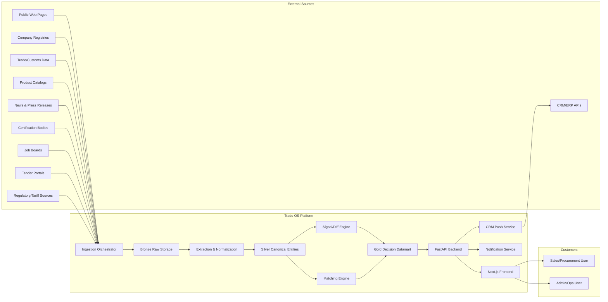
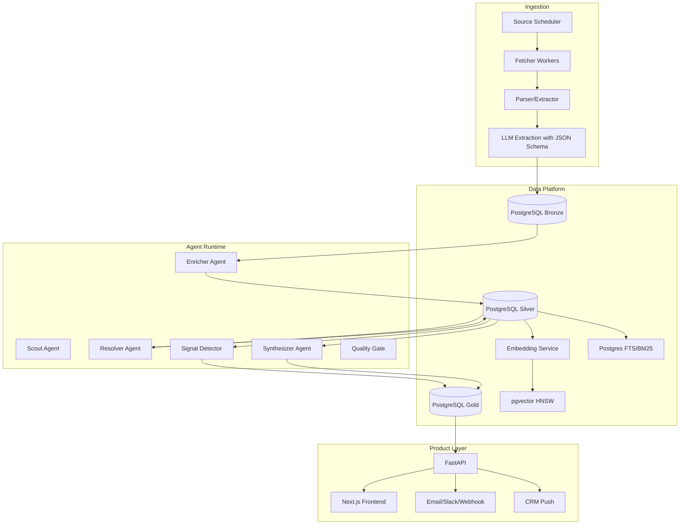
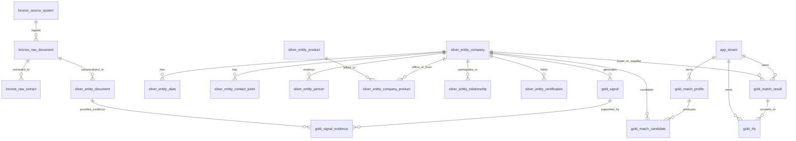
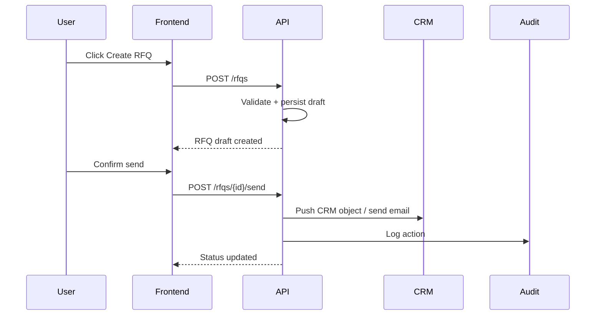

# Trade OS — Masterclass Architecture Specification (HLD/LLD) & 4-Week Sprint Plan

**Version:** 1.0  
**Target:** Transform Trade OS from a developer scraper into a production-grade, un-cancelable B2B vertical market intelligence and decision platform for leather, chemicals, raw materials, and industrial supply chains.  
**Primary outcome:** Within 4 weeks, deploy a customer-facing Match Portal + Live Signals Feed + Account 360 + 1-Click RFQ/CRM Push, and close the first 3 paying customers at **$500–$1,500/month**.

---

## 0. Executive Summary

Trade OS should not sell “scraped data.” It must sell **decisions**:

- Who to contact now.
- Why they are relevant.
- What signal proves intent or risk.
- What action to take next.
- One-click execution: RFQ, save to CRM, alert, outreach draft.

The platform is built as a **deterministic, evidence-first intelligence system**:

1. **Multi-source ingestion** → Bronze raw lineage.
2. **Canonical entity resolution** → Silver companies, products, documents, relationships.
3. **Signals, matching, and account intelligence** → Gold decision datamart.
4. **Customer UX** → Match Portal, Signals Feed, Account 360, RFQ/CRM actions.
5. **GTM** → Founder-led paid pilots with 3 design partners.

The system is intentionally not “fully autonomous AI.” It uses **deterministic agent workflows** with guardrails, auditability, and human approval for customer-facing actions.

---

# 1. Product Positioning and North Star

## 1.1 Category Definition

**Trade OS = B2B Vertical Market Intelligence & Decision Platform**

Not:
- A scraper.
- A lead database.
- A generic AI chatbot.
- A dashboard of charts.

Instead:

> Trade OS identifies high-intent buyers, suppliers, and supply-chain risks in leather, chemical, and industrial raw materials markets, then converts those signals into RFQs, CRM records, and revenue actions.

## 1.2 North Star Metric

**Weekly Qualified Actions Generated**

A Qualified Action is one of:

- RFQ created.
- Account saved to CRM.
- Outreach draft accepted.
- High-intent signal acknowledged.
- Match shortlisted by a paying customer.

Target by end of Week 4:

- 3 paying customers.
- 15+ qualified actions per customer per week.
- 50+ defensible match candidates per customer.
- 100+ live signals across monitored entities.

## 1.3 Core Value Proposition

For a chemical distributor, leather supplier, or industrial raw-material vendor:

> “Trade OS monitors buyers, suppliers, tenders, product changes, certifications, regulatory shifts, and trade signals, then gives your team a ranked list of accounts to contact today with evidence and one-click RFQ/CRM actions.”

## 1.4 Why It Becomes Un-cancelable

Trade OS becomes embedded when it owns the workflow:

1. **Discovery**: Match Portal.
2. **Monitoring**: Live Signals Feed.
3. **Decision**: Account 360.
4. **Action**: RFQ / CRM Push / Outreach Draft.
5. **Memory**: Saved searches, alerts, history, audit trail.

Cancellation becomes painful because the customer loses:

- Their live signal history.
- Their saved match profiles.
- Their account intelligence.
- Their CRM sync workflow.
- Their pipeline source.

---

# 2. High-Level Design (HLD)

## 2.1 System Context Diagram



---

## 2.2 Core Personas

| Persona | Job to be Done | Primary Screens |
|---|---|---|
| Sales Director / BD Manager | Find buyers and suppliers worth contacting now | Match Portal, Signals Feed |
| Procurement Manager | Identify alternative suppliers and monitor supplier risk | Match Portal, Account 360 |
| Founder / RevOps | Build pipeline and push opportunities into CRM | Match Portal, CRM Push |
| Ops/Admin | Manage sources, monitor pipeline health, review data quality | Admin Console |
| Analyst | Validate signals and entity resolution | Admin Console, Evidence Drawer |

---

## 2.3 Component Topology



---

## 2.4 End-to-End Data Flow

### Stage 1: Source Discovery and Fetch

Inputs:
- Source definitions.
- Schedules.
- Legal/robots policy.
- Rate limits.

Outputs:
- `raw_fetch`
- `raw_document`
- `content_hash`
- `storage_uri`

### Stage 2: Extraction

Extract structured fields:
- Company name.
- Country.
- Products.
- HS codes.
- Certifications.
- Contact details.
- Document type.
- Published date.
- Signal candidates.

Outputs:
- `raw_extract`
- JSON extraction payload.
- Confidence scores.

### Stage 3: Canonicalization

Create Silver entities:
- `entity_company`
- `entity_product`
- `entity_document`
- `entity_person`
- `entity_certification`
- `entity_relationship`

### Stage 4: Entity Resolution

Merge duplicates using:
- Exact domain match.
- Registration number.
- Normalized name.
- Country + name.
- Address similarity.
- Embedding similarity.
- Human review for low-confidence merges.

### Stage 5: Enrichment

Generate:
- Embeddings.
- Summaries.
- Tags.
- Product categories.
- Risk flags.
- Intent flags.

### Stage 6: Signal Detection and Diff

Detect changes:
- New product.
- Price change.
- Capacity expansion.
- Certification added.
- Regulatory change.
- New buyer/supplier relationship.
- Financial distress.
- Job posting indicating procurement/expansion.

### Stage 7: Matching

Create ranked matches:
- Buyer-to-supplier.
- Supplier-to-buyer.
- Account-to-signal.
- Search-to-account.

### Stage 8: Customer Decision Layer

Expose:
- Match Portal.
- Signals Feed.
- Account 360.
- Saved searches.
- Alerts.
- RFQ creation.
- CRM push.

---

## 2.5 Non-Functional Requirements

| Area | Requirement |
|---|---|
| Latency | Search < 500ms p95 for 10k–100k entities |
| Freshness | Critical sources refreshed daily or hourly |
| Lineage | Every Gold signal traceable to Bronze raw document |
| Auditability | Every merge, signal, match, RFQ, CRM push logged |
| Security | TLS, encrypted secrets, RBAC, tenant isolation |
| Privacy | GDPR-aware B2B processing, opt-out handling, data minimization |
| Reliability | Retry with exponential backoff, dead-letter queue |
| Observability | Structured logs, traces, metrics, agent run history |
| Extensibility | New source adapters without changing core schema |
| Cost | Prefer Postgres-first architecture before adding vector DB/search cluster |

---

# 3. Low-Level Design (LLD)

## 3.1 PostgreSQL Medallion Database Schema

### 3.1.1 Design Principles

- **Postgres-first**: PostgreSQL + `pgvector` + FTS is enough for MVP.
- **Medallion architecture**:
  - `bronze`: immutable raw data and lineage.
  - `silver`: canonical entities and relationships.
  - `gold`: signals, matches, decisions, commercial actions.
- **Evidence-first**: every signal/match must reference documents.
- **Multi-tenant ready**: tenant isolation at Gold/App layer.
- **Human-in-the-loop**: low-confidence entity merges go to review.

---

## 3.1.2 Extensions and Schemas

```sql
CREATE EXTENSION IF NOT EXISTS pgcrypto;
CREATE EXTENSION IF NOT EXISTS vector;
CREATE EXTENSION IF NOT EXISTS pg_trgm;

CREATE SCHEMA IF NOT EXISTS app;
CREATE SCHEMA IF NOT EXISTS bronze;
CREATE SCHEMA IF NOT EXISTS silver;
CREATE SCHEMA IF NOT EXISTS gold;
CREATE SCHEMA IF NOT EXISTS audit;

CREATE OR REPLACE FUNCTION set_updated_at()
RETURNS TRIGGER AS $$
BEGIN
  NEW.updated_at = now();
  RETURN NEW;
END;
$$ LANGUAGE plpgsql;
```

---

## 3.1.3 App / Tenant Schema

```sql
CREATE TABLE app.tenant (
  id UUID PRIMARY KEY DEFAULT gen_random_uuid(),
  name TEXT NOT NULL,
  slug TEXT NOT NULL UNIQUE,
  plan TEXT NOT NULL DEFAULT 'pilot',
  status TEXT NOT NULL DEFAULT 'active'
    CHECK (status IN ('active','suspended','churned','trial')),
  created_at TIMESTAMPTZ NOT NULL DEFAULT now(),
  updated_at TIMESTAMPTZ NOT NULL DEFAULT now()
);

CREATE TABLE app.app_user (
  id UUID PRIMARY KEY DEFAULT gen_random_uuid(),
  tenant_id UUID NOT NULL REFERENCES app.tenant(id) ON DELETE CASCADE,
  email TEXT NOT NULL UNIQUE,
  full_name TEXT,
  role TEXT NOT NULL DEFAULT 'member'
    CHECK (role IN ('owner','admin','member','analyst')),
  auth_provider TEXT NOT NULL DEFAULT 'email',
  created_at TIMESTAMPTZ NOT NULL DEFAULT now(),
  updated_at TIMESTAMPTZ NOT NULL DEFAULT now()
);

CREATE TABLE app.api_key (
  id UUID PRIMARY KEY DEFAULT gen_random_uuid(),
  tenant_id UUID NOT NULL REFERENCES app.tenant(id) ON DELETE CASCADE,
  user_id UUID REFERENCES app.app_user(id) ON DELETE SET NULL,
  name TEXT NOT NULL,
  hashed_key TEXT NOT NULL,
  scopes TEXT[] NOT NULL DEFAULT '{read}',
  last_used_at TIMESTAMPTZ,
  expires_at TIMESTAMPTZ,
  created_at TIMESTAMPTZ NOT NULL DEFAULT now()
);

CREATE TABLE app.crm_connection (
  id UUID PRIMARY KEY DEFAULT gen_random_uuid(),
  tenant_id UUID NOT NULL REFERENCES app.tenant(id) ON DELETE CASCADE,
  provider TEXT NOT NULL CHECK (provider IN ('hubspot','salesforce','pipedrive','zoho','generic')),
  status TEXT NOT NULL DEFAULT 'disconnected'
    CHECK (status IN ('connected','disconnected','error')),
  credentials_encrypted JSONB,
  default_object_mapping JSONB NOT NULL DEFAULT '{}',
  created_at TIMESTAMPTZ NOT NULL DEFAULT now(),
  updated_at TIMESTAMPTZ NOT NULL DEFAULT now()
);

CREATE TABLE app.saved_search (
  id UUID PRIMARY KEY DEFAULT gen_random_uuid(),
  tenant_id UUID NOT NULL REFERENCES app.tenant(id) ON DELETE CASCADE,
  user_id UUID REFERENCES app.app_user(id) ON DELETE SET NULL,
  name TEXT NOT NULL,
  query JSONB NOT NULL,
  embedding VECTOR(1024),
  notify BOOLEAN NOT NULL DEFAULT true,
  created_at TIMESTAMPTZ NOT NULL DEFAULT now(),
  updated_at TIMESTAMPTZ NOT NULL DEFAULT now()
);

CREATE TABLE audit.audit_event (
  id BIGSERIAL PRIMARY KEY,
  tenant_id UUID REFERENCES app.tenant(id),
  user_id UUID REFERENCES app.app_user(id),
  action TEXT NOT NULL,
  object_type TEXT NOT NULL,
  object_id TEXT,
  metadata JSONB NOT NULL DEFAULT '{}',
  created_at TIMESTAMPTZ NOT NULL DEFAULT now()
);

CREATE TABLE audit.lineage_edge (
  id BIGSERIAL PRIMARY KEY,
  run_id UUID,
  from_table TEXT NOT NULL,
  from_id TEXT NOT NULL,
  to_table TEXT NOT NULL,
  to_id TEXT NOT NULL,
  transform TEXT NOT NULL,
  created_at TIMESTAMPTZ NOT NULL DEFAULT now()
);
```

---

## 3.1.4 Bronze Schema — Raw Ingestion and Lineage

```sql
CREATE TABLE bronze.source_system (
  id UUID PRIMARY KEY DEFAULT gen_random_uuid(),
  name TEXT NOT NULL UNIQUE,
  kind TEXT NOT NULL CHECK (kind IN ('api','web','rss','file','manual','crm')),
  base_url TEXT,
  legal_basis TEXT,
  robots_policy TEXT,
  auth JSONB NOT NULL DEFAULT '{}',
  rate_limit JSONB NOT NULL DEFAULT '{"requests_per_minute": 30}',
  enabled BOOLEAN NOT NULL DEFAULT true,
  created_at TIMESTAMPTZ NOT NULL DEFAULT now(),
  updated_at TIMESTAMPTZ NOT NULL DEFAULT now()
);

CREATE TABLE bronze.ingestion_run (
  id UUID PRIMARY KEY DEFAULT gen_random_uuid(),
  source_id UUID NOT NULL REFERENCES bronze.source_system(id) ON DELETE CASCADE,
  status TEXT NOT NULL DEFAULT 'queued'
    CHECK (status IN ('queued','running','succeeded','failed','partial')),
  started_at TIMESTAMPTZ NOT NULL DEFAULT now(),
  finished_at TIMESTAMPTZ,
  cursor TEXT,
  stats JSONB NOT NULL DEFAULT '{}',
  error TEXT
);

CREATE TABLE bronze.raw_fetch (
  id UUID PRIMARY KEY DEFAULT gen_random_uuid(),
  run_id UUID REFERENCES bronze.ingestion_run(id) ON DELETE SET NULL,
  source_id UUID NOT NULL REFERENCES bronze.source_system(id),
  url TEXT NOT NULL,
  http_status INTEGER,
  fetched_at TIMESTAMPTZ NOT NULL DEFAULT now(),
  content_hash TEXT,
  storage_uri TEXT,
  request JSONB NOT NULL DEFAULT '{}',
  response_headers JSONB NOT NULL DEFAULT '{}',
  latency_ms INTEGER
);

CREATE TABLE bronze.raw_document (
  id UUID PRIMARY KEY DEFAULT gen_random_uuid(),
  raw_fetch_id UUID REFERENCES bronze.raw_fetch(id) ON DELETE SET NULL,
  source_id UUID NOT NULL REFERENCES bronze.source_system(id),
  external_id TEXT,
  url TEXT,
  title TEXT,
  language TEXT,
  mime_type TEXT,
  content_text TEXT,
  content_html TEXT,
  content_json JSONB,
  content_hash TEXT NOT NULL,
  captured_at TIMESTAMPTZ NOT NULL DEFAULT now(),
  published_at TIMESTAMPTZ,
  meta JSONB NOT NULL DEFAULT '{}',
  UNIQUE (source_id, external_id)
);

CREATE TABLE bronze.raw_extract (
  id UUID PRIMARY KEY DEFAULT gen_random_uuid(),
  raw_document_id UUID NOT NULL REFERENCES bronze.raw_document(id) ON DELETE CASCADE,
  extractor_name TEXT NOT NULL,
  extractor_version TEXT NOT NULL,
  status TEXT NOT NULL DEFAULT 'success'
    CHECK (status IN ('success','failed','partial')),
  payload JSONB NOT NULL DEFAULT '{}',
  confidence NUMERIC NOT NULL DEFAULT 0,
  error TEXT,
  created_at TIMESTAMPTZ NOT NULL DEFAULT now()
);

CREATE TABLE bronze.raw_event (
  id UUID PRIMARY KEY DEFAULT gen_random_uuid(),
  source_id UUID NOT NULL REFERENCES bronze.source_system(id),
  raw_document_id UUID REFERENCES bronze.raw_document(id) ON DELETE SET NULL,
  event_type TEXT NOT NULL,
  occurred_at TIMESTAMPTZ,
  payload JSONB NOT NULL DEFAULT '{}',
  content_hash TEXT,
  created_at TIMESTAMPTZ NOT NULL DEFAULT now()
);
```

---

## 3.1.5 Silver Schema — Canonical Entities and Relationships

```sql
CREATE TABLE silver.entity_company (
  id UUID PRIMARY KEY DEFAULT gen_random_uuid(),
  canonical_name TEXT NOT NULL,
  legal_name TEXT,
  domain TEXT,
  country_code CHAR(2),
  registration_number TEXT,
  tax_id TEXT,
  address_line TEXT,
  city TEXT,
  region TEXT,
  postal_code TEXT,
  latitude NUMERIC,
  longitude NUMERIC,
  website TEXT,
  linkedin_url TEXT,
  description TEXT,
  founded_year INTEGER,
  employee_range TEXT,
  ownership_type TEXT,
  status TEXT NOT NULL DEFAULT 'active'
    CHECK (status IN ('active','inactive','unknown','risk')),
  confidence NUMERIC NOT NULL DEFAULT 0,
  source_count INTEGER NOT NULL DEFAULT 1,
  search_vector TSVECTOR,
  embedding VECTOR(1024),
  created_at TIMESTAMPTZ NOT NULL DEFAULT now(),
  updated_at TIMESTAMPTZ NOT NULL DEFAULT now()
);

CREATE TABLE silver.entity_alias (
  id UUID PRIMARY KEY DEFAULT gen_random_uuid(),
  entity_id UUID NOT NULL REFERENCES silver.entity_company(id) ON DELETE CASCADE,
  alias TEXT NOT NULL,
  alias_type TEXT NOT NULL DEFAULT 'trade_name'
    CHECK (alias_type IN ('trade_name','legal_name','brand','former_name','localized')),
  source_id UUID REFERENCES bronze.source_system(id),
  confidence NUMERIC NOT NULL DEFAULT 0,
  created_at TIMESTAMPTZ NOT NULL DEFAULT now()
);

CREATE TABLE silver.entity_contact_point (
  id UUID PRIMARY KEY DEFAULT gen_random_uuid(),
  entity_id UUID NOT NULL REFERENCES silver.entity_company(id) ON DELETE CASCADE,
  contact_type TEXT NOT NULL CHECK (contact_type IN ('email','phone','address','web_form')),
  value TEXT NOT NULL,
  verified BOOLEAN NOT NULL DEFAULT false,
  legal_basis TEXT,
  consent_status TEXT NOT NULL DEFAULT 'legitimate_interest'
    CHECK (consent_status IN ('legitimate_interest','consent','contract','none')),
  created_at TIMESTAMPTZ NOT NULL DEFAULT now()
);

CREATE TABLE silver.entity_person (
  id UUID PRIMARY KEY DEFAULT gen_random_uuid(),
  entity_id UUID REFERENCES silver.entity_company(id) ON DELETE SET NULL,
  full_name TEXT NOT NULL,
  title TEXT,
  email TEXT,
  phone TEXT,
  linkedin_url TEXT,
  source_id UUID REFERENCES bronze.source_system(id),
  confidence NUMERIC NOT NULL DEFAULT 0,
  is_primary BOOLEAN NOT NULL DEFAULT false,
  created_at TIMESTAMPTZ NOT NULL DEFAULT now(),
  updated_at TIMESTAMPTZ NOT NULL DEFAULT now()
);

CREATE TABLE silver.entity_hs_code (
  code TEXT PRIMARY KEY,
  description TEXT NOT NULL,
  parent_code TEXT
);

CREATE TABLE silver.entity_product_category (
  id UUID PRIMARY KEY DEFAULT gen_random_uuid(),
  name TEXT NOT NULL,
  parent_id UUID REFERENCES silver.entity_product_category(id),
  description TEXT
);

CREATE TABLE silver.entity_product (
  id UUID PRIMARY KEY DEFAULT gen_random_uuid(),
  name TEXT NOT NULL,
  description TEXT,
  category_id UUID REFERENCES silver.entity_product_category(id),
  hs_code TEXT REFERENCES silver.entity_hs_code(code),
  spec JSONB NOT NULL DEFAULT '{}',
  search_vector TSVECTOR,
  embedding VECTOR(1024),
  created_at TIMESTAMPTZ NOT NULL DEFAULT now(),
  updated_at TIMESTAMPTZ NOT NULL DEFAULT now()
);

CREATE TABLE silver.entity_company_product (
  company_id UUID NOT NULL REFERENCES silver.entity_company(id) ON DELETE CASCADE,
  product_id UUID NOT NULL REFERENCES silver.entity_product(id) ON DELETE CASCADE,
  role TEXT NOT NULL CHECK (role IN ('supplies','buys','manufactures','distributes','services')),
  evidence JSONB NOT NULL DEFAULT '[]',
  confidence NUMERIC NOT NULL DEFAULT 0,
  created_at TIMESTAMPTZ NOT NULL DEFAULT now(),
  PRIMARY KEY (company_id, product_id, role)
);

CREATE TABLE silver.entity_document (
  id UUID PRIMARY KEY DEFAULT gen_random_uuid(),
  raw_document_id UUID REFERENCES bronze.raw_document(id) ON DELETE SET NULL,
  entity_id UUID REFERENCES silver.entity_company(id) ON DELETE SET NULL,
  doc_type TEXT NOT NULL CHECK (doc_type IN (
    'website','catalog','press_release','news','tender','job_posting',
    'certification','regulatory','financial','social','manual','other'
  )),
  title TEXT,
  url TEXT,
  published_at TIMESTAMPTZ,
  summary TEXT,
  content_text TEXT,
  content_hash TEXT,
  search_vector TSVECTOR,
  embedding VECTOR(1024),
  created_at TIMESTAMPTZ NOT NULL DEFAULT now()
);

CREATE TABLE silver.document_version (
  id UUID PRIMARY KEY DEFAULT gen_random_uuid(),
  entity_document_id UUID NOT NULL REFERENCES silver.entity_document(id) ON DELETE CASCADE,
  content_hash TEXT NOT NULL,
  normalized_text TEXT,
  dom_hash TEXT,
  structured_hash TEXT,
  captured_at TIMESTAMPTZ NOT NULL DEFAULT now()
);

CREATE TABLE silver.entity_relationship (
  id UUID PRIMARY KEY DEFAULT gen_random_uuid(),
  subject_entity_id UUID NOT NULL REFERENCES silver.entity_company(id) ON DELETE CASCADE,
  predicate TEXT NOT NULL CHECK (predicate IN (
    'supplies_to','buys_from','partner_of','subsidiary_of','parent_of',
    'certified_by','represented_by','competes_with','mentioned_with'
  )),
  object_entity_id UUID REFERENCES silver.entity_company(id) ON DELETE CASCADE,
  object_external_name TEXT,
  evidence JSONB NOT NULL DEFAULT '[]',
  confidence NUMERIC NOT NULL DEFAULT 0,
  valid_from DATE,
  valid_to DATE,
  created_at TIMESTAMPTZ NOT NULL DEFAULT now()
);

CREATE TABLE silver.entity_certification (
  id UUID PRIMARY KEY DEFAULT gen_random_uuid(),
  entity_id UUID NOT NULL REFERENCES silver.entity_company(id) ON DELETE CASCADE,
  certification_type TEXT NOT NULL,
  certification_name TEXT NOT NULL,
  issued_by TEXT,
  status TEXT NOT NULL DEFAULT 'active'
    CHECK (status IN ('active','expired','pending','revoked')),
  valid_from DATE,
  valid_to DATE,
  evidence JSONB NOT NULL DEFAULT '[]',
  created_at TIMESTAMPTZ NOT NULL DEFAULT now()
);

CREATE TABLE silver.entity_tag (
  entity_id UUID NOT NULL REFERENCES silver.entity_company(id) ON DELETE CASCADE,
  tag TEXT NOT NULL,
  score NUMERIC NOT NULL DEFAULT 0,
  source TEXT,
  created_at TIMESTAMPTZ NOT NULL DEFAULT now(),
  PRIMARY KEY (entity_id, tag)
);

CREATE TABLE silver.entity_link (
  id UUID PRIMARY KEY DEFAULT gen_random_uuid(),
  entity_id UUID NOT NULL REFERENCES silver.entity_company(id) ON DELETE CASCADE,
  source_id UUID REFERENCES bronze.source_system(id),
  external_id TEXT NOT NULL,
  url TEXT,
  confidence NUMERIC NOT NULL DEFAULT 0,
  created_at TIMESTAMPTZ NOT NULL DEFAULT now(),
  UNIQUE (entity_id, source_id, external_id)
);

CREATE TABLE silver.entity_resolution_candidate (
  id UUID PRIMARY KEY DEFAULT gen_random_uuid(),
  left_entity_id UUID NOT NULL REFERENCES silver.entity_company(id) ON DELETE CASCADE,
  right_entity_id UUID NOT NULL REFERENCES silver.entity_company(id) ON DELETE CASCADE,
  score NUMERIC NOT NULL,
  features JSONB NOT NULL DEFAULT '{}',
  status TEXT NOT NULL DEFAULT 'pending'
    CHECK (status IN ('pending','merged','rejected')),
  created_at TIMESTAMPTZ NOT NULL DEFAULT now(),
  resolved_at TIMESTAMPTZ
);

CREATE TABLE silver.entity_resolution_decision (
  id UUID PRIMARY KEY DEFAULT gen_random_uuid(),
  candidate_id UUID NOT NULL REFERENCES silver.entity_resolution_candidate(id) ON DELETE CASCADE,
  decision TEXT NOT NULL CHECK (decision IN ('merged','rejected','escalated')),
  decided_by TEXT NOT NULL,
  reason TEXT,
  created_at TIMESTAMPTZ NOT NULL DEFAULT now()
);

CREATE TABLE silver.entity_change_log (
  id BIGSERIAL PRIMARY KEY,
  entity_id UUID NOT NULL,
  entity_type TEXT NOT NULL,
  field TEXT NOT NULL,
  old_value JSONB,
  new_value JSONB,
  source_id UUID REFERENCES bronze.source_system(id),
  created_at TIMESTAMPTZ NOT NULL DEFAULT now()
);
```

---

## 3.1.6 Gold Schema — Signals, Matches, and Commercial Actions

```sql
CREATE TABLE gold.signal_rule (
  id UUID PRIMARY KEY DEFAULT gen_random_uuid(),
  name TEXT NOT NULL,
  entity_type TEXT NOT NULL DEFAULT 'company',
  pattern_type TEXT NOT NULL CHECK (pattern_type IN ('regex','keyword','embedding','diff','structured')),
  pattern JSONB NOT NULL,
  signal_type TEXT NOT NULL,
  severity TEXT NOT NULL DEFAULT 'medium'
    CHECK (severity IN ('low','medium','high','critical')),
  active BOOLEAN NOT NULL DEFAULT true,
  created_at TIMESTAMPTZ NOT NULL DEFAULT now()
);

CREATE TABLE gold.diff_event (
  id UUID PRIMARY KEY DEFAULT gen_random_uuid(),
  entity_document_id UUID NOT NULL REFERENCES silver.entity_document(id) ON DELETE CASCADE,
  prev_version_id UUID REFERENCES silver.document_version(id),
  new_version_id UUID NOT NULL REFERENCES silver.document_version(id),
  diff_type TEXT NOT NULL CHECK (diff_type IN ('text','html_dom','json_structured','price','product','certification')),
  diff_json JSONB NOT NULL DEFAULT '{}',
  changed_fields TEXT[] NOT NULL DEFAULT '{}',
  created_at TIMESTAMPTZ NOT NULL DEFAULT now()
);

CREATE TABLE gold.signal (
  id UUID PRIMARY KEY DEFAULT gen_random_uuid(),
  tenant_id UUID REFERENCES app.tenant(id),
  entity_id UUID NOT NULL REFERENCES silver.entity_company(id) ON DELETE CASCADE,
  signal_type TEXT NOT NULL CHECK (signal_type IN (
    'demand_signal','price_change','capacity_expansion','new_product',
    'supplier_risk','regulatory_change','partnership','certification',
    'financial_distress','inventory_shortage','tariff_change','leadership_change',
    'job_posting_intent','tender_published','rfp_detected'
  )),
  severity TEXT NOT NULL DEFAULT 'medium'
    CHECK (severity IN ('low','medium','high','critical')),
  title TEXT NOT NULL,
  summary TEXT NOT NULL,
  occurred_at TIMESTAMPTZ,
  detected_at TIMESTAMPTZ NOT NULL DEFAULT now(),
  score NUMERIC NOT NULL DEFAULT 0,
  status TEXT NOT NULL DEFAULT 'new'
    CHECK (status IN ('new','acknowledged','dismissed','converted','archived')),
  dedupe_key TEXT UNIQUE,
  embedding VECTOR(1024),
  created_at TIMESTAMPTZ NOT NULL DEFAULT now()
);

CREATE TABLE gold.signal_evidence (
  id UUID PRIMARY KEY DEFAULT gen_random_uuid(),
  signal_id UUID NOT NULL REFERENCES gold.signal(id) ON DELETE CASCADE,
  document_id UUID REFERENCES silver.entity_document(id) ON DELETE SET NULL,
  quote TEXT,
  url TEXT,
  confidence NUMERIC NOT NULL DEFAULT 0,
  created_at TIMESTAMPTZ NOT NULL DEFAULT now()
);

CREATE TABLE gold.match_profile (
  id UUID PRIMARY KEY DEFAULT gen_random_uuid(),
  tenant_id UUID NOT NULL REFERENCES app.tenant(id) ON DELETE CASCADE,
  name TEXT NOT NULL,
  objective TEXT NOT NULL CHECK (objective IN ('find_buyers','find_suppliers','monitor_risk','find_partners')),
  criteria JSONB NOT NULL DEFAULT '{}',
  embedding VECTOR(1024),
  active BOOLEAN NOT NULL DEFAULT true,
  created_by UUID REFERENCES app.app_user(id),
  created_at TIMESTAMPTZ NOT NULL DEFAULT now(),
  updated_at TIMESTAMPTZ NOT NULL DEFAULT now()
);

CREATE TABLE gold.match_candidate (
  id UUID PRIMARY KEY DEFAULT gen_random_uuid(),
  match_profile_id UUID NOT NULL REFERENCES gold.match_profile(id) ON DELETE CASCADE,
  entity_id UUID NOT NULL REFERENCES silver.entity_company(id) ON DELETE CASCADE,
  score NUMERIC NOT NULL,
  rank INTEGER,
  features JSONB NOT NULL DEFAULT '{}',
  rationale TEXT,
  status TEXT NOT NULL DEFAULT 'suggested'
    CHECK (status IN ('suggested','shortlisted','contacted','dismissed','converted')),
  created_at TIMESTAMPTZ NOT NULL DEFAULT now(),
  UNIQUE (match_profile_id, entity_id)
);

CREATE TABLE gold.match_result (
  id UUID PRIMARY KEY DEFAULT gen_random_uuid(),
  tenant_id UUID NOT NULL REFERENCES app.tenant(id) ON DELETE CASCADE,
  match_profile_id UUID REFERENCES gold.match_profile(id) ON DELETE SET NULL,
  buyer_entity_id UUID NOT NULL REFERENCES silver.entity_company(id),
  supplier_entity_id UUID NOT NULL REFERENCES silver.entity_company(id),
  score NUMERIC NOT NULL,
  rationale JSONB NOT NULL DEFAULT '{}',
  state TEXT NOT NULL DEFAULT 'new'
    CHECK (state IN ('new','shortlisted','contacted','rfq_sent','won','lost','dismissed')),
  created_at TIMESTAMPTZ NOT NULL DEFAULT now(),
  updated_at TIMESTAMPTZ NOT NULL DEFAULT now()
);

CREATE TABLE gold.account_360_snapshot (
  id UUID PRIMARY KEY DEFAULT gen_random_uuid(),
  entity_id UUID NOT NULL REFERENCES silver.entity_company(id) ON DELETE CASCADE,
  snapshot JSONB NOT NULL DEFAULT '{}',
  generated_at TIMESTAMPTZ NOT NULL DEFAULT now()
);

CREATE TABLE gold.opportunity (
  id UUID PRIMARY KEY DEFAULT gen_random_uuid(),
  tenant_id UUID NOT NULL REFERENCES app.tenant(id) ON DELETE CASCADE,
  entity_id UUID NOT NULL REFERENCES silver.entity_company(id),
  match_result_id UUID REFERENCES gold.match_result(id) ON DELETE SET NULL,
  stage TEXT NOT NULL DEFAULT 'discovery'
    CHECK (stage IN ('discovery','qualified','proposal','negotiation','closed_won','closed_lost')),
  value NUMERIC,
  currency CHAR(3),
  owner_user_id UUID REFERENCES app.app_user(id),
  next_action TEXT,
  due_at TIMESTAMPTZ,
  created_at TIMESTAMPTZ NOT NULL DEFAULT now(),
  updated_at TIMESTAMPTZ NOT NULL DEFAULT now()
);

CREATE TABLE gold.rfq (
  id UUID PRIMARY KEY DEFAULT gen_random_uuid(),
  tenant_id UUID NOT NULL REFERENCES app.tenant(id) ON DELETE CASCADE,
  entity_id UUID NOT NULL REFERENCES silver.entity_company(id),
  match_result_id UUID REFERENCES gold.match_result(id) ON DELETE SET NULL,
  product_name TEXT NOT NULL,
  spec JSONB NOT NULL DEFAULT '{}',
  quantity NUMERIC,
  unit TEXT,
  target_price NUMERIC,
  currency CHAR(3),
  deadline DATE,
  notes TEXT,
  status TEXT NOT NULL DEFAULT 'draft'
    CHECK (status IN ('draft','ready','sent','acknowledged','expired','converted')),
  crm_id TEXT,
  sent_at TIMESTAMPTZ,
  created_at TIMESTAMPTZ NOT NULL DEFAULT now(),
  updated_at TIMESTAMPTZ NOT NULL DEFAULT now()
);

CREATE TABLE gold.alert_subscription (
  id UUID PRIMARY KEY DEFAULT gen_random_uuid(),
  tenant_id UUID NOT NULL REFERENCES app.tenant(id) ON DELETE CASCADE,
  user_id UUID REFERENCES app.app_user(id) ON DELETE SET NULL,
  channel TEXT NOT NULL CHECK (channel IN ('email','slack','webhook','in_app')),
  filter JSONB NOT NULL DEFAULT '{}',
  active BOOLEAN NOT NULL DEFAULT true,
  created_at TIMESTAMPTZ NOT NULL DEFAULT now()
);

CREATE TABLE gold.notification_log (
  id UUID PRIMARY KEY DEFAULT gen_random_uuid(),
  tenant_id UUID REFERENCES app.tenant(id),
  user_id UUID REFERENCES app.app_user(id),
  channel TEXT NOT NULL,
  payload JSONB NOT NULL DEFAULT '{}',
  status TEXT NOT NULL DEFAULT 'queued'
    CHECK (status IN ('queued','sent','failed')),
  sent_at TIMESTAMPTZ
);
```

---

## 3.1.7 Indexes, Triggers, and Search Configuration

```sql
-- Updated_at triggers
CREATE TRIGGER tenant_updated_at BEFORE UPDATE ON app.tenant FOR EACH ROW EXECUTE FUNCTION set_updated_at();
CREATE TRIGGER app_user_updated_at BEFORE UPDATE ON app.app_user FOR EACH ROW EXECUTE FUNCTION set_updated_at();
CREATE TRIGGER crm_connection_updated_at BEFORE UPDATE ON app.crm_connection FOR EACH ROW EXECUTE FUNCTION set_updated_at();
CREATE TRIGGER saved_search_updated_at BEFORE UPDATE ON app.saved_search FOR EACH ROW EXECUTE FUNCTION set_updated_at();
CREATE TRIGGER source_system_updated_at BEFORE UPDATE ON bronze.source_system FOR EACH ROW EXECUTE FUNCTION set_updated_at();
CREATE TRIGGER entity_company_updated_at BEFORE UPDATE ON silver.entity_company FOR EACH ROW EXECUTE FUNCTION set_updated_at();
CREATE TRIGGER entity_person_updated_at BEFORE UPDATE ON silver.entity_person FOR EACH ROW EXECUTE FUNCTION set_updated_at();
CREATE TRIGGER entity_product_updated_at BEFORE UPDATE ON silver.entity_product FOR EACH ROW EXECUTE FUNCTION set_updated_at();
CREATE TRIGGER match_profile_updated_at BEFORE UPDATE ON gold.match_profile FOR EACH ROW EXECUTE FUNCTION set_updated_at();
CREATE TRIGGER match_result_updated_at BEFORE UPDATE ON gold.match_result FOR EACH ROW EXECUTE FUNCTION set_updated_at();
CREATE TRIGGER opportunity_updated_at BEFORE UPDATE ON gold.opportunity FOR EACH ROW EXECUTE FUNCTION set_updated_at();
CREATE TRIGGER rfq_updated_at BEFORE UPDATE ON gold.rfq FOR EACH ROW EXECUTE FUNCTION set_updated_at();

-- FTS triggers
CREATE TRIGGER entity_company_search_update
BEFORE INSERT OR UPDATE ON silver.entity_company
FOR EACH ROW EXECUTE FUNCTION tsvector_update_trigger(
  search_vector, 'pg_catalog.english', canonical_name, legal_name, description
);

CREATE TRIGGER entity_product_search_update
BEFORE INSERT OR UPDATE ON silver.entity_product
FOR EACH ROW EXECUTE FUNCTION tsvector_update_trigger(
  search_vector, 'pg_catalog.english', name, description
);

CREATE TRIGGER entity_document_search_update
BEFORE INSERT OR UPDATE ON silver.entity_document
FOR EACH ROW EXECUTE FUNCTION tsvector_update_trigger(
  search_vector, 'pg_catalog.english', title, summary, content_text
);

-- Core indexes
CREATE INDEX IF NOT EXISTS idx_company_country ON silver.entity_company(country_code);
CREATE INDEX IF NOT EXISTS idx_company_domain ON silver.entity_company(domain);
CREATE INDEX IF NOT EXISTS idx_company_name_trgm ON silver.entity_company USING gin(canonical_name gin_trgm_ops);
CREATE INDEX IF NOT EXISTS idx_company_search_vector ON silver.entity_company USING gin(search_vector);
CREATE INDEX IF NOT EXISTS idx_company_embedding ON silver.entity_company USING hnsw(embedding vector_cosine_ops);

CREATE INDEX IF NOT EXISTS idx_product_search_vector ON silver.entity_product USING gin(search_vector);
CREATE INDEX IF NOT EXISTS idx_product_embedding ON silver.entity_product USING hnsw(embedding vector_cosine_ops);

CREATE INDEX IF NOT EXISTS idx_document_search_vector ON silver.entity_document USING gin(search_vector);
CREATE INDEX IF NOT EXISTS idx_document_embedding ON silver.entity_document USING hnsw(embedding vector_cosine_ops);
CREATE INDEX IF NOT EXISTS idx_document_entity ON silver.entity_document(entity_id);
CREATE INDEX IF NOT EXISTS idx_document_published ON silver.entity_document(published_at DESC);

CREATE INDEX IF NOT EXISTS idx_signal_entity ON gold.signal(entity_id);
CREATE INDEX IF NOT EXISTS idx_signal_type ON gold.signal(signal_type);
CREATE INDEX IF NOT EXISTS idx_signal_detected_at ON gold.signal(detected_at DESC);
CREATE INDEX IF NOT EXISTS idx_signal_embedding ON gold.signal USING hnsw(embedding vector_cosine_ops);

CREATE INDEX IF NOT EXISTS idx_match_candidate_profile ON gold.match_candidate(match_profile_id);
CREATE INDEX IF NOT EXISTS idx_match_candidate_entity ON gold.match_candidate(entity_id);
CREATE INDEX IF NOT EXISTS idx_match_result_tenant ON gold.match_result(tenant_id);
CREATE INDEX IF NOT EXISTS idx_rfq_tenant ON gold.rfq(tenant_id);
CREATE INDEX IF NOT EXISTS idx_opportunity_tenant ON gold.opportunity(tenant_id);

CREATE INDEX IF NOT EXISTS idx_audit_event_tenant ON audit.audit_event(tenant_id);
CREATE INDEX IF NOT EXISTS idx_lineage_run ON audit.lineage_edge(run_id);
```

---

## 3.1.8 Tenant Isolation with Row-Level Security

Use RLS for tenant-owned Gold tables.

```sql
ALTER TABLE gold.match_profile ENABLE ROW LEVEL SECURITY;
ALTER TABLE gold.match_candidate ENABLE ROW LEVEL SECURITY;
ALTER TABLE gold.match_result ENABLE ROW LEVEL SECURITY;
ALTER TABLE gold.opportunity ENABLE ROW LEVEL SECURITY;
ALTER TABLE gold.rfq ENABLE ROW LEVEL SECURITY;
ALTER TABLE gold.alert_subscription ENABLE ROW LEVEL SECURITY;

CREATE POLICY tenant_isolation_match_profile ON gold.match_profile
USING (tenant_id = current_setting('app.tenant_id', true)::uuid);

CREATE POLICY tenant_isolation_match_result ON gold.match_result
USING (tenant_id = current_setting('app.tenant_id', true)::uuid);

CREATE POLICY tenant_isolation_rfq ON gold.rfq
USING (tenant_id = current_setting('app.tenant_id', true)::uuid);

CREATE POLICY tenant_isolation_opportunity ON gold.opportunity
USING (tenant_id = current_setting('app.tenant_id', true)::uuid);
```

Application layer must set:

```sql
SET LOCAL app.tenant_id = 'tenant-uuid-here';
```

inside each request transaction.

---

## 3.1.9 Simplified ERD



---

# 3.2 Autonomous Agent Architecture

Trade OS uses a **deterministic state machine**, not a free-form autonomous agent. The agent graph is implemented with **LangGraph + Python** and persists state in Postgres.

## 3.2.1 Agent Roles

| Agent | Responsibility | Inputs | Outputs |
|---|---|---|---|
| Scout | Discover/fetch source documents | source config, cursor | raw fetches, raw documents |
| Enricher | Extract structured entities and embeddings | raw documents | raw extracts, Silver entities |
| Resolver | Deduplicate and merge entities | Silver entities | resolution candidates, merged entities |
| Signal Detector | Detect changes and classify events | document versions, rules | diff events, signals |
| Synthesizer | Generate match rationale and account summaries | entities, signals, products | match results, account 360 |
| Quality Gate | Validate confidence and evidence | all outputs | approve/reject/escalate |

---

## 3.2.2 Agent State Schema

```python
from typing import TypedDict, Literal, Optional
from uuid import UUID
from datetime import datetime

class AgentTaskState(TypedDict):
    task_id: UUID
    tenant_id: Optional[UUID]
    objective: Literal[
        "ingest_source",
        "enrich_entities",
        "resolve_entities",
        "detect_signals",
        "synthesize_matches",
        "full_refresh"
    ]
    source_ids: list[UUID]
    cursor: Optional[str]
    raw_document_ids: list[UUID]
    extract_ids: list[UUID]
    entity_ids: list[UUID]
    unresolved_candidate_ids: list[UUID]
    signal_ids: list[UUID]
    match_profile_ids: list[UUID]
    match_result_ids: list[UUID]
    errors: list[dict]
    next_action: Literal[
        "fetch",
        "extract",
        "resolve",
        "detect_signals",
        "synthesize",
        "quality_gate",
        "persist",
        "notify",
        "done",
        "failed"
    ]
    started_at: datetime
    updated_at: datetime
```

---

## 3.2.3 LangGraph State Machine

```python
from langgraph.graph import StateGraph, END

def scout_node(state: AgentTaskState) -> AgentTaskState:
    ...

def enricher_node(state: AgentTaskState) -> AgentTaskState:
    ...

def resolver_node(state: AgentTaskState) -> AgentTaskState:
    ...

def signal_detector_node(state: AgentTaskState) -> AgentTaskState:
    ...

def synthesizer_node(state: AgentTaskState) -> AgentTaskState:
    ...

def quality_gate_node(state: AgentTaskState) -> AgentTaskState:
    ...

def persist_node(state: AgentTaskState) -> AgentTaskState:
    ...

def notify_node(state: AgentTaskState) -> AgentTaskState:
    ...

def route_next(state: AgentTaskState) -> str:
    return state["next_action"]

builder = StateGraph(AgentTaskState)

builder.add_node("scout", scout_node)
builder.add_node("enricher", enricher_node)
builder.add_node("resolver", resolver_node)
builder.add_node("signal_detector", signal_detector_node)
builder.add_node("synthesizer", synthesizer_node)
builder.add_node("quality_gate", quality_gate_node)
builder.add_node("persist", persist_node)
builder.add_node("notify", notify_node)

builder.set_entry_point("scout")

builder.add_conditional_edges(
    "scout",
    route_next,
    {
        "extract": "enricher",
        "failed": END,
    }
)

builder.add_conditional_edges(
    "enricher",
    route_next,
    {
        "resolve": "resolver",
        "detect_signals": "signal_detector",
        "failed": END,
    }
)

builder.add_conditional_edges(
    "resolver",
    route_next,
    {
        "detect_signals": "signal_detector",
        "failed": END,
    }
)

builder.add_conditional_edges(
    "signal_detector",
    route_next,
    {
        "synthesize": "synthesizer",
        "quality_gate": "quality_gate",
        "failed": END,
    }
)

builder.add_conditional_edges(
    "synthesizer",
    route_next,
    {
        "quality_gate": "quality_gate",
        "failed": END,
    }
)

builder.add_conditional_edges(
    "quality_gate",
    route_next,
    {
        "persist": "persist",
        "failed": END,
    }
)

builder.add_edge("persist", "notify")
builder.add_edge("notify", END)

graph = builder.compile()
```

---

## 3.2.4 Python Service Signatures

```python
from dataclasses import dataclass
from uuid import UUID
from typing import Optional

@dataclass
class ScoutInput:
    source_id: UUID
    cursor: Optional[str]
    max_items: int = 100

@dataclass
class ScoutOutput:
    raw_fetch_ids: list[UUID]
    raw_document_ids: list[UUID]
    next_cursor: Optional[str]
    errors: list[dict]

class ScoutAgent:
    def run(self, input: ScoutInput) -> ScoutOutput:
        ...

@dataclass
class EnricherInput:
    raw_document_ids: list[UUID]

@dataclass
class EnricherOutput:
    extract_ids: list[UUID]
    company_ids: list[UUID]
    product_ids: list[UUID]
    document_ids: list[UUID]
    errors: list[dict]

class EnricherAgent:
    def run(self, input: EnricherInput) -> EnricherOutput:
        ...

@dataclass
class ResolverInput:
    entity_ids: list[UUID]
    auto_merge_threshold: float = 0.92
    review_threshold: float = 0.75

@dataclass
class ResolverOutput:
    merged_entity_ids: list[UUID]
    review_candidate_ids: list[UUID]
    rejected_candidate_ids: list[UUID]

class ResolverAgent:
    def run(self, input: ResolverInput) -> ResolverOutput:
        ...

@dataclass
class SignalDetectorInput:
    entity_ids: list[UUID]
    document_ids: list[UUID]

@dataclass
class SignalDetectorOutput:
    diff_event_ids: list[UUID]
    signal_ids: list[UUID]

class SignalDetector:
    def run(self, input: SignalDetectorInput) -> SignalDetectorOutput:
        ...

@dataclass
class SynthesizerInput:
    tenant_id: UUID
    match_profile_ids: list[UUID]

@dataclass
class SynthesizerOutput:
    match_result_ids: list[UUID]
    account_snapshot_ids: list[UUID]

class SynthesizerAgent:
    def run(self, input: SynthesizerInput) -> SynthesizerOutput:
        ...
```

---

## 3.2.5 Agent Guardrails

| Guardrail | Rule |
|---|---|
| Source legality | Only allowed domains/source IDs |
| PII | Redact personal emails unless B2B legitimate interest recorded |
| Confidence | Auto-merge only if score ≥ 0.92 |
| Evidence | Signal must have at least one evidence document |
| Rate limit | Enforce source rate limits |
| Retry | Max 3 retries with exponential backoff |
| Human review | Low-confidence merges/signals go to admin queue |
| Audit | Every agent node writes `audit_event` and lineage |
| Output schema | LLM extraction must validate against JSON Schema |
| No customer action without approval | RFQ/CRM push requires explicit user action |

---

# 3.3 Hybrid Search and Retrieval System

## 3.3.1 Retrieval Strategy

Trade OS uses hybrid retrieval:

1. **Postgres Full-Text Search** for keyword/exact business terms.
2. **pgvector HNSW** for semantic similarity.
3. **Reciprocal Rank Fusion (RRF)** to merge results.
4. Optional true BM25 via ParadeDB/pg_search if needed.

For MVP, `tsvector` + `ts_rank_cd` is acceptable. Label it as “BM25-style lexical retrieval” unless using ParadeDB.

---

## 3.3.2 Hybrid Search Function with RRF

```sql
CREATE OR REPLACE FUNCTION silver.search_company(
  query_text TEXT,
  query_embedding VECTOR(1024),
  match_count INT DEFAULT 20,
  rrf_k INT DEFAULT 60
)
RETURNS TABLE (
  id UUID,
  canonical_name TEXT,
  country_code CHAR(2),
  domain TEXT,
  rrf_score DOUBLE PRECISION,
  fts_score DOUBLE PRECISION,
  vector_score DOUBLE PRECISION
)
LANGUAGE sql
STABLE
AS $$
WITH query AS (
  SELECT websearch_to_tsquery('english', query_text) AS q
),
fts AS (
  SELECT
    c.id,
    ts_rank_cd(c.search_vector, query.q) AS score,
    ROW_NUMBER() OVER (ORDER BY ts_rank_cd(c.search_vector, query.q) DESC) AS rank_no
  FROM silver.entity_company c, query
  WHERE c.search_vector @@ query.q
  LIMIT match_count * 3
),
vec AS (
  SELECT
    c.id,
    GREATEST(0, 1 - (c.embedding <=> query_embedding)) AS score,
    ROW_NUMBER() OVER (ORDER BY c.embedding <=> query_embedding) AS rank_no
  FROM silver.entity_company c
  WHERE c.embedding IS NOT NULL
  LIMIT match_count * 3
),
rrf AS (
  SELECT
    COALESCE(f.id, v.id) AS id,
    COALESCE(1.0 / (rrf_k + f.rank_no), 0) +
    COALESCE(1.0 / (rrf_k + v.rank_no), 0) AS rrf_score,
    f.score AS fts_score,
    v.score AS vector_score
  FROM fts f
  FULL OUTER JOIN vec v ON f.id = v.id
)
SELECT
  c.id,
  c.canonical_name,
  c.country_code,
  c.domain,
  r.rrf_score,
  r.fts_score,
  r.vector_score
FROM rrf r
JOIN silver.entity_company c ON c.id = r.id
ORDER BY r.rrf_score DESC
LIMIT match_count;
$$;
```

---

## 3.3.3 Optional True BM25 with ParadeDB

If using ParadeDB `pg_search`:

```sql
-- Example replacement for lexical CTE
SELECT
  id,
  paradedb.score(id) AS score,
  ROW_NUMBER() OVER (ORDER BY paradedb.score(id) DESC) AS rank_no
FROM silver.entity_company
WHERE canonical_name @@@ 'leather OR chemical OR "raw material"'
LIMIT 60;
```

Use true BM25 when:
- Search quality is weak on technical product terms.
- Customers need exact part numbers, HS codes, or chemical names.
- You need advanced boosting and phrase queries.

---

# 3.4 Signal Detection and Diff Engine

## 3.4.1 Signal Taxonomy

| Signal Type | Business Meaning |
|---|---|
| `demand_signal` | Company is likely buying |
| `price_change` | Price increase/decrease detected |
| `capacity_expansion` | New plant, hiring, equipment |
| `new_product` | New catalog/product launch |
| `supplier_risk` | Financial, legal, quality, sanction risk |
| `regulatory_change` | Compliance/tariff/REACH/TSCA change |
| `partnership` | New distributor/partner |
| `certification` | ISO, REACH, ESG, leather certification |
| `financial_distress` | Insolvency, layoffs, negative news |
| `inventory_shortage` | Stockout/lead-time increase |
| `tariff_change` | Import/export duty change |
| `leadership_change` | New procurement head/CEO |
| `job_posting_intent` | Hiring indicates expansion/procurement |
| `tender_published` | Public tender/RFP detected |
| `rfp_detected` | Informal RFQ language detected |

---

## 3.4.2 Diff Strategy

Use three diff modes:

### Text Diff
For articles, press releases, web copy.

### DOM/AST Diff
For HTML pages where structure matters:
- product tables
- pricing tables
- certification badges
- specification lists

### Structured JSON Diff
For APIs/catalogs:
- product name
- price
- availability
- certifications
- specifications

---

## 3.4.3 Python Diff Engine Signatures

```python
from dataclasses import dataclass
from typing import Optional
from uuid import UUID

@dataclass
class HashResult:
    content_hash: str
    dom_hash: Optional[str]
    structured_hash: Optional[str]

@dataclass
class DiffResult:
    diff_type: str
    changed_fields: list[str]
    diff_json: dict
    confidence: float

class DocumentVersioner:
    def compute_hashes(
        self,
        text: str,
        html: Optional[str] = None,
        structured: Optional[dict] = None
    ) -> HashResult:
        ...

    def diff_versions(
        self,
        previous: dict,
        current: dict
    ) -> DiffResult:
        ...

@dataclass
class SignalCandidate:
    entity_id: UUID
    signal_type: str
    severity: str
    title: str
    summary: str
    evidence: list[dict]
    score: float
    dedupe_key: str

class SignalDetector:
    def detect_from_diff(
        self,
        entity_id: UUID,
        document_id: UUID,
        diff: DiffResult
    ) -> list[SignalCandidate]:
        ...

class EventClassifier:
    def classify(
        self,
        text: str,
        metadata: dict
    ) -> SignalCandidate:
        ...
```

---

## 3.4.4 Signal Candidate JSON Schema

```json
{
  "$schema": "https://json-schema.org/draft/2020-12/schema",
  "title": "SignalCandidate",
  "type": "object",
  "required": [
    "entity_id",
    "signal_type",
    "severity",
    "title",
    "summary",
    "evidence",
    "score",
    "dedupe_key"
  ],
  "properties": {
    "entity_id": { "type": "string", "format": "uuid" },
    "signal_type": {
      "type": "string",
      "enum": [
        "demand_signal",
        "price_change",
        "capacity_expansion",
        "new_product",
        "supplier_risk",
        "regulatory_change",
        "partnership",
        "certification",
        "financial_distress",
        "inventory_shortage",
        "tariff_change",
        "leadership_change",
        "job_posting_intent",
        "tender_published",
        "rfp_detected"
      ]
    },
    "severity": {
      "type": "string",
      "enum": ["low", "medium", "high", "critical"]
    },
    "title": { "type": "string" },
    "summary": { "type": "string" },
    "evidence": {
      "type": "array",
      "items": {
        "type": "object",
        "required": ["document_id", "quote", "confidence"],
        "properties": {
          "document_id": { "type": "string", "format": "uuid" },
          "quote": { "type": "string" },
          "url": { "type": "string", "format": "uri" },
          "confidence": { "type": "number", "minimum": 0, "maximum": 1 }
        }
      }
    },
    "score": { "type": "number", "minimum": 0, "maximum": 1 },
    "dedupe_key": { "type": "string" }
  }
}
```

---

## 3.4.5 Example Signal Rules

```sql
INSERT INTO gold.signal_rule (name, pattern_type, pattern, signal_type, severity)
VALUES
(
  'Price increase language',
  'regex',
  '{"regex": "(price increase|surcharge|price adjustment|increase effective)", "fields": ["content_text"]}',
  'price_change',
  'high'
),
(
  'Capacity expansion language',
  'keyword',
  '{"keywords": ["new plant", "capacity expansion", "production line", "facility opening"], "fields": ["content_text"]}',
  'capacity_expansion',
  'medium'
),
(
  'Tender detected',
  'keyword',
  '{"keywords": ["tender", "request for proposal", "rfp", "bid submission"], "fields": ["title", "content_text"]}',
  'tender_published',
  'high'
);
```

---

# 3.5 Matching Engine

## 3.5.1 Match Scoring Formula

For each candidate buyer/supplier pair:

```text
final_score =
  0.35 * intent_score
+ 0.30 * capability_score
+ 0.15 * geography_score
+ 0.10 * risk_inverse_score
+ 0.10 * freshness_score
```

### Intent Score
Signals indicating buying intent:
- tender
- job posting
- procurement language
- RFQ language
- product demand
- expansion

### Capability Score
Overlap between supplier capability and buyer need:
- product category
- HS code
- certification
- technical spec
- production capacity

### Geography Score
- Country preference.
- Trade lane.
- Tariff advantage.
- Logistics proximity.

### Risk Inverse Score
Lower risk = higher score.

### Freshness Score
More recent signals = higher score.

---

## 3.5.2 Python Matching Signature

```python
from dataclasses import dataclass
from uuid import UUID

@dataclass
class MatchFeatures:
    intent_score: float
    capability_score: float
    geography_score: float
    risk_score: float
    freshness_score: float

@dataclass
class MatchOutput:
    buyer_entity_id: UUID
    supplier_entity_id: UUID
    score: float
    rationale: dict
    evidence_signal_ids: list[UUID]

class MatchingEngine:
    def score_pair(
        self,
        buyer_entity_id: UUID,
        supplier_entity_id: UUID,
        match_profile_id: UUID
    ) -> MatchOutput:
        ...
```

---

## 3.5.3 Rationale JSON Example

```json
{
  "final_score": 0.87,
  "components": {
    "intent_score": 0.91,
    "capability_score": 0.84,
    "geography_score": 0.78,
    "risk_inverse_score": 0.93,
    "freshness_score": 0.88
  },
  "why": "Buyer published a tender for leather finishing chemicals and recently expanded production capacity in Vietnam.",
  "evidence": [
    {
      "signal_id": "uuid",
      "title": "Tender published for leather finishing chemicals",
      "quote": "Request for proposals: supply of leather finishing chemicals for 2026 production.",
      "url": "https://example.com/tender"
    }
  ]
}
```

---

# 3.6 Production FastAPI API Route Contracts

## 3.6.1 API Conventions

- Base URL: `/api/v1`
- Auth: Bearer token or API key.
- Content type: JSON.
- Pagination: `page`, `page_size`, max 100.
- Errors: RFC-style problem JSON.
- Idempotency: `Idempotency-Key` header for POST actions.
- Tenant isolation: JWT claim or `app.tenant_id` session setting.

---

## 3.6.2 Core Route Table

| Method | Route | Purpose |
|---|---|---|
| POST | `/auth/token` | Issue access token |
| POST | `/api-keys` | Create API key |
| GET | `/tenants/me` | Get tenant profile |
| GET | `/search/companies` | Hybrid company search |
| GET | `/search/signals` | Signal search |
| GET | `/signals` | Live signals feed |
| POST | `/signals/{signal_id}/ack` | Acknowledge signal |
| POST | `/signals/{signal_id}/dismiss` | Dismiss signal |
| GET | `/accounts/{account_id}` | Account 360 |
| GET | `/accounts/{account_id}/signals` | Account signals |
| GET | `/accounts/{account_id}/timeline` | Account timeline |
| POST | `/accounts/{account_id}/crm-push` | Push account to CRM |
| GET | `/match-profiles` | List match profiles |
| POST | `/match-profiles` | Create match profile |
| GET | `/matches` | Get ranked matches |
| POST | `/matches/{match_id}/shortlist` | Shortlist match |
| POST | `/matches/{match_id}/dismiss` | Dismiss match |
| POST | `/rfqs` | Create RFQ |
| GET | `/rfqs` | List RFQs |
| POST | `/rfqs/{rfq_id}/send` | Send RFQ |
| GET | `/saved-searches` | List saved searches |
| POST | `/saved-searches` | Create saved search |
| GET | `/streams/signals` | SSE live signal stream |
| POST | `/admin/sources` | Create source |
| POST | `/admin/runs` | Trigger ingestion run |
| GET | `/admin/runs/{run_id}` | Inspect run |
| GET | `/admin/review/entity-merges` | Entity merge review queue |
| POST | `/admin/review/entity-merges/{candidate_id}` | Approve/reject merge |

---

## 3.6.3 Pydantic Schemas

```python
from pydantic import BaseModel, Field, HttpUrl, EmailStr
from uuid import UUID
from datetime import datetime
from typing import Optional, Literal

class TokenRequest(BaseModel):
    email: EmailStr
    password: str

class TokenResponse(BaseModel):
    access_token: str
    token_type: str = "bearer"
    expires_in: int

class CompanySearchResult(BaseModel):
    id: UUID
    canonical_name: str
    country_code: Optional[str]
    domain: Optional[str]
    score: float
    top_signal: Optional[str]
    match_reason: Optional[str]

class SignalOut(BaseModel):
    id: UUID
    entity_id: UUID
    signal_type: str
    severity: Literal["low", "medium", "high", "critical"]
    title: str
    summary: str
    occurred_at: Optional[datetime]
    detected_at: datetime
    score: float
    status: str
    evidence: list[dict]

class Account360Out(BaseModel):
    id: UUID
    canonical_name: str
    country_code: Optional[str]
    website: Optional[HttpUrl]
    description: Optional[str]
    tags: list[str]
    products: list[dict]
    recent_signals: list[SignalOut]
    relationships: list[dict]
    risk_flags: list[str]
    recommended_next_action: str

class MatchProfileCreate(BaseModel):
    name: str
    objective: Literal["find_buyers", "find_suppliers", "monitor_risk", "find_partners"]
    criteria: dict

class MatchResultOut(BaseModel):
    id: UUID
    buyer_entity_id: UUID
    supplier_entity_id: UUID
    score: float
    rationale: dict
    state: str
    created_at: datetime

class RFQCreate(BaseModel):
    entity_id: UUID
    match_result_id: Optional[UUID] = None
    product_name: str
    spec: dict = {}
    quantity: Optional[float] = None
    unit: Optional[str] = None
    target_price: Optional[float] = None
    currency: Optional[str] = "USD"
    deadline: Optional[str] = None
    notes: Optional[str] = None

class RFQOut(BaseModel):
    id: UUID
    entity_id: UUID
    product_name: str
    status: str
    crm_id: Optional[str]
    created_at: datetime

class CRMPushRequest(BaseModel):
    provider: Literal["hubspot", "salesforce", "pipedrive", "zoho", "generic"]
    object_type: Literal["company", "contact", "deal", "note"]
    payload: dict

class CRMPushResponse(BaseModel):
    job_id: UUID
    status: Literal["queued", "sent", "failed"]
```

---

## 3.6.4 Example API Contracts

### Search Companies

```http
GET /api/v1/search/companies?q=leather%20chemicals&country=VN&page=1&page_size=20
```

Response:

```json
{
  "items": [
    {
      "id": "uuid",
      "canonical_name": "Vietnam Leather Chemicals JSC",
      "country_code": "VN",
      "domain": "vietnamleatherchem.example",
      "score": 0.91,
      "top_signal": "Tender published for tannery finishing chemicals",
      "match_reason": "High product overlap and recent procurement signal"
    }
  ],
  "page": 1,
  "page_size": 20,
  "total": 132
}
```

### Get Account 360

```http
GET /api/v1/accounts/{account_id}
```

Response:

```json
{
  "id": "uuid",
  "canonical_name": "Alpha Leather Group",
  "country_code": "VN",
  "website": "https://alphaleather.example",
  "description": "Leather goods manufacturer supplying footwear brands.",
  "tags": ["leather", "footwear", "exporter", "REACH-aware"],
  "products": [
    {
      "name": "Finished leather",
      "hs_code": "4107",
      "role": "supplies"
    }
  ],
  "recent_signals": [
    {
      "id": "uuid",
      "signal_type": "capacity_expansion",
      "severity": "high",
      "title": "New production line announced",
      "summary": "Company announced a new leather finishing line in Binh Duong.",
      "score": 0.86,
      "evidence": [
        {
          "quote": "Alpha Leather opened a new finishing line...",
          "url": "https://news.example/article"
        }
      ]
    }
  ],
  "relationships": [
    {
      "predicate": "supplies_to",
      "object_name": "Global Footwear Brand",
      "confidence": 0.82
    }
  ],
  "risk_flags": [],
  "recommended_next_action": "Send RFQ for finishing chemicals before Q3 procurement cycle."
}
```

### Create RFQ

```http
POST /api/v1/rfqs
```

Request:

```json
{
  "entity_id": "uuid",
  "match_result_id": "uuid",
  "product_name": "Leather finishing chemical",
  "spec": {
    "grade": "industrial",
    "packaging": "200L drums",
    "certification": ["REACH"]
  },
  "quantity": 5000,
  "unit": "kg",
  "target_price": 4.2,
  "currency": "USD",
  "deadline": "2026-07-15",
  "notes": "Need COA and REACH documentation."
}
```

Response:

```json
{
  "id": "uuid",
  "entity_id": "uuid",
  "product_name": "Leather finishing chemical",
  "status": "draft",
  "crm_id": null,
  "created_at": "2026-06-16T12:00:00Z"
}
```

### CRM Push

```http
POST /api/v1/accounts/{account_id}/crm-push
```

Request:

```json
{
  "provider": "hubspot",
  "object_type": "company",
  "payload": {
    "name": "Alpha Leather Group",
    "country": "Vietnam",
    "industry": "Leather Manufacturing",
    "notes": "High-intent account detected by Trade OS."
  }
}
```

Response:

```json
{
  "job_id": "uuid",
  "status": "queued"
}
```

---

# 4. Frontend Customer UX/UI Architecture

## 4.1 UX Principles

1. **Evidence before opinion**  
   Every match/signal must show source quote and URL.

2. **Action within 30 seconds**  
   User should be able to shortlist, create RFQ, or push to CRM immediately.

3. **No developer-facing logs**  
   Customers see business language, not scraper logs.

4. **Signal freshness is visible**  
   Show “Detected 2 hours ago,” not just raw timestamp.

5. **Confidence is explainable**  
   Show why a match is recommended.

---

## 4.2 Information Architecture

```text
/dashboard
/matches
/matches/[matchId]
/signals
/signals/[signalId]
/accounts
/accounts/[accountId]
/rfqs
/rfqs/[rfqId]
/saved-searches
/settings
/settings/crm
/settings/alerts
/admin/sources
/admin/review
```

---

## 4.3 Match Portal Wireframe

```text
+------------------------------------------------------------------+
| Trade OS   Matches   Signals   Accounts   RFQs        [Alerts] [User] |
+------------------------------------------------------------------+
| Filters: Objective [Find Buyers v] Country [VN v] HS Code [4107] |
| Signal Type [Tender v] Severity [High v]       [Save Search]     |
+------------------------------------------------------------------+
| Ranked Matches                                                   |
|                                                                  |
| [91] Alpha Leather Group                                         |
| Vietnam | Leather goods manufacturer                             |
| Signal: Tender published for finishing chemicals                 |
| Why: Product overlap + recent procurement signal                 |
| [Open Account] [Shortlist] [Create RFQ] [Push to CRM]            |
|                                                                  |
| [87] Mekong Chemicals                                            |
| Vietnam | Chemical distributor                                   |
| Signal: Hiring procurement manager                               |
| Why: Expansion + chemical category match                         |
| [Open Account] [Shortlist] [Create RFQ] [Push to CRM]            |
+------------------------------------------------------------------+
```

---

## 4.4 Account 360 Wireframe

```text
+------------------------------------------------------------------+
| < Back to Matches                                                |
| Alpha Leather Group                            [Push to CRM]     |
| Vietnam | Leather goods manufacturer | Website | LinkedIn        |
+------------------------------------------------------------------+
| Tabs: Overview | Signals | Products | Relationships | Risk | RFQs |
+------------------------------------------------------------------+
| Overview                                                         |
| - Description                                                    |
| - Tags                                                           |
| - Certifications                                                 |
| - Recommended next action                                        |
+------------------------------------------------------------------+
| Signals                                                          |
| [High] Tender published for finishing chemicals                  |
| Detected 2h ago | Evidence: quote | URL                          |
| [Acknowledge] [Dismiss] [Create RFQ]                             |
+------------------------------------------------------------------+
| Products                                                         |
| - Finished leather, HS 4107                                      |
| - Leather chemicals, HS 3403                                     |
+------------------------------------------------------------------+
| Relationships                                                    |
| - Supplies to Global Footwear Brand                              |
| - Partner with Logistics Co                                      |
+------------------------------------------------------------------+
```

---

## 4.5 Live Signals Feed Wireframe

```text
+------------------------------------------------------------------+
| Live Signals                                                     |
| Filters: Type [All v] Severity [High v] Country [All v]          |
+------------------------------------------------------------------+
| [Critical] Supplier risk detected                                |
| Entity: Delta Tannery                                            |
| Summary: Negative news regarding environmental compliance        |
| Evidence: View source                                            |
| [Acknowledge] [Dismiss] [Open Account]                           |
+------------------------------------------------------------------+
| [High] Tender published                                          |
| Entity: Alpha Leather Group                                      |
| Summary: RFP for leather finishing chemicals                     |
| Evidence: View source                                            |
| [Create RFQ] [Open Account]                                      |
+------------------------------------------------------------------+
```

---

## 4.6 1-Click RFQ / CRM Push Flow



---

## 4.7 Frontend Component Architecture

Use:
- Next.js App Router
- Tailwind CSS
- shadcn/ui
- TanStack Query
- Zustand for lightweight UI state
- Server-Sent Events for live signals

### Core Components

| Component | Purpose |
|---|---|
| `MatchCard` | Ranked match with actions |
| `SignalCard` | Signal with severity/evidence |
| `EvidenceDrawer` | Side panel showing source quote |
| `Account360Tabs` | Account intelligence tabs |
| `RFQModal` | Create/edit RFQ |
| `CRMConnect` | Connect HubSpot/Salesforce |
| `SavedSearchBuilder` | Save search + alert |
| `CommandBar` | Quick search/actions |
| `AdminSourceTable` | Manage ingestion sources |
| `ReviewQueue` | Entity merge/signal review |

---

## 4.8 Frontend Data Contracts

```ts
type CompanySearchResult = {
  id: string;
  canonical_name: string;
  country_code?: string;
  domain?: string;
  score: number;
  top_signal?: string;
  match_reason?: string;
};

type Signal = {
  id: string;
  entity_id: string;
  signal_type: string;
  severity: "low" | "medium" | "high" | "critical";
  title: string;
  summary: string;
  detected_at: string;
  score: number;
  evidence: {
    document_id?: string;
    quote?: string;
    url?: string;
    confidence?: number;
  }[];
};

type Account360 = {
  id: string;
  canonical_name: string;
  country_code?: string;
  website?: string;
  description?: string;
  tags: string[];
  products: {
    name: string;
    hs_code?: string;
    role: string;
  }[];
  recent_signals: Signal[];
  relationships: {
    predicate: string;
    object_name?: string;
    confidence?: number;
  }[];
  risk_flags: string[];
  recommended_next_action: string;
};
```

---

# 5. 4-Week Immediate Business Impact Sprint Plan

## 5.0 Sprint Goal

By the end of Week 4:

- Live customer portal.
- At least 3 paying design partners.
- 5+ production sources.
- 10k+ canonical companies.
- 100+ signals.
- 50+ match candidates per design partner.
- RFQ/CRM push working.
- Legal/GDPR baseline complete.
- Founder-led GTM motion running daily.

## 5.0.1 Team Assumption

Minimum team:

- Founder/CEO: GTM, sales, product, legal.
- Technical Founder/Engineer: backend, agents, DB.
- Optional: Frontend/contractor for UI.
- Optional: Ops/analyst for data review.

If solo founder: reduce scope to one niche and use concierge onboarding.

---

## 5.1 Week 1 — Foundation, Data, and First Value

### Week 1 Objective

Stand up the data platform and produce the first commercially useful match list.

### Week 1 Milestone

**Milestone:** Internal demo with 10k companies, 100 signals, and 20 high-intent accounts.

---

### Week 1 Day-by-Day

| Day | Technical Tasks | Commercial Tasks | Output |
|---|---|---|---|
| Day 1 | Repo, Docker, Postgres, pgvector, schema migration, env vars | Define ICP, pick niche, create 50-prospect list | Running stack + ICP doc |
| Day 2 | Build 2 source adapters, Bronze ingestion, raw document storage | Draft lead magnet: “20 High-Intent Buyers Report” | First raw data ingested |
| Day 3 | Extraction pipeline, JSON schema validation, Silver entities | Create outreach sequence | 5k canonical companies |
| Day 4 | Embeddings + FTS + hybrid search | Create landing page | Search API working |
| Day 5 | First signal rules, admin review queue, internal demo | Book 10 discovery calls | First 20-account match list |

### Week 1 Definition of Done

- Postgres schema deployed.
- 2+ sources ingesting.
- Bronze lineage stored.
- Silver companies created.
- Hybrid search returns relevant results.
- 20 high-intent accounts manually validated.
- 10 discovery calls booked.

### Week 1 Commercial Deliverables

- ICP one-pager.
- 50-prospect list.
- Lead magnet PDF or live report.
- Landing page.
- Cold email sequence v1.
- Discovery call script.

---

## 5.2 Week 2 — Agents, Signals, and Match Quality

### Week 2 Objective

Make the system produce repeatable match candidates with evidence.

### Week 2 Milestone

**Milestone:** Agent pipeline generates 50 match candidates with rationale and evidence.

---

### Week 2 Day-by-Day

| Day | Technical Tasks | Commercial Tasks | Output |
|---|---|---|---|
| Day 6 | LangGraph scaffold, Scout node, ingestion run tracking | Discovery calls, collect pain points | Agent run framework |
| Day 7 | Enricher node, extraction improvements, product tagging | Refine ICP based on calls | Better entity extraction |
| Day 8 | Resolver node, dedupe candidates, merge review UI | Create pilot offer | Entity resolution v1 |
| Day 9 | Diff engine, document versions, signal rules | Send follow-up sequence | 100+ signals |
| Day 10 | Synthesizer node, match rationale, gold match results | Demo to 3 prospects | 50 ranked matches |

### Week 2 Definition of Done

- Scout/Enricher/Resolver/Synthesizer nodes working.
- Agent runs are logged and resumable.
- Signal detection produces evidence-backed signals.
- Match rationale is visible.
- 3 prospects have seen a tailored demo.

### Week 2 Commercial Deliverables

- Pilot offer: $500 paid pilot.
- Demo video.
- 3 design-partner conversations.
- Objection handling doc.
- First paid pilot proposal sent.

---

## 5.3 Week 3 — Customer Portal and Action Layer

### Week 3 Objective

Replace developer-facing outputs with a customer-facing decision portal.

### Week 3 Milestone

**Milestone:** Customer can log in, view matches, open Account 360, and create RFQ.

---

### Week 3 Day-by-Day

| Day | Technical Tasks | Commercial Tasks | Output |
|---|---|---|---|
| Day 11 | FastAPI route hardening, auth, tenant context | Send pilot proposals | Stable API |
| Day 12 | Next.js scaffold, auth, dashboard layout | Onboard first pilot | App shell |
| Day 13 | Match Portal UI, filters, match cards | Collect pilot feedback | Match Portal v1 |
| Day 14 | Account 360 UI, signals tab, evidence drawer | Second pilot onboarding | Account 360 v1 |
| Day 15 | RFQ modal, CRM push stub, saved search | Third pilot onboarding | Action layer v1 |

### Week 3 Definition of Done

- Customer login works.
- Match Portal loads ranked matches.
- Account 360 shows signals and evidence.
- RFQ can be created.
- CRM push at least creates a HubSpot/Pipedrive note or company stub.
- 3 pilot users active.

### Week 3 Commercial Deliverables

- 3 active pilots.
- Pilot onboarding checklist.
- Customer success playbook.
- First customer RFQ generated.
- Case study notes.

---

## 5.4 Week 4 — Hardening, Conversion, and First Revenue

### Week 4 Objective

Convert pilots into paying customers and harden production reliability.

### Week 4 Milestone

**Milestone:** 3 paying customers at $500–$1,500/month.

---

### Week 4 Day-by-Day

| Day | Technical Tasks | Commercial Tasks | Output |
|---|---|---|---|
| Day 16 | Observability, error tracking, rate limits, audit logs | Pilot review calls | Production hardening |
| Day 17 | Improve top 3 customer match profiles | Present ROI summary | Better match quality |
| Day 18 | Alerting, saved searches, notification email | Ask for payment/upgrade | Alerting v1 |
| Day 19 | Fix pilot blockers, polish UI, CRM integration | Close customer 1 and 2 | Stable pilot experience |
| Day 20 | Final demo, invoice, onboarding, case study | Close customer 3 | 3 paying customers |

### Week 4 Definition of Done

- 3 paying customers.
- Each customer has:
  - saved match profile,
  - at least 10 shortlisted accounts,
  - at least 1 RFQ or CRM push,
  - weekly alert configured.
- Error rate < 1% of API requests.
- Agent runs have retry and audit.
- Legal baseline published.
- Billing/invoicing operational.

### Week 4 Commercial Deliverables

- 3 signed paid agreements.
- 3 invoices sent.
- 1 case study draft.
- 20 qualified pipeline opportunities.
- Repeatable outreach sequence.
- Customer onboarding playbook.

---

# 6. Founder Operations and GTM Playbook

## 6.1 Legal, Privacy, and GDPR Compliance Checklist

This is not legal advice. Validate with counsel, especially for EU, UK, US, and chemical-sector regulations.

### Data Protection

| Item | Required Action |
|---|---|
| Lawful basis | Document B2B legitimate interest or consent where required |
| Privacy policy | Publish clear privacy policy |
| DPA | Prepare Data Processing Agreement for customers |
| Subprocessors | List Postgres host, LLM provider, email provider, CRM |
| Data minimization | Avoid unnecessary personal data |
| DSAR process | Support access/deletion requests |
| Retention policy | Define raw/silver/gold retention |
| Opt-out | Provide suppression list for contacts/companies |
| Cross-border transfers | Use SCCs or equivalent if EU data leaves EU |
| Security | TLS, encrypted secrets, RBAC, audit logs |

### Scraping and Source Use

| Item | Required Action |
|---|---|
| Robots.txt | Respect robots.txt where feasible |
| Terms of service | Review source ToS |
| Login walls | Do not bypass authentication |
| Rate limits | Respect rate limits |
| Copyright | Store extracts for internal analysis; display only short quotes |
| API terms | Comply with API licensing |
| Sanctions/export control | Flag sanctioned entities |
| Chemical compliance | Be aware of REACH/TSCA but do not provide compliance certification unless qualified |

### Customer Contracts

Include:
- Data is provided “as is.”
- No guarantee of business outcomes.
- Customer is responsible for outreach compliance.
- IP ownership of customer data.
- Confidentiality.
- Limitation of liability.
- Subscription terms.
- Cancellation/refund policy.

---

## 6.2 Lead Magnet Deployment

### Lead Magnet Idea

**“20 High-Intent Buyers/Suppliers in [Niche] — Signal Report”**

Example:

> “20 Active Buyers for Leather Finishing Chemicals in Vietnam and Indonesia — Updated Weekly”

### Lead Magnet Contents

For each account:
- Company name.
- Country.
- Why flagged.
- Signal type.
- Evidence snippet.
- Recommended action.

### Delivery

1. Landing page with email capture.
2. Instant PDF or live portal link.
3. Follow-up email sequence.
4. Book demo CTA.

### Landing Page Copy

```text
Headline:
Find active buyers and suppliers in leather, chemicals, and industrial raw materials — before your competitors do.

Subheadline:
Trade OS monitors tenders, product changes, certifications, expansion signals, and procurement intent across global supply chains.

CTA:
Get the 20 High-Intent Accounts Report

Secondary CTA:
Book a 15-minute demo
```

---

## 6.3 Cold Outreach Templates

### Template 1: Signal-Based Email

Subject: `{{Company}} + {{Signal}}`

```text
Hi {{FirstName}},

We noticed {{Company}} recently {{signal: published a tender / expanded production / hired a procurement lead / launched a new product line}}.

Trade OS tracks procurement and supply-chain signals for {{industry}} companies. Based on this, we identified {{number}} potential {{buyers/suppliers}} that match your {{product/service}}.

Would you be open to a 15-minute walkthrough of the list?

Best,
{{FounderName}}
```

### Template 2: Direct Pilot Offer

Subject: `Paid pilot: {{number}} qualified {{buyers/suppliers}}`

```text
Hi {{FirstName}},

We are running a limited pilot of Trade OS for {{industry}} companies.

For $500, we will deliver:
- 25 qualified {{buyers/suppliers}}
- Live signals explaining why each account matters
- 1-click RFQ/CRM push workflow
- Weekly alerting

If we do not identify at least 5 accounts worth contacting, we will refund the pilot fee.

Can I send a sample report for {{Company}}?

Best,
{{FounderName}}
```

### Template 3: LinkedIn Note

```text
Hi {{FirstName}} — we track procurement signals for {{industry}} companies. Saw {{Company}} may be {{signal}}. We found a few matching accounts worth contacting. Happy to share a sample.
```

### Follow-Up Sequence

| Day | Action |
|---|---|
| Day 0 | Email 1 |
| Day 2 | LinkedIn view + connection note |
| Day 4 | Email 2: sample signal |
| Day 7 | Call or LinkedIn message |
| Day 10 | Email 3: pilot offer |
| Day 14 | Breakup email with report link |

---

## 6.4 Pricing and Packaging

### Starter Pilot — $500/month

For first customers.

Includes:
- 1 user.
- 1 match profile.
- 25 monitored accounts.
- Weekly signal digest.
- Manual onboarding.
- Email support.

### Growth — $950/month

Includes:
- 3 users.
- 3 match profiles.
- 100 monitored accounts.
- Live signals feed.
- Saved searches.
- CRM push.
- Weekly strategy call.

### Professional — $1,500/month

Includes:
- 5 users.
- Unlimited match profiles within fair use.
- 500 monitored accounts.
- API access.
- CRM sync.
- Priority source onboarding.
- SLA response time.
- Quarterly signal strategy review.

### Pilot Guarantee

For first 3 customers:

> “If we do not deliver at least 5 accounts your team agrees are worth contacting within 14 days, we will refund the $500 pilot fee.”

This reduces friction while keeping the pilot paid and serious.

---

## 6.5 Exact Strategy to Close First 3 Paying Customers

### Step 1: Pick One Narrow Wedge

Do not sell “all industrial supply chains.”

Choose one:

**Recommended wedge:**  
“Leather chemical suppliers and buyers in Vietnam/Indonesia/India.”

Why:
- Specific.
- Signal-rich.
- Global trade relevance.
- Clear buyer/supplier matching.

### Step 2: Build a 50-Account Prospect List

Target:
- Leather chemical manufacturers.
- Tannery suppliers.
- Footwear/leather goods manufacturers.
- Chemical distributors.
- Trading companies.

Sources:
- LinkedIn Sales Navigator.
- Trade directories.
- Exhibition exhibitor lists.
- Public import/export records.
- Industry associations.

### Step 3: Create a Personalized Signal Report

For each prospect:
- Find one real signal.
- Identify 3 potential matches.
- Create a 1-page PDF.

Example:

```text
Prepared for: ABC Leather Chemicals
Signal detected: Vietnam footwear manufacturer expanding finishing capacity.
Potential matches:
1. Alpha Leather Group — tender for finishing chemicals.
2. Mekong Tannery — hiring procurement manager.
3. Pacific Leather — new REACH-compliant product line.
Recommended action: Send technical spec and COA.
```

### Step 4: Run Founder-Led Outreach

Daily target:
- 10 personalized emails.
- 10 LinkedIn touches.
- 5 follow-ups.
- 2 discovery calls.

### Step 5: Discovery Call Script

1. Ask:
   - How do you currently find buyers/suppliers?
   - How much time does it take?
   - What signals do you use today?
   - What is a qualified account worth?
2. Show:
   - One signal.
   - One match.
   - One recommended action.
3. Offer:
   - Paid pilot.
   - 14-day guarantee.
   - Onboarding within 48 hours.

### Step 6: Close With a Paid Pilot

Do not give free custom work.

Say:

> “We can build this for you as a paid pilot. It is $500 for 14 days. We will deliver 25 qualified accounts with signals and recommended actions. If your team does not see at least 5 worth contacting, we refund the fee.”

### Step 7: Onboard in 48 Hours

Onboarding checklist:
1. Confirm ICP.
2. Confirm product/HS codes.
3. Confirm target countries.
4. Create match profile.
5. Deliver first 25 matches.
6. Set up weekly alert.
7. Connect CRM if available.
8. Schedule review call.

### Step 8: Convert to $950–$1,500/month

At day 14:

- Show number of matches.
- Show signals.
- Show actions taken.
- Show pipeline value.
- Ask for upgrade.

Script:

> “The pilot produced X accounts and Y signals. Your team shortlisted Z. The next step is to keep monitoring live and push new accounts directly into your CRM. The Growth plan is $950/month.”

---

## 6.6 Objection Handling

| Objection | Response |
|---|---|
| “We already use a database.” | “Databases give static lists. Trade OS gives live signals and recommended actions.” |
| “Is this scraped data?” | “We combine public sources, validate entities, and show evidence. We focus on decision-ready accounts.” |
| “We don’t trust AI.” | “The workflow is deterministic and evidence-based. Every match has source quotes and confidence scores.” |
| “Too expensive.” | “One qualified RFQ usually covers the monthly fee. The pilot guarantee reduces risk.” |
| “We need more data.” | “We will onboard your exact product/HS codes and target countries during the pilot.” |
| “We are worried about GDPR.” | “We use B2B legitimate interest where applicable, minimize personal data, and provide opt-out handling.” |

---

## 6.7 KPI Dashboard

### Product KPIs

| KPI | Target by Week 4 |
|---|---|
| Canonical companies | 10,000+ |
| Signals generated | 100+ |
| Match candidates per customer | 50+ |
| Shortlist rate | >20% |
| RFQ creation rate | >10% of shortlists |
| Weekly active users | 100% of pilot accounts |

### GTM KPIs

| KPI | Target by Week 4 |
|---|---|
| Outreach sent | 300+ |
| Replies | 15+ |
| Discovery calls | 10+ |
| Pilot proposals | 5+ |
| Paying customers | 3 |
| MRR | $1,500–$4,500 |

---

# 7. Production Readiness Checklist

## 7.1 Infrastructure

- Postgres managed database with backups.
- `pgvector` enabled.
- Object storage for raw HTML/PDF snapshots.
- Redis or queue for jobs.
- Worker process for ingestion/agents.
- FastAPI service.
- Next.js frontend.
- Secret manager.
- TLS everywhere.

## 7.2 Observability

- Structured JSON logs.
- Request IDs.
- Agent run IDs.
- Ingestion metrics:
  - fetch success rate
  - extraction success rate
  - entity resolution rate
  - signal precision
- Product metrics:
  - searches
  - shortlists
  - RFQs
  - CRM pushes
  - alert clicks

## 7.3 Quality Gates

| Gate | Threshold |
|---|---|
| Extraction confidence | ≥ 0.75 for auto-accept |
| Entity merge confidence | ≥ 0.92 auto-merge |
| Entity review threshold | 0.75–0.92 |
| Signal evidence | At least one quote/source |
| Match score | ≥ 0.65 to surface |
| High-intent match | ≥ 0.80 |
| Duplicate signal | Dedupe key required |

## 7.4 Security

- RBAC roles: owner, admin, member, analyst.
- API keys hashed.
- Tenant isolation enforced.
- Audit logs for CRM push and RFQ send.
- No secrets in code.
- Rate limiting.
- Input validation.
- SSRF protection for fetchers.
- Allowlist for source domains.

---

# 8. Appendix: Recommended First Sources

Use only legally compliant sources.

| Source Type | Examples | Use |
|---|---|---|
| Company registries | OpenCorporates, national registries | Entity resolution |
| Trade directories | Kompass, Europages, exhibitor lists | Company discovery |
| News | Industry news, press releases | Signals |
| Tenders | Public procurement portals | Demand signals |
| Job boards | LinkedIn, Indeed | Expansion/procurement intent |
| Certifications | ISO, REACH, Leather Working Group | Capability signals |
| Product catalogs | Supplier websites | Product matching |
| Regulatory | Tariff/trade regulation sites | Risk signals |
| CRM | Customer’s CRM | Feedback loop and push target |

---

# 9. Final 4-Week Success Definition

At the end of 4 weeks, Trade OS is not a scraper. It is:

1. A **vertical intelligence platform** with canonical entities.
2. A **signal engine** with evidence and lineage.
3. A **matching engine** with explainable scores.
4. A **customer portal** with Match Portal, Signals Feed, and Account 360.
5. A **workflow tool** with RFQ and CRM push.
6. A **commercial business** with 3 paying customers.

The most important rule:

> Do not sell data. Sell the next best action.