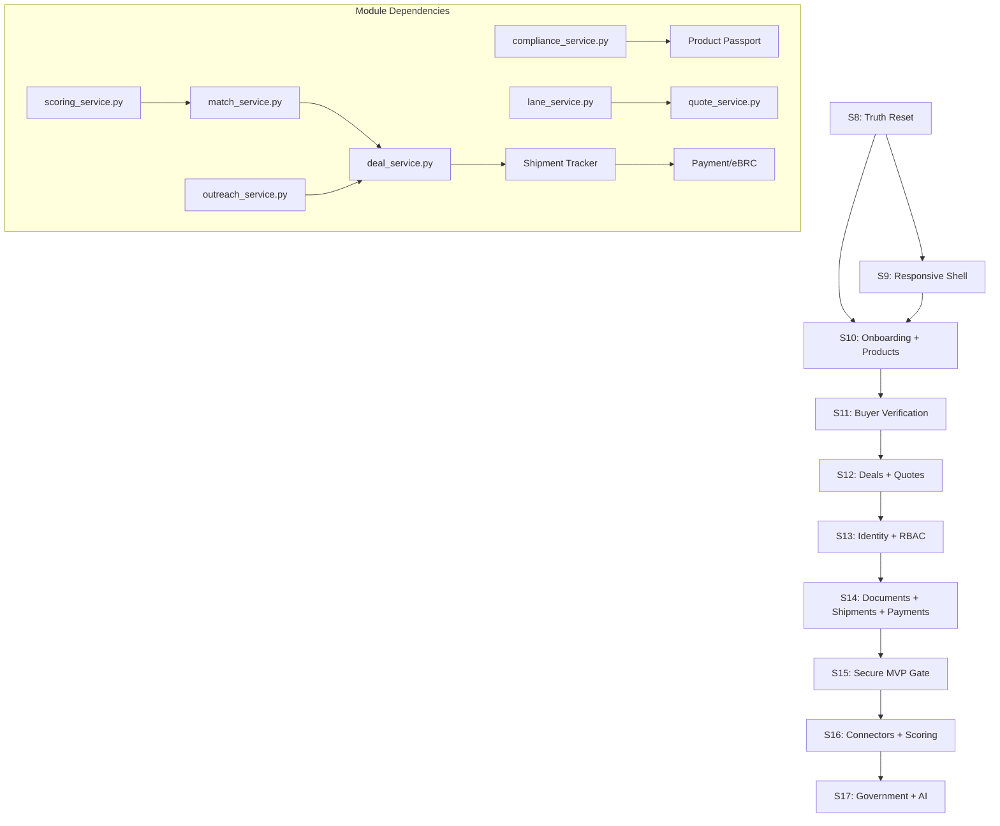

# Trade OS — India-SMB Reconstruction Implementation Plan

> **Source:** [Trade_OS_India_SMB_End_to_End_Completion_Master_Plan.md](file:///C:/Users/arsac/OneDrive/Documents/GitHub/Trade%20OS/Trade_OS_India_SMB_End_to_End_Completion_Master_Plan.md)
> **Existing codebase:** 153 entities, 11 modules (S1–S7 completed)
> **Target:** Honest, trustworthy export execution OS for Indian leather SMB exporters
> **Planning date:** 29 August 2026

---

## TL;DR — Is the Reconstruction Worth It?

> [!IMPORTANT]
> **Yes, absolutely.** The master plan explicitly says (§1.2): _"A coherent vertical concept, a working FastAPI/React/PostgreSQL foundation, a clear repository/service/layer architecture, a polished desktop demonstration, passing tests, and explainability concepts"_ — these are all **valuable and retained**.
>
> What changes is the **product promise** (from "autonomous AI intelligence platform" → "trustworthy export opportunity & execution OS") and the **missing end-to-end workflow** (exporter readiness → buyer → deal → quote → shipment → payment → eBRC).

### What We KEEP (✅)
- FastAPI modular monolith architecture (services → repos → models)
- PostgreSQL 16 + medallion schema pattern (bronze → silver → gold)
- All 23 SQLAlchemy ORM models (refactored, not rebuilt)
- All 11 service files (extended, not replaced)
- All 11 repository files (tenant-scoped, not replaced)
- React 18 + TypeScript + Vite + TanStack Query + Zustand
- Apple HIG design system (11 shared components)
- Scoring engine core algorithm (versioned + calibrated)
- Compliance service (expanded from EUDR-only → market requirement framework)

### What We REFACTOR (🔧)
- Auth: `X-TradeOS-Key` header → OIDC/OAuth + tenant RBAC
- Scoring: fixed rank constants → feature-based versioned scoring with evidence links
- Seed data: verified-appearing → isolated `demo` tenant with `truth_status=demo`
- Navigation: tech-led ("Match Portal", "Signals", "Agents") → action-led ("Today", "Buyers", "Deals")
- Frontend: desktop-only fixed sidebar → responsive mobile-first with bottom nav
- EUDR Scorecard → Market Requirement Readiness (EUDR is one conditional rule)
- Lane service: hardcoded benchmarks → dated forwarder quote records

### What We BUILD NEW (🆕)
- Identity/org/RBAC/tenancy module
- Exporter onboarding wizard (IEC, GSTIN, PAN, AD code, RCMC, LUT)
- Product passport & compliance workspace
- Buyer verification queue & entity resolution
- Deal/task/opportunity pipeline (12 stages)
- Quote/margin calculator with INR/FX
- Shipment milestone tracker
- Payment/invoice/eBRC reconciliation
- Document storage & export system
- Admin/support/billing module
- Integration adapters (Zoho, Tally, DGFT, WhatsApp)

---

## Sprint Architecture — 8 Sprints, 4 Phases

| Phase | Sprints | Calendar | Outcome |
|-------|---------|----------|---------|
| **P0 — Truth & Safety** | S8–S9 | Weeks 1–2 | Honest demo, no exposed secrets, responsive shell |
| **P1 — Concierge Pilot** | S10–S12 | Weeks 3–6 | First paid pilot deliverable |
| **P2 — Multi-Customer MVP** | S13–S15 | Weeks 7–14 | Tenant isolation, secure operations |
| **P3 — Execution & Connectors** | S16–S17+ | Weeks 15–26 | Accounting sync, government workflows |

---

## Sprint S8 — Truth Reset & Security Baseline (Week 1)

> **Epic:** E01 (Truth/provenance) + E02 (Secret/auth remediation)
> **Theme:** _"Make the demo honest and the secrets safe"_

### Backend

#### [MODIFY] [config.py](file:///C:/Users/arsac/OneDrive/Documents/GitHub/Trade%20OS/backend/app/config.py)
- Add `ENVIRONMENT` enum: `demo | staging | production`
- Fail-fast startup: crash if `DATABASE_URL`, `API_KEY` not set in production
- Remove any hardcoded fallback secrets

#### [MODIFY] [deps.py](file:///C:/Users/arsac/OneDrive/Documents/GitHub/Trade%20OS/backend/app/api/deps.py)
- Keep `require_api_key` for now (OIDC comes in S13)
- Add environment-aware middleware that sets `X-TradeOS-Environment: demo` header
- Protect `/docs` and `/redoc` behind API key in non-dev environments

#### [MODIFY] [health.py](file:///C:/Users/arsac/OneDrive/Documents/GitHub/Trade%20OS/backend/app/api/health.py)
- Add dependency-aware readiness check: DB connection + queue health
- Separate `/health/live` (process up) from `/health/ready` (dependencies ok)

#### [NEW] `backend/app/models/provenance.py`
- `TruthStatus` enum: `verified | inferred | customer_supplied | provider_supplied | demo | stale | disputed | unavailable`
- `SourceRegistry` model: `id, name, type (tier_a/b/c/d/e), licence_terms, checked_at, owner`
- `EvidenceAssertion` model: `id, claim_type, value, truth_status, source_id, checked_at, valid_from, valid_until, confidence, tenant_id`

#### [MODIFY] [seed_db.py](file:///C:/Users/arsac/OneDrive/Documents/GitHub/Trade%20OS/backend/app/scripts/seed_db.py)
- Make idempotent: check before insert, use `ON CONFLICT DO NOTHING`
- Set `truth_status = 'demo'` and `is_synthetic = True` on all seed records
- Add obvious fictional markers to company/contact names

#### [NEW] `backend/app/schemas/provenance.py`
- Pydantic schemas: `TruthStatusEnum`, `SourceRegistryResponse`, `EvidenceAssertionResponse`

#### [NEW] `backend/alembic/` — Alembic migration baseline
- `alembic init` with proper `env.py` pointing to existing models
- Create baseline migration from current schema state
- Add CI test: `alembic upgrade head` on empty DB

### Frontend

#### [MODIFY] [GlassTopbar.tsx](file:///C:/Users/arsac/OneDrive/Documents/GitHub/Trade%20OS/frontend/src/components/layout/GlassTopbar.tsx)
- Add demo watermark banner when `environment === 'demo'`
- Banner text: _"Sample data — not for commercial decisions"_
- Amber/orange styling, dismissible per session

#### [MODIFY] [GlassSidebar.tsx](file:///C:/Users/arsac/OneDrive/Documents/GitHub/Trade%20OS/frontend/src/components/layout/GlassSidebar.tsx)
- Remove "Medallion Sync" / "LangGraph" / "pgvector" references
- Rename nav items to business language (partial done in previous sprint, complete remaining)

#### [MODIFY] [MatchCard.tsx](file:///C:/Users/arsac/OneDrive/Documents/GitHub/Trade%20OS/frontend/src/components/matches/MatchCard.tsx)
- Add `TruthStatusBadge` component showing `verified | inferred | demo` per card
- Remove fake pipeline valuation numbers
- Fix score ranking: unique ordered candidates, no duplicate evidence

#### [MODIFY] [EUDRScorecard.tsx](file:///C:/Users/arsac/OneDrive/Documents/GitHub/Trade%20OS/frontend/src/components/signals/EUDRScorecard.tsx)
- Rename to `MarketRequirementReadiness.tsx`
- EUDR becomes one conditional rule (note: EU removed cattle hides/skins/leather in July 2026)
- Add REACH, chromium VI, azo dyes, packaging, labelling as requirement categories
- Show requirement version and jurisdiction

#### [MODIFY] [client.ts](file:///C:/Users/arsac/OneDrive/Documents/GitHub/Trade%20OS/frontend/src/api/client.ts)
- Remove hardcoded API key from frontend bundle
- Use environment variable or session-injected token
- Add `X-TradeOS-Environment` header passthrough

### Tests & Verification

- [ ] `pytest` — all existing 23 tests still pass
- [ ] `npm run build` — 0 errors
- [ ] Secret scan: no hardcoded keys in frontend bundle (`grep -r "sk-" frontend/dist/`)
- [ ] Seed script re-run produces no duplicates
- [ ] `/health/ready` returns unhealthy when DB is down
- [ ] Demo watermark visible on all screens

---

## Sprint S9 — Responsive Shell & Simple Mode (Week 2)

> **Epic:** E03 (Responsive shell/Simple mode)
> **Theme:** _"A 50-year-old tannery owner in Ambur can use this on their phone"_

### Frontend — Mobile-First Responsive Overhaul

#### [NEW] `frontend/src/components/layout/MobileBottomNav.tsx`
- 5-tab bottom navigation: Today, Buyers, Deals, Products, More
- 44×44px minimum touch targets
- Active tab indicator with Apple HIG spring animation
- Visible only at ≤768px viewport

#### [MODIFY] [GlassSidebar.tsx](file:///C:/Users/arsac/OneDrive/Documents/GitHub/Trade%20OS/frontend/src/components/layout/GlassSidebar.tsx)
- Convert to responsive drawer: hidden on mobile, slide-out on tablet, fixed on desktop
- Collapse to hamburger menu at ≤768px

#### [NEW] `frontend/src/components/layout/ResponsiveShell.tsx`
- Layout wrapper: sidebar (desktop) | drawer (tablet) | bottom-nav (mobile)
- Content area: single-column cards on mobile, grid on desktop

#### [MODIFY] [App.tsx](file:///C:/Users/arsac/OneDrive/Documents/GitHub/Trade%20OS/frontend/src/App.tsx)
- Replace current fixed layout with `ResponsiveShell`
- Update routing to new 8-tab navigation:
  1. **Today** — tasks, approvals, alerts
  2. **Buyers** — verified accounts, qualification
  3. **Deals** — opportunity stages
  4. **Products** — product passports
  5. **Documents** — compliance, certificates
  6. **Shipments** — orders, milestones, payments
  7. **Insights** — conversion, margin, performance
  8. **Settings** — company, users, integrations

#### [NEW] `frontend/src/components/ui/SimpleModeToggle.tsx`
- Toggle between Simple Mode (default for owners) and Analyst Mode
- Simple Mode: High/Medium/Low, "Why this buyer?", plain language
- Analyst Mode: raw scores, driver weights, source IDs, ingestion logs

#### [NEW] `frontend/src/store/modeStore.ts`
- Zustand store for `isSimpleMode`, `isMobileView` breakpoint state

### CSS & Theme

#### [MODIFY] [index.css](file:///C:/Users/arsac/OneDrive/Documents/GitHub/Trade%20OS/frontend/src/index.css)
- Add mobile-first media queries (390px, 768px, 1024px breakpoints)
- Cards collapse to single column below 768px
- Tables → stacked labelled rows on mobile
- Remove all horizontal-overflow scroll on mobile
- Sticky bottom action bar at thumb reach

### Verification

- [ ] 390×844 viewport renders all 8 nav items via bottom nav
- [ ] No horizontal scroll on any screen at 390px
- [ ] Touch targets ≥ 44×44px
- [ ] Simple/Analyst mode toggle works
- [ ] Desktop layout unchanged (regression)

---

## Sprint S10 — Exporter Onboarding & Product Passport (Week 3)

> **Epic:** E04 (Exporter onboarding) + E05 (Product passport)
> **Theme:** _"Capture everything an Indian leather exporter needs to prove they're ready"_

### Backend — Exporter Domain

#### [MODIFY] [exporter.py (model)](file:///C:/Users/arsac/OneDrive/Documents/GitHub/Trade%20OS/backend/app/models/exporter.py)
- Extend `ExporterCapability` with India-specific fields:
  - `pan`, `gstin_list` (JSONB array), `iec`, `udyam_number`, `rcmc_number`, `rcmc_expiry`
  - `lut_status`, `lut_expiry`, `ad_code`, `ad_bank_branch`, `ad_bank_ifsc`
  - `icegate_status`, `authorised_signatory`, `facilities` (JSONB)
  - `ports` (JSONB), `incoterms_preference`, `commercial_constraints`
  - `onboarding_step` (integer), `onboarding_status` (draft/complete/approved)
  - `reviewed_by`, `reviewed_at`, `evidence_status` (JSONB per field)

#### [NEW] `backend/app/models/product.py`
- `ProductFamily`: `id, tenant_id, name, hs_code, itc_hs_code, category, leather_type, description`
- `ProductVersion`: `id, product_family_id, version, materials, finishes, thickness, dimensions, capacity_monthly, moq, lead_time_days, price_basis, incoterms, approved_by, approved_at, status`
- `ProductCertificate`: `id, product_version_id, cert_type (LWG/ISO/REACH_test/RSL), issuer, lab, scope, file_hash, issue_date, expiry_date, verified_by, verified_at`
- `ProductPassport`: `id, product_version_id, created_at, exported_at, recipient, status`

#### [NEW] `backend/app/repositories/exporter_repo.py`
- `save_onboarding_step()`, `get_exporter_profile()`, `update_evidence_status()`
- `list_readiness_gaps()` — returns fields with missing/unverified evidence

#### [NEW] `backend/app/repositories/product_repo.py`
- Full CRUD for ProductFamily, ProductVersion, ProductCertificate
- `get_passport()`, `list_expiring_certificates()`

#### [NEW] `backend/app/services/onboarding_service.py`
- Step-by-step wizard logic: validate each section, track progress
- Generate readiness gap plan with owners and due dates
- Support save-and-resume (draft status)

#### [NEW] `backend/app/api/exporters.py`
- Routes: `POST /api/v1/exporters`, `GET /api/v1/exporters/{id}`, `PATCH /api/v1/exporters/{id}/onboarding`
- `GET /api/v1/exporters/{id}/readiness` — gap analysis
- `POST /api/v1/exporters/{id}/registrations` — IEC, GSTIN, RCMC uploads

#### [NEW] `backend/app/api/products.py`
- Routes: `POST /api/v1/products`, `GET /api/v1/products/{id}/versions`
- `POST /api/v1/products/{id}/certificates`, `GET /api/v1/products/{id}/passport`

#### [NEW] `backend/app/schemas/exporter.py`
- Pydantic: `ExporterOnboardingRequest`, `ExporterProfileResponse`, `ReadinessGapResponse`

#### [NEW] `backend/app/schemas/product.py`
- Pydantic: `ProductFamilyCreate`, `ProductVersionCreate`, `CertificateUpload`, `PassportResponse`

### Frontend — Onboarding Wizard

#### [NEW] `frontend/src/components/onboarding/OnboardingWizard.tsx`
- Multi-step form: Company → Registrations → Facilities → Products → Compliance → Review
- Save draft automatically, resume from last step
- Progress bar with completion percentage
- Each field shows verification status badge

#### [NEW] `frontend/src/components/products/ProductPassportView.tsx`
- Product family list with version history
- Certificate upload with expiry countdown
- Document pack builder per buyer/market
- "Needs Expert Review" status option

#### [NEW] `frontend/src/api/exporters.ts` + `frontend/src/api/products.ts`
- TanStack Query hooks for onboarding and product CRUD

### Database Migration

#### [NEW] `backend/alembic/versions/002_exporter_onboarding.py`
- Add India-specific columns to `gold.exporter_capability`
- Create `gold.product_family`, `gold.product_version`, `gold.product_certificate`, `gold.product_passport`

### Verification

- [ ] New exporter completes basic profile in < 30 minutes (manual test)
- [ ] No registration marked verified without evidence
- [ ] Alembic migration: upgrade and downgrade clean
- [ ] Product passport version history is immutable

---

## Sprint S11 — Buyer Verification & Entity Resolution (Week 4)

> **Epic:** E06 (Source/evidence model) + E07 (Buyer verification)
> **Theme:** _"Every buyer account has legal proof, checked date, and analyst sign-off"_

### Backend

#### [MODIFY] [company.py (model)](file:///C:/Users/arsac/OneDrive/Documents/GitHub/Trade%20OS/backend/app/models/company.py)
- Extend `EntityCompany` with:
  - `legal_entity_type`, `vat_number`, `lei`, `company_registry_id`, `registry_country`
  - `truth_status` (FK → provenance), `source_id`, `checked_at`, `verified_by`
  - `entity_resolution_status` (unresolved/linked/merged/disputed)
  - `parent_entity_id` (self-FK for brand → legal entity relationships)
  - `tenant_id` (for multi-tenancy, nullable initially)

- Extend `EntityPerson` with:
  - `contact_confidence` (existing), `confidence_rubric` (text: how confidence was determined)
  - `contact_basis` (verified_direct/company_route/inferred/unavailable)
  - `lawful_source`, `correction_history` (JSONB)

#### [NEW] `backend/app/models/verification.py`
- `VerificationQueue`: `id, entity_id, entity_type, assigned_to, priority, status (pending/in_review/verified/rejected), notes, created_at, completed_at`
- `EntityResolutionLink`: `id, source_entity_id, target_entity_id, link_type (alias/subsidiary/brand/duplicate), evidence, confidence, reviewer, created_at`
- `CorrectionRecord`: `id, entity_id, field, old_value, new_value, reason, reporter, reviewer, status, created_at`

#### [NEW] `backend/app/services/verification_service.py`
- Verification queue management: assign, review, approve/reject
- Entity resolution: candidate matching by name/domain/VAT/address
- Confidence scoring rubric application
- Correction processing with audit trail

#### [NEW] `backend/app/repositories/verification_repo.py`
- Queue CRUD, entity resolution link management
- Correction record append-only insert

#### [MODIFY] [accounts.py (api)](file:///C:/Users/arsac/OneDrive/Documents/GitHub/Trade%20OS/backend/app/api/accounts.py)
- Add verification endpoints:
  - `GET /api/v1/verification-queue` — analyst queue
  - `POST /api/v1/buyers/{id}/verify` — mark as verified with evidence
  - `POST /api/v1/buyers/{id}/corrections` — report correction
  - `GET /api/v1/entity-resolution/reviews` — duplicate/merge candidates

### Frontend

#### [NEW] `frontend/src/components/buyers/BuyerListView.tsx`
- Verified accounts with fit, evidence quality, source age
- Filters: country, segment, product interest, verification status
- No duplicate ranks; filters work on mobile (stacked cards)

#### [NEW] `frontend/src/components/buyers/Buyer360View.tsx`
- Legal entity, site, segment, contacts, products, evidence, activity, risks
- Contact confidence badge (verified/inferred/unavailable)
- "Why this buyer?" evidence drawer
- Actions: Add to deal, verify, correct, draft outreach

#### [NEW] `frontend/src/components/buyers/VerificationQueueView.tsx`
- Analyst-only view: pending verification items
- Approve/reject with notes and evidence upload

### Verification

- [ ] First 10 seed accounts show `truth_status: demo` (not verified)
- [ ] Analyst can verify an account with evidence and sign-off
- [ ] Correction record creates immutable audit trail
- [ ] Entity resolution detects duplicate companies by domain match

---

## Sprint S12 — Deals, Quotes & First Pilot Launch (Weeks 5–6)

> **Epic:** E08 (Tasks/deals/outcomes) + E09 (Quote/margin)
> **Theme:** _"End-to-end buyer-to-quote journey without a spreadsheet"_

### Backend — Deal Pipeline

#### [NEW] `backend/app/models/deal.py`
- `OpportunityStage` enum: `identified | reviewing | qualified | contact_ready | contacted | engaged | sample | quotation | negotiation | won | lost | dormant`
- `Opportunity`: `id, tenant_id, buyer_id, product_id, stage, value_inr, value_fx, fx_currency, fx_rate, fx_source, fx_timestamp, probability, owner_id, created_at, updated_at`
- `StageHistory`: `id, opportunity_id, from_stage, to_stage, reason, actor, created_at` (append-only)
- `Task`: `id, tenant_id, opportunity_id, title, description, assignee, due_date, status, priority, created_at, completed_at`
- `Sample`: `id, opportunity_id, product_version_id, courier_reference, sent_at, feedback, next_action`
- `LossReason`: `id, opportunity_id, reason_category, description, recorded_by, created_at`

#### [NEW] `backend/app/models/quote.py`
- `QuoteScenario`: `id, opportunity_id, version, currency, fx_rate, fx_source, fx_timestamp, incoterm`
- `QuoteLineItem`: `id, scenario_id, description, quantity, unit, unit_cost_inr, product_cost, packing_cost, inland_logistics, freight, insurance, duties_estimate, commission, total`
- `QuoteApproval`: `id, scenario_id, approved_by, approved_at, exported_pdf_url, validity_date`
- `ContributionMargin`: `id, scenario_id, revenue, total_cost, margin_inr, margin_pct, assumptions` (JSONB)

#### [NEW] `backend/app/services/deal_service.py`
- Stage transition with entry/exit conditions
- Task management: create, assign, complete, overdue alerts
- Outreach draft → approval → user-send → outcome recording

#### [NEW] `backend/app/services/quote_service.py`
- Quote scenario builder with landed-cost calculation
- FX rate with source and timestamp (not hardcoded)
- Contribution margin calculator
- PDF export generation

#### [NEW] `backend/app/repositories/deal_repo.py` + `quote_repo.py`
- Full CRUD + stage history append-only
- Stalled deal detection (no activity > N days)

#### [NEW] `backend/app/api/deals.py` + `backend/app/api/quotes.py`
- Routes: `/api/v1/opportunities`, `/api/v1/opportunities/{id}/stage`, `/api/v1/tasks`
- Routes: `/api/v1/quotes`, `/api/v1/quotes/{id}/versions`, `/api/v1/quotes/{id}/margin`

#### [NEW] `backend/app/schemas/deal.py` + `backend/app/schemas/quote.py`
- Full Pydantic v2 schemas for all deal/quote operations

### Frontend — Deal & Quote Workspace

#### [NEW] `frontend/src/components/deals/DealWorkspaceView.tsx`
- Kanban or list view of opportunity stages
- Stage transitions with reason capture
- Tasks with assignee, due date, status

#### [NEW] `frontend/src/components/deals/QuoteBuilderView.tsx`
- Currency selector, FX rate input with source/date
- Line-item cost breakdown (FOB → CIF)
- Contribution margin calculator
- Compare scenarios side-by-side

#### [NEW] `frontend/src/components/deals/OutreachDraftView.tsx`
- Outreach template editor with approval workflow
- Record: sent → response → outcome
- WhatsApp share link + email mailto

#### [NEW] `frontend/src/components/today/TodayView.tsx`
- Top 5 most important actions
- Overdue tasks, pending approvals, expiring documents
- Changed evidence alerts
- Owner understands next action in < 30 seconds

### Module Connections

> [!IMPORTANT]
> This sprint connects multiple existing modules:
> - **Deal → Match**: qualified buyer from match scoring creates opportunity
> - **Deal → Product**: opportunity links to product passport version
> - **Quote → Lane**: freight costs sourced from `lane_service.py` (dated records)
> - **Task → Outreach**: outreach draft approval uses existing `outreach_service.py`
> - **Today → Everything**: aggregates tasks, approvals, alerts from all modules

### Verification

- [ ] Full buyer-to-quote journey in UI without spreadsheet
- [ ] All monetary outputs show FX assumptions and timestamp
- [ ] Stage history is append-only (cannot delete stage transitions)
- [ ] Manager can identify stalled deals and overdue actions
- [ ] WhatsApp share link generates correctly formatted message
- [ ] `pytest` all tests pass (existing + new deal/quote tests)

---

## Sprint S13 — Identity, RBAC & Tenant Isolation (Weeks 7–8)

> **Epic:** E10 (Identity/org/RBAC/tenancy)
> **Theme:** _"User A in tenant A cannot see, search, or export tenant B's data"_

### Backend — Identity Module

#### [NEW] `backend/app/models/identity.py`
- `Organisation`: `id, name, legal_name, pan, gstin, iec, plan, status, created_at`
- `User`: `id, email, name, role, organisation_id, status (active/suspended/invited), mfa_enabled, last_login`
- `Membership`: `id, user_id, organisation_id, role, permissions (JSONB), created_at`
- `Session`: `id, user_id, token_hash, created_at, expires_at, revoked_at`
- `SupportAccess`: `id, organisation_id, granted_by, reason, expires_at, actor, audit_event_id`

#### [NEW] `backend/app/services/auth_service.py`
- OIDC/OAuth flow integration (provider TBD: Auth0/Cognito/Clerk)
- Session management, token validation, MFA check
- Role/permission resolution: owner, sales, compliance, finance, operations, analyst, partner, support

#### [MODIFY] [deps.py](file:///C:/Users/arsac/OneDrive/Documents/GitHub/Trade%20OS/backend/app/api/deps.py)
- Replace `require_api_key` with `require_auth` dependency
- Add `get_current_user()`, `get_current_tenant()` dependencies
- Service API keys (M2M) still valid but hashed/scoped

#### [MODIFY] ALL repository files
- Add `tenant_id` filter to every query method
- `get_current_tenant()` injected via dependency
- PostgreSQL Row-Level Security (RLS) as defence-in-depth

#### [NEW] `backend/app/api/auth.py`
- Routes: `POST /api/v1/auth/login`, `POST /api/v1/auth/logout`, `GET /api/v1/me`
- `POST /api/v1/organisations`, `POST /api/v1/organisations/{id}/invite`
- `GET /api/v1/memberships`, `PATCH /api/v1/memberships/{id}/role`

#### [NEW] `backend/alembic/versions/005_identity_tenancy.py`
- Create identity tables
- Add `tenant_id` (nullable) to all existing gold tables
- Backfill seed data to demo tenant
- Add RLS policies

### Frontend

#### [NEW] `frontend/src/components/auth/LoginPage.tsx`
- OIDC redirect flow
- Organisation selector for multi-org users

#### [NEW] `frontend/src/components/settings/SettingsView.tsx`
- Company profile, users, roles
- Invite/suspend/remove users
- Integration connections

#### [MODIFY] [client.ts](file:///C:/Users/arsac/OneDrive/Documents/GitHub/Trade%20OS/frontend/src/api/client.ts)
- Replace API key with Bearer token from OIDC session
- Add automatic token refresh

### Verification

- [ ] **Critical:** User in Org A cannot read, search, export, or receive events from Org B
- [ ] Suspended user loses access within 1 minute
- [ ] Support access requires reason, expiry, and creates audit event
- [ ] No production secrets in frontend bundle
- [ ] All 23+ existing tests adapted for tenant context

---

## Sprint S14 — Documents, Compliance Rules & Shipment Tracking (Weeks 9–12)

> **Epic:** E11 (Documents) + E12 (Compliance rule engine v2) + E13 (Shipment/payment/eBRC)
> **Theme:** _"From verified buyer to paid invoice with evidence at every step"_

### Backend — Document Storage

#### [NEW] `backend/app/models/document.py`
- `Document`: `id, tenant_id, filename, file_type, file_hash, size_bytes, storage_url, uploaded_by, version, retention_class, virus_scan_status, created_at`
- `DocumentPack`: `id, tenant_id, name, recipient, contents (JSONB), created_by, created_at`
- `DocumentAccess`: `id, document_id, accessed_by, access_type, created_at`

#### [NEW] `backend/app/services/document_service.py`
- Upload with virus scan, type/size restriction
- Signed expiring download URLs
- Version management and retention enforcement
- Document pack generation (PDF/Excel with watermark)

### Backend — Compliance Rule Engine v2

#### [MODIFY] [compliance_service.py](file:///C:/Users/arsac/OneDrive/Documents/GitHub/Trade%20OS/backend/app/services/compliance_service.py)
- Refactor from EUDR-only to market requirement framework
- `RequirementRule`: jurisdiction, legal_basis, effective_date, applicability_expression, rule_version
- Versioned applicability: REACH + chromium VI + azo dyes + packaging + labelling + LWG + ISO
- Human approval before external readiness statement
- Expired/superseded evidence cannot silently support green result

### Backend — Shipment, Payment & eBRC

#### [NEW] `backend/app/models/shipment.py`
- `Shipment`: `id, tenant_id, opportunity_id, order_id, status, booking_ref, container_awb_bl, shipping_bill_number, shipping_bill_date, port, created_at`
- `ShipmentMilestone`: `id, shipment_id, milestone_type (booking/packing/customs/sailing/arrival/delivery), event_type (manual/api), evidence, actor, created_at`
- `ShipmentException`: `id, shipment_id, description, severity, owner, resolution, created_at`

#### [NEW] `backend/app/models/finance.py`
- `Invoice`: `id, tenant_id, shipment_id, invoice_number, currency, amount, due_date, status`
- `Receipt`: `id, invoice_id, amount, bank_reference, irm_reference, received_at`
- `EbrcCase`: `id, tenant_id, invoice_id, status (not_started/irm_awaited/mapping_ready/submitted/processing/issued/exception), assigned_to, notes`
- `IncentiveTask`: `id, tenant_id, type (rodtep/drawback), status, checklist (JSONB)`

#### [NEW] `backend/app/api/shipments.py` + `backend/app/api/finance.py`
- CRUD routes for shipments, milestones, invoices, receipts, eBRC cases

### Frontend

#### [NEW] `frontend/src/components/shipments/ShipmentTrackerView.tsx`
- Milestone timeline (visual pipeline)
- Manual event entry with evidence upload
- Exception flagging and assignment

#### [NEW] `frontend/src/components/finance/PaymentTrackerView.tsx`
- Invoice list with aging indicators
- Receipt reconciliation
- eBRC case status tracker

#### [NEW] `frontend/src/components/compliance/ComplianceWorkspaceView.tsx`
- Requirement matrix by buyer/market
- Document status: ready / missing / not applicable / needs review
- Expiry alerts and replacement tasks

### Module Connections

> [!IMPORTANT]
> This sprint creates the complete end-to-end chain:
> - **Deal (S12)** → won → creates **Order/Shipment** (S14)
> - **Shipment** → commercial invoice → links to **Invoice/Receipt** (S14)
> - **Receipt** → IRM → triggers **eBRC case** (S14)
> - **Product Passport (S10)** → feeds **Compliance requirement matrix** (S14)
> - **Documents** → serve all modules (evidence, certificates, packing lists, invoices)

### Verification

- [ ] One pilot shipment tracked from accepted order to payment/eBRC closure
- [ ] Manual and API events separately labelled
- [ ] Expired compliance certificates show red warning, not green
- [ ] Document upload rejects non-allowed file types
- [ ] No filing or declaration without user action and audit record

---

## Sprint S15 — Production Operations & Secure MVP Gate (Weeks 13–14)

> **Epic:** E16 (IaC/CI/CD/observability) + E17 (Privacy/retention/audit) + E27 (Security assurance)
> **Theme:** _"Ready for the second and third paying customer"_

### Infrastructure & DevOps

#### [NEW] `infrastructure/` directory
- Docker Compose: production-grade with API, worker, frontend, DB
- Multi-stage Dockerfiles with non-root users, pinned deps
- Health/readiness probes
- `.env.production` template with all required vars

#### [MODIFY] `docker-compose.yml`
- Add worker service
- Private network for PostgreSQL (no public port)
- Volume encryption

### Backend — Audit & Privacy

#### [MODIFY] [match.py (models)](file:///C:/Users/arsac/OneDrive/Documents/GitHub/Trade%20OS/backend/app/models/match.py)
- Enforce append-only on `MatchScoreHistory` and `AuditEvent` via DB triggers
- Add constraint: no match candidate without score + score_version + ≥1 driver

#### [NEW] `backend/app/services/privacy_service.py`
- Consent record management
- Data export workflow (customer-controlled)
- Deletion/account closure with retention exceptions
- Correction/dispute processing

#### [NEW] `backend/app/services/audit_service.py`
- Centralized audit event creation
- Actor, reason, correlation ID for sensitive changes
- Append-only enforcement

### CI/CD Pipeline

#### [NEW] `.github/workflows/ci.yml`
- Lint + type check (ruff, mypy, tsc)
- Backend tests against ephemeral PostgreSQL
- Frontend build
- Alembic migration test (upgrade + downgrade)
- Secret scan (gitleaks/truffleHog)
- Dependency vulnerability scan

### Verification — Secure MVP Gate

- [ ] Tenant isolation tests: User A cannot access Org B data
- [ ] Backup restore exercise: restore from encrypted snapshot
- [ ] All critical workflow tests pass (onboarding → buyer → deal → quote → shipment → payment)
- [ ] Mobile responsive test at 390px viewport
- [ ] No exposed secrets in repo or bundles
- [ ] Monitoring: error alerts fire on test failure
- [ ] 3 customers can operate independently

---

## Sprint S16 — Connectors & Calibrated Scoring (Weeks 15–20)

> **Epic:** E18 (Zoho Books) + E14 (Search) + scoring calibration
> **Theme:** _"Connected to real accounting; scoring improves from pilot feedback"_

### Backend — Zoho Books Connector

#### [NEW] `backend/app/integrations/zoho/`
- OAuth 2.0 flow with India DC redirect URI
- Minimum scopes: organisations, contacts, invoices, payments
- Sync cursors, webhook/polling, retries, reconciliation
- Refresh token storage in secrets manager
- Revocation support

### Backend — Scoring Calibration

#### [MODIFY] [scoring_service.py](file:///C:/Users/arsac/OneDrive/Documents/GitHub/Trade%20OS/backend/app/services/scoring_service.py)
- Replace fixed rank constants with feature-based scoring on observed data
- Version scoring formulas (`score_version` field)
- Missing-data penalties separate from negative-fit signals
- Measure: precision@5, precision@10, analyst override rate
- Customer accept/reject feedback loop

### Backend — Search Completion

#### [MODIFY] [search_service.py](file:///C:/Users/arsac/OneDrive/Documents/GitHub/Trade%20OS/backend/app/services/search_service.py)
- Complete PostgreSQL full-text + trigram search with tenant isolation
- Faceted filters: country, segment, product, status, evidence age, owner, deal stage
- Permission-aware result highlighting
- pgvector only after measured recall/latency benefit (not before)

### Verification

- [ ] Zoho Books sandbox sync round-trips invoice data
- [ ] Scoring replay: same inputs → same score (deterministic)
- [ ] Search returns correct tenant-scoped results in < 200ms
- [ ] No cross-tenant search leakage

---

## Sprint S17 — Government Workflows & Governed AI (Weeks 21–26)

> **Epic:** E20 (DGFT eBRC) + E25 (Governed AI) + E19 (Tally)
> **Theme:** _"Authorised government integrations with human approval"_

### Backend — DGFT eBRC Connector

#### [NEW] `backend/app/integrations/dgft/`
- Per-IEC authorisation (DSC/eSign by IEC holder)
- Static IP registration for API calls
- Token generation, payload encryption, digital signatures
- Sandbox testing first, production only with exporter sign-off
- Reconciliation: request ID, acknowledgement, status, errors, human correction

### Backend — Governed AI

#### [MODIFY] `backend/app/agents/` (all files)
- Rename template workflows honestly
- Restrict to 5 use cases: research summary, requirement gap, match explanation, outreach draft, account plan
- Retrieval from authorised tenant/source content only
- Store: model, version, prompt template, input refs, output, cost, latency, reviewer decision
- Human approval before external messages
- Citation requirements and output schema validation

### Backend — Tally CSV Exchange

#### [NEW] `backend/app/integrations/tally/`
- CSV/Excel import/export templates
- Mapping preview and duplicate detection
- Reconciliation queue

### Verification

- [ ] DGFT eBRC sandbox: successful token generation and status query
- [ ] No AI output presented as verified fact without evidence
- [ ] No AI sends external communication autonomously
- [ ] Tally CSV import creates correct invoice records with reconciliation

---

## Cross-Sprint Module Connection Map



---

## Existing Entity Reuse Map

| Existing Entity (153 total) | Decision | Sprint |
|---|---|---|
| `ExporterCapability` (model) | **Extend** with India fields | S10 |
| `EntityCompany` / `EntityPerson` / `EntityProduct` | **Extend** with truth_status, tenant_id | S11 |
| `MatchProfile` / `MatchCandidate` / `MatchScoreHistory` | **Keep** + version scoring | S16 |
| `Signal` / `SignalEvidence` | **Keep** + add truth_status | S8 |
| `TradeLaneBenchmark` | **Extend** with dated provider records | S12 |
| `EntityCertification` | **Merge** into ProductCertificate | S10 |
| `CustomsShipmentNormalized` | **Keep** for demo, add `truth_status=demo` | S8 |
| `SourceSystem` / `IngestionRun` / `RawDocument` / `RawExtract` | **Keep** entire ingestion pipeline | — |
| `WebhookSubscription` / `WebhookEventLog` | **Keep** for connector events | S16 |
| `AgentRunRecord` | **Extend** with model/version/cost tracking | S17 |
| `Action` / `AuditEvent` | **Keep** + enforce append-only via DB triggers | S15 |
| All 11 Apple HIG shared components | **Keep** as-is | — |
| All API route files (16) | **Extend** with new routes, add auth | S13 |
| All service files (12) | **Extend**, never replace | — |
| All repository files (11) | **Add tenant_id filter** | S13 |
| All frontend hooks (5) | **Extend** with auth context | S13 |

---

## Open Questions

> [!WARNING]
> These require your decision before implementation starts:

1. **OIDC Provider**: Auth0, AWS Cognito, Clerk, or self-hosted? This affects S13 timeline.
2. **Cloud Region**: AWS Mumbai confirmed? Or Azure/GCP India?
3. **First Pilot Customer**: Do you have a design partner exporter identified? This drives S12 urgency.
4. **Licensed Buyer Data**: Which commercial provider for buyer-level trade intelligence? (E24)
5. **Budget**: Is the ₹10–21L budget for P0+P1 approved? What's the team size?
6. **Do you want me to start with S8 (Truth Reset) immediately?**

---

## Verification Plan

### Automated Tests (every sprint)
```bash
# Backend
pytest backend/app/tests/ -v

# Frontend
npm run build
npm run test  # when test suite exists

# Migrations
alembic upgrade head  # clean DB
alembic downgrade base
alembic upgrade head  # round-trip

# Secret scan
gitleaks detect --source .

# Lint
ruff check backend/
npx tsc --noEmit
```

### Manual Verification
- 390px mobile viewport test on all screens
- Demo watermark visible on all views
- Tenant isolation: create 2 orgs, verify no cross-access
- End-to-end: onboarding → buyer → deal → quote → shipment → payment

### Working Prototype Acceptance (from Master Plan §11.3)
All 13 criteria must pass before declaring "working prototype":
1. Secure sign-in + 2 role-limited users
2. Complete exporter profile + 3 product passports
3. 10 analyst-verified buyer accounts with sources/dates
4. Qualify/reject buyers and assign tasks
5. Draft, approve, and record outreach
6. Record sample + build versioned quotation with INR/FX margin
7. Assemble document/compliance pack with gaps and approval
8. Track mock shipment through milestones
9. Record invoice, receipt, eBRC tasks
10. Export customer-ready PDF/Excel
11. All above work on 390px mobile
12. Tenant isolation + backup restore + monitoring
13. Zero unsupported "live/verified/compliant" claims
